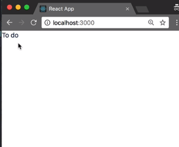
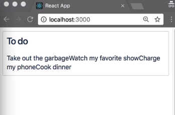
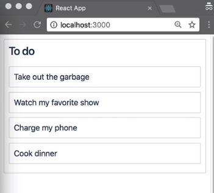

We are now going to sort the data that will drive our application. `react-beautiful-dnd` has no opinions about how you should structure your data or manage it. For our purposes, we're going to have a very simple data structure.

We are firstly going to have a property called `tasks`. The `tasks` object contains the `tasks` in our system. It uses the task's `id` as the key for the lookup of the `task` object. The `task` object contains an `id`, as well as the `content` for the `task`, such as "take out the garbage."

#### initial-data.js
```javascript
const initialData = {
  tasks: {
    'task-1': { id: 'task-1', content: 'Take out the garbage' },
    'task-2': { id: 'task-2', content: 'Watch my favorite show' },
    'task-3': { id: 'task-3', content: 'Charge my phone' },
    'task-4': { id: 'task-4', content: 'Cook dinner' },
  },
```

We are also going to have a `columns` object, which we'll use to store the `columns` in our system. We use the `columns` object to store the `columns` in our system. We also use the column `id` as the key for looking up the `column`. This `column` is our `To do` `column`.

```javascript
columns: {
    'column-1': {
      id: 'column-1',
      title: 'To do',
      taskIds: ['task-1', 'task-2', 'task-3', 'task-4'],
    },
  },
```

Each column has a `taskIds` array. This array serves two purposes. The first purpose is to indicate ownership. We know that `task-1` is currently inside of `column-1`. The second purpose of the array is to maintain order. Right now, `task-1` appears on the list before `task-2`.

We are also going to add another property to the object called `columnOrder`. This is the property that we will use to record the order of the columns. Right now, we just have one column. I'm adding this here now so that, in future lessons, we're able to add more columns.

```javascript
// Facilitate reordering of the columns
  columnOrder: ['column-1'],
```

We just need to `export` this and return to our `index` file. 

```javascript
export default initialData;
```

Inside of our `index` file, we can now `import` our `initialData`. 

#### index.js
```javascript
import initialData from './initial-data';
```
We're going to use this data as the basis for rendering our application. We're going to set the initial `state` of our application to be that `initialData`. 

```javascript
class App extends React.Component {
  state = initialData;
```
It'll be the responsibility of `App` to `render()` our columns.
The `columnOrder` array stores the order in which we want to render out our columns, and so we're going to `map` over that in order to render out our columns. Now we need to pull the `column` out of our `state`, and we'll also get the `tasks` associated with that `column`.

```javascript
 render() {
    return this.state.columnOrder.map(columnId => {
      const column = this.state.columns[columnId];
      const tasks = column.taskIds.map(taskId => this.state.tasks[taskId]);
   });
  }
```

Just to check that we've got everything wired up correctly, I'm simply going to return the `title` of the `column`. 

```javascript
render() {
    return this.state.columnOrder.map(columnId => {
      ...
      return column.title;
   });
  }
```

OK, great. We can see over here that we are now rendering out the `title` of our only `column`, `To do`.


We are now going to render out a column component `<Column>` rather than just the `title`. It is important for us to give a `key` to the `column`. Because we're rendering out a list of components, this is how React keeps track of that list. We're also going to pass the `column` in, as well as the `tasks` for that `column`.

```javascript
 render() {
    return this.state.columnOrder.map(columnId => {
      const column = this.state.columns[columnId];
      const tasks = column.taskIds.map(taskId => this.state.tasks[taskId]);

      return <Column key={column.id} column={column} tasks={tasks} />;
    });
  }
```

Now we need to create this column component, `<Column>`, for us to render out. Firstly, I'm going to import `column` from `./column`
This file doesn't exist yet, so we need to go ahead and create that. For our column component `<Column>`, we're simply going to render out the `title` again. OK, great.

#### column.jsx
```javascript
import React from 'react';

export default class Column extends React.Component {
  render() {
    return this.props.column.title;
}
}
```

Our new column component  `<Column>` is rendering out the `column.title` for the column. At this point, we're going to need to start styling our application. In order to do that, I'm going to add a library called `styled-components`. `styled-components` is a component based CSS in JS library that I like using.

#### Terminal
```javascript
yarn add style-components
```

`react-beautiful-dnd` has no opinions about what styling approach you want to use, whether that's preprocessed styles like `Less` or [Sass](https://egghead.io/browse/languages/scss), CSS in JS, inline styles, or some other styling mechanism. It's up to you.

I'm also going to add a CSS reset in order to improve the visual consistency of our application across browsers. You're welcome to use your own CSS reset or none at all. To add the CSS reset, I'm going to go back to `index.js` and directly import the reset from here. 

#### index.js
```javascript
import '@atlaskit/css-reset';
```

You will see that our application's visual appearance has changed slightly.



We're now going to go back to `Column`. Using the `styled` import from `styled-components`, we're able to create elements with styles. We're going to need a `Container`, which is going to wrap our column. We'll make this a `div`.

We're also going to need a `Title`, which we'll make a `h3`. We're going to have a `TaskList` component, and this will be the area in which we render out our tasks. For now, we can leave that as a `div`.

#### column.jsx
```javascript
const Container = styled.div``;
const Title = styled.h3``;
const TaskList = styled.div``;
```

We're now rendering out our column with no additional styles other than the CSS reset that we've added. 

```javascript
return (
      <Container>
        <Title>{this.props.column.title}</Title>
            <TaskList>Tasks go here</TaskList>
      </Container>
    );
```

Let's go ahead and make this look a bit nicer. We're going to add a `margin` to our `Container`. We're also going to add a `border`, a `border-radius`.

We're now going to apply some `padding` to our `Title` and to our `TaskList`. I'm applying the `padding` directly to the `Title` and the `TaskList`, rather than the `Container`, so that they press up against the edges of the box.

```javascript
const Container = styled.div`
  margin: 8px;
  border: 1px solid lightgrey;
  border-radius: 2px;
`;
const Title = styled.h3`
  padding: 8px;
`;
const TaskList = styled.div`
  padding: 8px;
`;
```

The reason I'm doing that is, in the future, I'm going to highlight them when I'm dragging them, and I like the colors to bleed out to the edge. You're welcome to use whatever styling approach or spacing you want to create your own lists.

We are now going to make our `TaskList` return a list of `tasks`. We're now rendering out a list of task components, but we haven't created it yet. Let's go ahead and `import Task from task`. We haven't created this file, so let's go ahead and create that.

We've now created our Task component. For now, let's simply return the `task.content`, so that we know that we're passing through the right data. 

#### task.jsx
```javascript
import React from 'react';

export default class Task extends React.Component {
  render() {
    return this.props.task.content;
  }
}
```
Great. We can see that we're now listing out the content of the tasks that are being passed into the column.



Let's improve the styling of this. We're again going to create a `Container` component and we're going to wrap our task content inside of that. We're now rendering out our list of tasks.

```javascript
const Container = styled.div``

export default class Task extends React.Component {
  render() {
    return <Container>{this.props.task.content}</Container>;
  }
}

```

Let's make this look a little bit nicer. We're going to give it a `border`, some internal `padding`, and we're also going to make each item push the one after it down slightly. We'll also add a `border-radius`, just so it's similar to the `column`.

```javascript
const Container = styled.div`
  border: 1px solid lightgrey;
  border-radius: 2px;
  padding: 8px;
  margin-bottom: 8px;
  background-color: white;
`;
```
We are now rendering out our to-do list.

