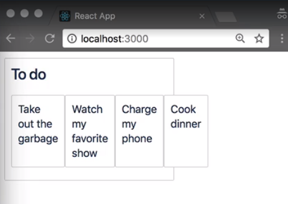
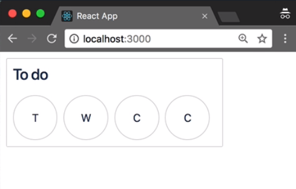
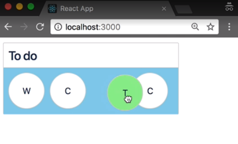
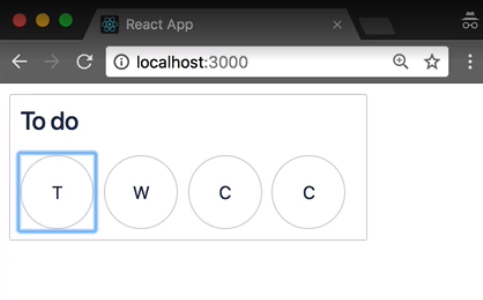
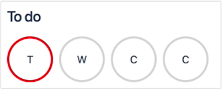

Up to now, we've only looked up vertical reordering in our application. `React-beautiful-dnd` also supports reordering draggables on the horizontal plane.

First, we are going to go to our `initial-data.js`. For this lesson, we're just going to use one column. 

#### initial-data.js
```javascript
const initialData = {
  tasks: {
    'task-1': { id: 'task-1', content: 'Take out the garbage' },
    'task-2': { id: 'task-2', content: 'Watch my favorite show' },
    'task-3': { id: 'task-3', content: 'Charge my phone' },
    'task-4': { id: 'task-4', content: 'Cook dinner' },
  },
  columns: {
    'column-1': {
      id: 'column-1',
      title: 'To do',
      taskIds: ['task-1', 'task-2', 'task-3', 'task-4'],
    }
  },
  // Facilitate reordering of the columns
  columnOrder: ['column-1'],
};

export default initialData;
```

Now I am going to `column.js`.  I'm going to convert `TaskList` into a flex parent.

#### column.jsx
```javascript
const TaskList = styled.div`
  padding: 8px;
  transition: background-color 0.2s ease;
  background-color: ${props =>
    props.isDraggingOver ? 'lightgrey' : 'inherit'};
  flex-grow: 1;
  min-height: 100px;

  display: flex;
`;

```

We can now see the items are being positioned left to right.



We can remove the `width` of our `Container` components, because we do not need that anymore, and also get rid of this `flex-grow`, and `min-height` property from the `TaskList` component.

In our `Task` component, rather rendering up the entire `content` of the `task`, I'm just going to make it now print out the first character. 

#### task.jsx
```javascript
{this.props.task.content[0]}
```

I'm going to give our `Container` a `width` of `40px`, a `height` of `40px`, and change the `border-radius` to `50%`, so that these are now rounded.


Rather than having white space at the bottom of our tasks, I now want on the right hand side of my tasks. I'm going to horizontally and vertically center the text by using flexbox. 

```javascript
const Container = styled.div`
  border: 1px solid lightgrey;
  border-radius: 50%;
  padding: 8px;
  margin-bottom: 8px;
  background-color: ${props => (props.isDragging ? 'lightgreen' : 'white')};
  width: 40px;
  height: 40px;

  display: flex;
  justify-content: center;
  align-items: center;
`;

```

Our `TaskList` is set up, so that is ordered on the horizontal plane.



When I start dragging, we're getting some weirdness. It's not what we expected. We need to go back to our `Column` component and change the prop on the `Droppable`. A `Droppable` has an optional prop called `direction`.

By default, a `Droppable` assumes that it is ordered vertically. By changing the `direction` prop to `horizontal`, you are able to have list that is ordered in the horizontal plane. 

#### column.jsx
```javascript
<Dropppable droppableId={this.props.column.id} direction="horizontal">
```
If we go back to our example now, we can say, that now we are able to have horizontal reordering using `react-beautiful-dnd`.



This will also work with keyboard. When we focus on a draggable, we currently get the default focus outline. This looks a bit funny, because our tasks are actually circular.



What I'll do is create a `focus` style where we disable the `outline` and change the `border-color` to `red`. I'm also going to bump up the `border` style a little bit. 

#### task.jsx
```javascript
const Container = styled.div`
  border: 1px solid lightgrey;
  border-radius: 50%;
  padding: 8px;
  margin-bottom: 8px;
  background-color: ${props => (props.isDragging ? 'lightgreen' : 'white')};
  width: 40px;
  height: 40px;

  display: flex;
  justify-content: center;
  align-items: center;

  &:focus {
      outline: none;
      border-color: red;
  }
`;

```

When we come back to our application and we focus on a task now, we won't get that blue focus box that we have before.

