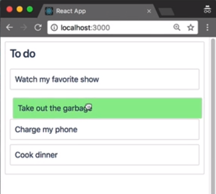
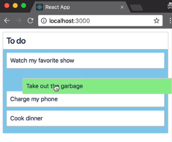

The reordering of our task list is looking really nice. What if we wanted to add some more visual styling to our application in response to a drag? `react-beautiful-dnd` provides you with a lot of information about the state of a drag interaction, which can be helpful in adding some visual cues to your application.

You're welcome to update anything you like, really, as honestly don't change the dimensions of your `Draggable` and `Droppable` components during a drag. Changing the `backgroundColor` of components is generally a nice way to indicate what is moving and what is currently being dragged over.

How do we do that? Go to `task.jsx`, the second argument to this function is called `snapshot`.

#### task.jsx
```javascript
 <Draggable draggableId={this.props.task.id} index={this.props.index}>
        {(provided, snapshot) => (
```

This object here contains a number of properties that you can use to style your `Draggable` component during a drag.

Here we have an example `draggableSnapshot` object.

#### example-snapshot.js
```javascript
// Draggable
const draggableSnapshot = {
  isDragging: true,
  draggingOver: "column-1"
};
```

Inside of the snapshot, we have two properties. The first one is a Boolean flag called `isDragging`. `isDragging` will be set to true when the draggable is currently being dragged.

The other property `draggingOver` will be set to the ID of the droppable that the draggable is currently dragging over. If a draggable is being dragged and is currently not over a droppable, then draggingOver will be set to `null`.

We're now going to use the snapshot to change the `backgroundColor` of our `Task` as it drags. What I'm doing here is passing a prop called `isDragging` to my style component which has the value of a `snapshot.isDragging` property.

#### task.jsx
```html
 <Container
            {...provided.draggableProps}
            {...provided.dragHandleProps}
            innerRef={provided.innerRef}
            isDragging={snapshot.isDragging}
          >
```

Using the `styled-components` API, I can conditionally set the `background-color` of the component based on this prop. What I'm doing here is stating that if the `isDragging` prop on my style component is `true`, then I want to set the background to be `lightgreen`. Otherwise, I want to set the `background-color` to be `white`.

```javascript
const Container = styled.div`
  .... background-color: ${props => (props.isDragging ? "lightgreen" : "white")};
`;
```

Now when we drag our `Task`, the `background-color` of the dragging item has changed to `lightgreen`.



We can also do the same effect for our `Column`. The second argument to a `Droppable` function is also a `snapshot`.

#### column.jsx
```javascript
<Droppable droppableId={this.props.column.id}>
          {(provided, snapshot) => (
```

Here we have an example `droppableSnapshot`.

#### example-snapshot.js
```javascript
//Droppable
const droppableSnapshot = {
  isDraggingOver: true,
  draggingOverWith: "task-1"
};
```

A `droppableSnapshot` has two properties. Firstly, it has a Boolean flag named `isDraggingOver`. This will be set to `true` when a draggable is dragging over the droppable. There is another property called `draggingOverWith`, and this will be set to the ID of the draggable that is dragging over a droppable. `draggingOverWith` will be set to null if the droppable is not been dragged over.

What we are going to do is change the `background-color` of our `TaskList` when it is being dragged over. I'm adding a prop to our `TaskList` style component called `isDraggingOver`. I'm setting the value of this prop to match the `snapshot.isDraggingOver` Boolean.

#### column.jsx
```html
<TaskList
  innerRef={provided.innerRef}
  {...provided.droppableProps}
  isDraggingOver={snapshot.isDraggingOver}
>
```

If the `isDraggingOver` prop is set to `true` on our `TaskList`, I'm going to set the `background-color` of the `TaskList` to `skyblue`. Otherwise, I'll set it to `white`.

```javascript
const TaskList = styled.div`
  padding: 8px;
  background-color: ${props => (props.isDraggingOver ? "skyblue" : "white")};
`;
```

When I pick up a task, the `background-color` of the task list turns to `lightblue`. When I move the task outside of the list, the `background-color` reverts to `white`.



I like adding a `transition` on the `background-color` property for my droppables, as it makes the color changes more visually appealing as you move between droppables.

```javascript
const TaskList = styled.div`
  padding: 8px;
  transition: background-color: 0.2s ease;
  background-color: ${props => (props.isDraggingOver ? "skyblue" : "white")};
`;
```
