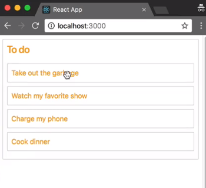
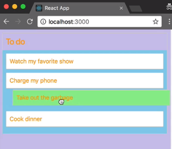

We also have some other information that we could use to update the style of our application in response to a drag. Previously, I mentioned that there are three callbacks for a `DragDropContext`. We are currently only using the `onDragEnd` callback.

We can also use the `onDragStart` and `onDragUpdate` callbacks, if we wanted to add some more visual styling to our application.

#### index.js
```html
<DragDropContext
    onDragStart={this.onDragStart}
    onDragUpdate={this.onDragUpdate}
    onDragEnd={this.onDragEnd}
    >
```

Here is some example data that is passed to the various callbacks for `DragDropContext`.

#### example-hooks.js
```javascript
// onDragStart
const start = {
    draggableId: 'task-1',
    type: 'TYPE'
    source: {
        droppableId: 'column-1',
        index: 0,
    }
}

//onDragUpdate
const update= {
    ...start,
    destination: {
        droppableId: 'column-1',
        index: 1,
    }
};

// onDragEnd
const result - {
    ...update,
    reason: 'DROP',
}
```

Now we have actually seen this before in a previous lesson, when we were looking at preserving a reorder for our list, we were playing with the `result` object.

These other objects are very similar. We have the `start` object which has the `draggableId`, the `type` which we haven't gone into yet, and the `source` location, which is where the draggable started.

`update` is the same thing with an optional `destination`. This might be `null` if it's not over anything, or otherwise this will be the current location of the `Draggable` in the system.

Here I'm setting the text color of the `body` to be `orange` when a drag starts. This is a very simple way of changing the styles, by modifying the `body.style` property directly and setting it inline style.

#### index.js
```javascript
onDragStart = ()) => {
   document.body.style.color = 'orange';
  };
```

When I look at the example, when I start dragging, the color of the text on the page changes to orange. The drag is finished, but the text color has stayed orange.



I'll reset that value in my `onDragEnd` function, so now when the drag ends, the text color changes back to its initial color.

```javascript
onDragEnd = result => {
  document.body.style.color = "inherit";
};
```

We can also make style changes in response to changes during a drag. What I'm doing here is creating a variable called `opacity`. It stores the percentage of the current `index` based on all of the `tasks` in our system. I'm then using that `opacity` variable to set the output channel on a `backgroundColor`.

```javascript
onDragUpdate = update => {
  const { destination } = update;
  const opacity = destination
    ? destination.index / Object.keys(this.state.tasks).length
    : 0;
  document.body.style.backgroundColor = `rgba( 153, 141, 217, ${opacity})`;
};
```

As I moved down the list, you will notice that the `backgroundColor` of our application is changing.



That looks a bit harsh, so I'm going to add a `transition` on the `backgroundColor`. Adding that `transition` will make the changes between the colors more fluid. I'm also going to reset the `backgroundColor` to its initial value, when a drag ends.

```javascript
onDragStart = () => {
     document.body.style.color = 'orange';
     document.body.style.transition = 'background-color 0.2s ease';
}

onDragEnd = result => {
...
document.body.style.backgroundColor = 'inherit';
}
```

You can see the `backgroundColor` is bleeding through our header. That's because we haven't set a `backgroundColor` for our header yet, so it's just taking the `backgroundColor` of the `body`.

This is a fairly contrived example that uses the `DragDropContext` callback functions to update some global styles. I generally don't update the styles for my application in these callbacks, and just rely on the snapshot values.
