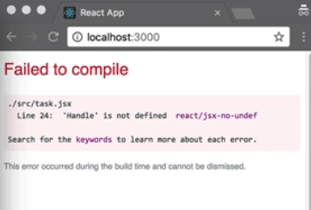

The drag handle is the part of the `Draggable` that is used to control the dragging of the entire draggable. For our `Task` component, the `Draggable` and the drag handle are the same component. This means, we can drag our `Task` from anywhere on the `Task`.

However, that is not need to be the case. Let's create a new `Handle` component to control the `Task`. 

#### task.jsx
```javascript
<Handle/>
```

Now we're getting an error, because we haven't created this component yet. 



Let's go ahead and do that.

```javascript
const Handle = styled.div``;
```

Now, I'm using a `div` for this drag handle, but you can use any element type that you like. I'm going to give it a `width` of `20px`, and a height of `20px`, `background-color` of `orange`, `border-radius` of `4px`. 

```javascript
const Handle = styled.div`
width: 20px;
height: 20px;
background-color: orange;
border-radius: 4px;
`;
```

Now, we want our drag handle to sit on the left of our content.
I'm going to convert our container into a `flex` parent. 

```javascript
const Container = styled.div`
  ....
  display: flex;
`;
```

Just going to add some margin on the handle. 

```javascript
const Handle = styled.div`
width: 20px;
height: 20px;
background-color: orange;
border-radius: 4px;
margin-right: 8px;
`;
```

Even though we've created this drag handle, we can still drag the draggable from any part of it. That's because, we're still applying the `dragHandleProps` to the `Container`.

```javascript
<Container
    {...provided.dragHandleProps}
>
```

To designate our `Handle` component as the drag handle, all we need to do is, spread the `dragHandleProps` on to this component. 

```javascript
<Handle {...provided.dragHandleProps} />
```
Now, we are no longer able to drag the draggable from the content. We can now only drag the `Task` from the `Handle` component, and this is also true for keyboard dragging.


Having custom drag handles is a really useful feature. However, in our task, this application, I don't think its necessary. As I think it is a nice experience to be able to drag the task from anywhere on the task. I'm not going to preserve this particular change in our next lesson.