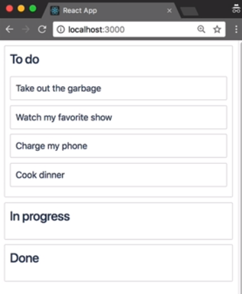
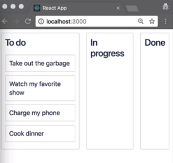
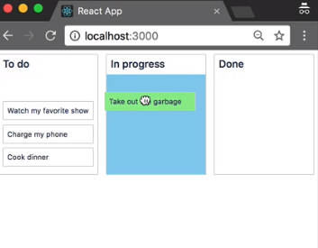
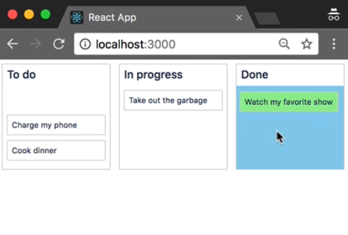

In this lesson, we are going to add further columns to our application and enable the movement of tasks between those columns. Firstly, I'm going to go back to our initial data.

We currently only have one column. I've now added an additional two columns, an `In progress` column and a `Done` column. I also need to add the IDs of those columns to our `columnOrder` array.

initial-data.js
```javascript
const initialData = {
  tasks: {
    "task-1": { id: "task-1", content: "Take out the garbage" },
    "task-2": { id: "task-2", content: "Watch my favorite show" },
    "task-3": { id: "task-3", content: "Charge my phone" },
    "task-4": { id: "task-4", content: "Cook dinner" }
  },
  columns: {
    "column-1": {
      id: "column-1",
      title: "To do",
      taskIds: ["task-1", "task-2", "task-3", "task-4"]
    },
    "column-2": {
      id: "column-2",
      title: "In progress",
      taskIds: []
    },
    "column-3": {
      id: "column-3",
      title: "Done",
      taskIds: []
    }
  },
  // Facilitate reordering of the columns
  columnOrder: ["column-1", "column-2", "column-3"]
};

export default initialData;
```

Our application is now rendering three columns.



We need to update the styles, so that the columns are placed next to each other. We'll go back to our `index.js`. I'm going to create a component called `Container`, which will wrap our columns in.

### index.js
```javascript
<DragDropContext onDragEnd={this.onDragEnd}>
  <Container>
    {this.state.columnOrder.map(columnId => {
      const column = this.state.columns[columnId];
      const tasks = column.taskIds.map(taskId => this.state.tasks[taskId]);

      return <Column key={column.id} column={column} tasks={tasks} />;
    })}
  </Container>
</DragDropContext>
```

This `Container` will be a flex parent that will align the items next to each other. I haven't imported `style-components` here. I'll just do that.

```javascript
import styled from "styled-components";

const Container = styled.div`
  display: flex;
`;
```

Our columns are being printed next to each other. However, that to do column which has tasks in it is much wider than the other ones.



Go back to `column.js` and in our container component here. I'm just going to add a width to these columns.

#### column.jsx
```javascript
const Container = styled.div`
  margin: 8px;
  border: 1px solid lightgrey;
  border-radius: 2px;
  width: 220px;
`;
```

Now, all of these columns have the same width. Let's going to zoom out a little bit, so that we can see what's going on.

When we hover over in other column, they currently not highlighting. This is because, the `Taskless` component in our `In progress` and `Done` columns currently have no height. To fix this, we are going to convert our `Container` to be a flex parent, and use the `flex-direction` of `column`.

```javascript
const Container = styled.div`
  margin: 8px;
  border: 1px solid lightgrey;
  border-radius: 2px;
  display: flex;
  flex-direction: column;
`;
```

This created a flexbox where the children are aligned vertically. For our `TaskList`, I'm going to say, "I want the flex to grow."

```javascript
const TaskList = styled.div`
  padding: 8px;
  transition: background-color 0.2s ease;
  background-color: ${props => (props.isDraggingOver ? "skyblue" : "white")};
  flex-grow: 1;
`;
```

Now, this flexbox will grow to fill the available space. Now, I want to hover over these columns, I get the correct coloring.



While we're here, it's worth mentioning that I'd like to add a minimum `height` to my droppable components. I do this, so that if all the lists are empty, it's still possible to drop something on to those columns. If I didn't have this, there would be a droppable area, but it's height would be zero, so wouldn't be a very easy drop target for people to get.

```javascript
const TaskList = styled.div`
  padding: 8px;
  transition: background-color 0.2s ease;
  background-color: ${props => (props.isDraggingOver ? "skyblue" : "white")};
  flex-grow: 1;
  min-height: 100px;
`;
```

Coming back to our application, if we now drop in the `In progress` column, who notice that the items shifts back to its original position. We need to update the reordering logic in our `onDragEnd` function to handle the movement between the columns.

Going back to our `index.js`, previously we were using the `source.droppableId` property to look up the column from our system. We were able to do this with your only moving within one column. However, now the column that we start in can be different from the column that we finish in.

#### index.js
```javascript
const column = this.state.columns[source.droppableId];
```

We will rename this column to `start`, and we've created a new variable to store our reference to the column that we `finish` in. If the `start` column and the `finish` column are the same thing, then we can continue to use the same logic that we were using before.

```javascript
const home = this.state.columns[source.droppableId];
const finish = this.state.columns[destination.droppableId];

if (home === foreign) {
}
```

Now, if I reorder within the same column, those reorder should be preserved. We now need to handle the case whether `start` and `finish` columns are different. We're going to use an approach that was very similar to what we had before.

Here, I'm creating a new `startTaskIds` array, which contains the same IDs as the old array.
I'm then going to remove the dragged `taskId` from this array. I'll then create a `newStart` column, which contains the same properties as the old column, but with our new `startTaskIds` array.

```javascript
const startTaskIs = Array.from(start.taskIds);
startTaskIds.splice(source.index, 1);
const newStart = {
  ...start,
  taskIds: startTaskIds
};
```

I'm also creating a new array for the `finishTaskIds` which contains the same `taskIds` as the last `finish` column. I'm using the `splice` operator to insert the `draggableId` at the `destination.index`. 

I'm again creating a new column. This time the finish column with the `finishTaskIds` for that column.

```javascript
const finishTaskIs = Array.from(finish.taskIds);
finishTaskIss.splice(destination.index, 0, draggableId);
const newFinish = {
  ...finish,
  taskIds: finishTaskIds
};
```

Finally, we're creating our `newState` object which has the same properties as a old `state` object, but we've updated the column's map to include the columns with the updated task IDs.

```javascript
    const newState = {
      ...this.state,
      columns: {
        ...this.state.columns,
        [newStart.id]: newStart,
        [newFinish.id]: newFinish,
      },
    };
```

The operations we implemented are very similar to the operations we needed to implement when reordering within a single column. The difference is, that we now apply the different components of this operation to the different columns rather than to the same column.

If we do get our application now, we should see as possible for us to move tasks anywhere in our application. This is also true for keyboard. We can now use our keyboard to move tasks anywhere in our app.

