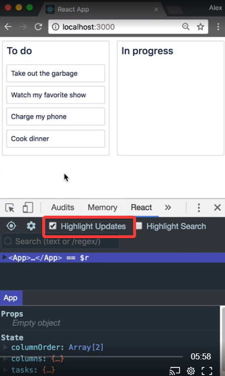
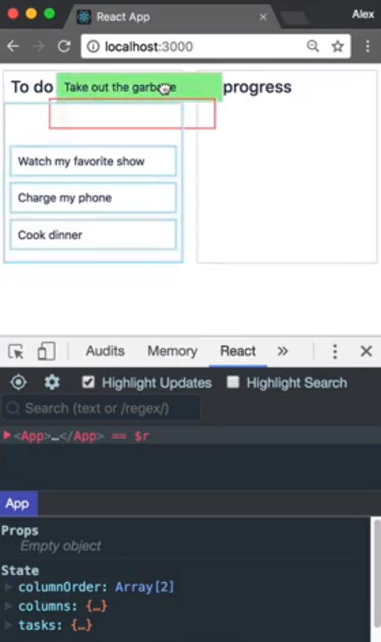
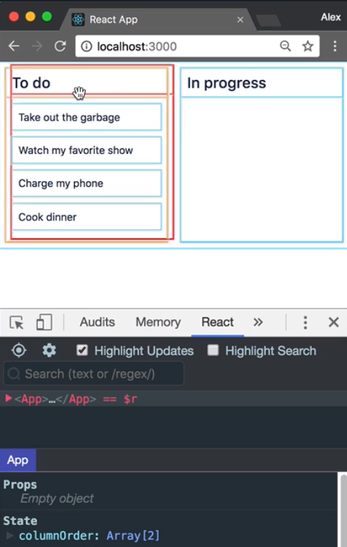

In this lesson, I will be talking about some important performance optimizations that you can implement to make your application as fast as possible.

A big performance bottleneck in React is the reconciliation process. In short, you do not want to be calling the render function on components that do not need to have any changes applied. I am going to be using the React Developer Tools extension for Chrome, which is available through the [Chrome Web Store](https://chrome.google.com/webstore/detail/react-developer-tools/fmkadmapgofadopljbjfkapdkoienihi?hl=en).

The extension has an incredibly useful toggle called Highlight Updates. By enabling this feature, the dev tool will highlight the components in our React application that have hand their render function called.



I'm going to change the dragging over background color of our column from `skyblue` to `lightgray` for this lesson. I'm going to do this so we can more clearly see what's going on.

#### column.jsx
```javascript
const TaskList = styled.div`
  padding: 8px;
  transition: background-color 0.2s ease;
  background-color: ${props =>
    props.isDraggingOver ? "lightgrey" : "inherit"};
  flex-grow: 1;
  min-height: 100px;
`;
```

When I pick up a task, you will see that all of the tasks have been highlighted in blue. This shows that the component has had its render function called. When the droppable inside of our column calls its child function, it is going to render out all of its tasks.

A droppable function will be called whenever the value of the `snapshot` argument changes. This will occur whenever you enter or leave a droppable. You can see, as I'm entering and leaving, all of the tasks in the list are having a blue outline applied to them, indicating that their render method is being called.



We want our task list to respond to `snapshot` value changes, as we want to update its `background-color` in response to a drag. However, we don't want to `render` out all of the `tasks` in order to make this style change. I'm going to replace this `map` here with a new `Component`.

```javascript
class InnerList extends React.Component {
  render() {
    return this.props.tasks.map((task, index) => (
      <Task key={task.id} task={task} index={index} />
    ));
  }
}

<InnerList tasks={this.props.tasks} />;
```

We have moved the logic for mapping over the `tasks` and returning a `Task` component into this `InnerList` component. I'm now adding a `shouldComponentUpdate` lifecycle method.

We're going to skip a `render` if the new `tasks` array shares referential equality with the existing `tasks` array. If the reference to the array has changed, then we will allow a render.

```javascript
class InnerList extends React.Component {
  shouldComponentUpdate(nextProps) {
    if (nextProps.tasks === this.props.tasks) {
      return false;
    }
    return true;
  }
```

Now when we drag a task, we are able to update the background color of the task list, but we do not need to render the task components that did not need to be rendered.

When I drag a column, all the tasks in the column render. You can see that all of the tasks are having a blue outline applied to them to indicate that they are being rendered.



Here is the `Droppable` for our columns. When I drag a column, all of the tasks in the column render. This is because our droppable function is being called with a new `snapshot` value even though we're not using it right now.

#### index.js
```html
<DragDropContext onDragEnd={this.onDragEnd}>
  <Droppable
    droppableId="all-columns"
    direction="horizontal"
    type="column"
  >
    {(provided,snapshot) => (
      <Container
        {...provided.droppableProps}
        innerRef={provided.innerRef}
      >
```

When this `Droppable` function is called, it is going to return a new list of `Column` components. Just as with our `Column` component, we want to avoid the rendering of the children of our `Droppable`, which in this case is `Container`, during a drag.

Rather than returning a `Column` component, we're now going to return a new `InnerList` component that is responsible for rendering a column. The key difference to the interface is that rather than passing in a dynamically created tasks array, we are passing in the entire `tasks` object map.

```html
<InnerList
  key={column.id}
  column={column}
  index={index}
  taskMap={this.state.tasks}
/>
```

The `InnerList` component is performing the same operations as we were previously doing inside of our droppable function. If we were to leave it here, we wouldn't have any performance wins.

```javascript
class InnerList extends React.Component {
  render() {
    const { column, taskMap, index } = this.props;
    const tasks = column.taskIds.map(taskId => taskMap[taskId]);
    return <Column column={column} tasks={tasks} index={index} />;
  }
}
```

We can now conditionally block renders if none of the props have changed. The key change that has enabled us to make this optimization is to pass in the entire `taskMap`, rather than a dynamically created `tasks` array. None of these three properties should change during a drag.

```javascript
shouldComponentUpdate(nextProps){
    if(
        nextProps.column === this.props.column  &&
        nextProps.taskMap === this.props.taskMap &&
        nextProps.index === this.props.index
    ){
        return false;
    }
    return true;
}
```

This change would allow us to add styles to our column while it was dragging, while still avoiding the rendering of our children. We can change our `Component` to instead extend from `PureComponent`. A `PureComponent` performs the same `shouldComponentUpdate` check as what we have here.

```javascript
class InnerList extends React.PureComponent {
  render() {
    const { column, taskMap, index } = this.props;
    const tasks = column.taskIds.map(taskId => taskMap[taskId]);
    return <Column column={column} tasks={tasks} index={index} />;
  }
}
```

Now when we drag our column, we will see that the tasks are no longer being highlighted in blue, showing that they are no longer being rendered.
