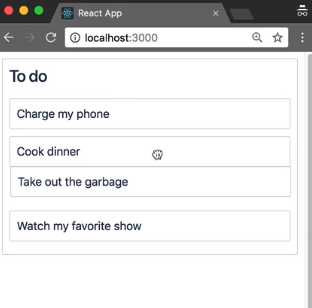

We can now drag things around in our task list application. These interactions are not being persisted, and our task list is reverting to its original state after the drop animation completes. We'll now work on persisting needs changes in a `onDragEnd` function.

#### index.js
```javascript
onDragEnd = result => {};
```

Firstly, what's this `result` object? What information have we been given? Here is an example, result object.

#### example-result.js
```javascript
const result = {
    draggableId: 'task-1',
    type: 'TYPE',
    reason: 'DROP',
    source: {
        droppableId: 'column-1,
        index: 0,
    },
    destination: {
        droppableId: 'column-1',
        index: 1,
    },
}
```

A `result` has a `draggableId`. This is the ID of the `Draggable` that the user was dragging. It has a `type` property, which will go into in a later lesson, and the `reason` for the drop. This could be `DROP` or `CANCEL`.

Generally, it's not super important to know whether the user dropped explicitly or cancelled the drag say by using the escape key, but you do have that information, if you need it. We now have two really important objects, the `source` and `destination`.

These objects contain location information about where the `Draggable` started and where it finished. In this case, the `Draggable` started in `column-1` in `index: 0`, and finished in the same column, `column-1` in `index: 1`. There are cases where the `destination` can be `null`, such as where the user drops outside of a list.

Then, you grab the information that we are interested in from the `result` object. If there's no `destination`, then there's nothing that we need to do as a result of this drag, so we can simply exit.

#### index.js
```javascript
 onDragEnd = result => {
    const { destination, source, draggableId } = result;

    if (!destination) {
      return;
    }
```

A little check that I like to add is to see if the location of the draggable changed. We do that by checking to see if the `destination.droppableId` is the same as the `source`, and if the `index` has the same in the `destination` as the `source`. If these two things are true, then the user drop the item back into the position that is started, so we don't need to do anything.

```javascript
if (
  destination.droppableId === source.droppableId &&
  destination.index === source.index
) {
  return;
}
```

At this point, we need to reorder the `taskIds` array for the `column`. We'll start by retrieving our `column` from the `state`. I've used the ID of the droppable from the source object to look up the `column` from my `state`.

```javascript
const column = this.state.columns[source.droppableId];
```

However, I could have just done this, because I know that I only have one column in this system `this.state.columns[''column-1]`, but this feels a little bit more robust. If I was to change the ID of the column in my initial data, then I would need to update this look up here.

```javascript
const newTaskIds = Array.from(column.taskIds);
```

This will create a `newTaskIds` array with the same contents as our last array. When I do update, I generally try to avoid mutating my existing state, and rather creating new objects for the things that I change.

We now need to move the task ID from its old `index` to its new `index` in the array.

```javascript
newTaskIds.splice(source.index, 1);
```

What `splice` will do is it actually modifys the array, it will modify `newTaskIds`. And what its saying is from this `index` we want to remove one item.

We're also going to use `splice` again. This time we're going to start from the `destination.index`. We're going to remove nothing and we are going to insert the `draggableId`, which we know is the `taskId`. There's lots of different ways of ordering an array. This is just one of them.

```javascript
newTaskIds.splice(destination.index, 0, draggableId);
```

I'm now going to create a `newColumn`, which has the same properties as our old `column` but with the `newTaskIds` array.

```javascript
const newColumn = {
  ...column,
  taskIds: newTaskIds
};
```

Now that we have our `newColumn`, we're going to put that into a new picture of our `state`.

I'm using object spread to maintain the old properties in our `state` object, but also invalidating the references of the past that I want to change.

```javascript
const newState = {
      ...this.state,
      columns: {
        ...this.state.columns,     
      },
    };

```

I'm now going to insert the `newColumn` into this map. This will override our existing `column`. 

```javascript
const newState = {
      ...this.state,
      columns: {
        ...this.state.columns,     
         [newColumn.id]: newColumn,
      },
    };

```

Technically, right now, we don't need this spread, because we only have one column, but I think this is good practice to do. 

Then I'm going to call `this.setState(newState)`, which will update the state for our React component.

Come back to our task list application, we can now see that our reorder operations are being preserved.



We have optimistically updated our UI without waiting for server confirmation. How you persist this change to your data store, will depend on your state management solution and server architecture.

A simple strategy for persisting changes would be to call an end point, after performing this optimistic update to let your server know that a reorder has occurred.