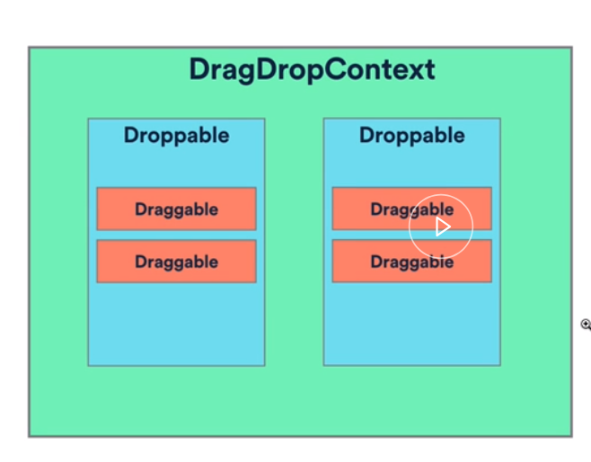
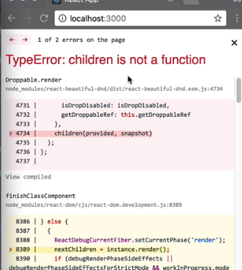
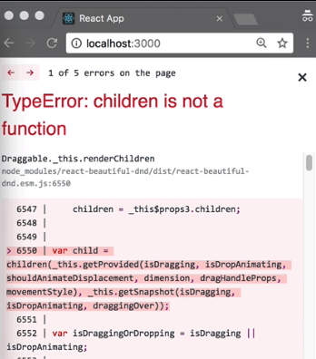
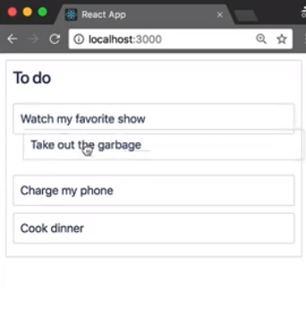

We are now going to add the ability to reorder the tasks in our list using `react-beautiful-dnd`. Let's add `react-beautiful-dnd` as a dependency to our project. OK, great.

#### Terminal
```javascript
yarn add react-beautiful-dnd
```

Before going any further, let's take a visual look at the components that make up `react-beautiful-dnd`.



`react-beautiful-dnd` is made up of three different components. The first is the `DragDropContext`. The `DragDropContext` is a component, that we use to wrap the part of our application, that we want to have drag and drop enable form.

A `Droppable` creates a region which can be dropped on to. They also contain draggables. A `Draggable` is a component that can be dragged around and dropped into droppables. In order to enable drag and drop for our column, we're going to wrap it in a `DragDropContext` component.

First, we'll `import { DragDropContext } from 'react-beautiful-dnd'`. Then, I'm going to wrap our columns inside of a `DragDropContext`.

#### index.js
```javascript
 render() {
    return (
      <DragDropContext >
        {this.state.columnOrder.map(columnId => {
          const column = this.state.columns[columnId];
          const tasks = column.taskIds.map(taskId => this.state.tasks[taskId]);

          return <Column key={column.id} column={column} tasks={tasks} />;
        })}
      </DragDropContext>
    );
  }
```

A `DragDropContext` has three callbacks. `onDragStart`, which is called when the drag starts. `onDragUpdate` is called when something changes during a drag, such as an item is moved into a new position, and `onDragEnd`, which is called at the end of a drag.

The only required call back for a `DragDropContext` is `onDragEnd`.

```html
  <DragDropContext onDragEnd={this.onDragEnd}>
```

It is your responsibility of your `onDragEnd` function to synchronously update your state to reflect the drag and drop result. We will leave this function blank for now and come back to it soon.

```javascript
onDragEnd = result => {
  // TODO: reorder our column
};
```

We'll now enhance our `column` component. We are going to import the `Droppable` component from `react-beautiful-dnd`. We're then going to wrap our `TaskList` component inside of the `Droppable`. A `Droppable` has one required prop, a `droppableId`.

This `droppableId` needs to be unique within the `DragDropContext`. We're going to use the `column.id`.

#### column.jsx
```html
<Container>
  <Title>{this.props.column.title}</Title>
  <Droppable droppableId={this.props.column.id}>
    <TaskList>
      {this.props.tasks.map((task, index) => (
        <Task key={task.id} task={task} index={index} />
      ))}
    </TaskList>
  </Droppable>
</Container>
```

You'll see that we're getting an error in our application saying, "Children is not a function."



A `Droppable` utilizes the render props pattern and expects its child to be a function that returns a React component.

```html
<Droppable droppableId={this.props.column.id}>
  {() => (
    <TaskList>
      {this.props.tasks.map((task, index) => (
        <Task key={task.id} task={task} index={index} />
      ))}
    </TaskList>
  )}
</Droppable>
```

One reason the [render props](https://egghead.io/lessons/react-use-prop-getters-with-render-props) pattern is used, is so that `react-beautiful-dnd` does not need to create any DOM nodes for you. You create your components that where you want to. `react-beautiful-dnd` latches into your existing structure.

The first argument to this function is called `provided`.

```html
{
  provided => (
    <TaskList>
      {this.props.tasks.map(task => <Task key={task.id} task={task} />)}
    </TaskList>
  );
}
```

`provided` is an object that serves a few important purposes. A `provided` object has a property for `droppableProps`. These are `props` that need to be applied to the component that you want to designate as your `Droppable`.

We explicitly call out what all of these `props` are in our [documentation](https://github.com/atlassian/react-beautiful-dnd). You can apply each one of these individually if you want, and you are even welcome to monkey patch them. However, we won't be going into that topic here.

Generally, you'll be able to just spread the `provided.droppableProps` object directly on to your component.

```html
 <TaskList {...provided.droppableProps}>
```

The `provided` object has a property called `innerRef`, which is a function used to supply the DOM node of your component to `react-beautiful-dnd`.

```html
 <TaskList innerRef={provided.innerRef} {...provided.droppableProps}>
```

A styled component has a call back prop named `innerRef`, which returns the DOM node of the component. We can assign the `provided.innerRef` function to this prop. The last thing we'll need to do for a droppable is to insert a placeholder.

```html
{
  provided.placeholder;
}
```

A `placeholder` is a React element that is used to increase the available space in a droppable during a drag when it's needed. The `placeholder` needs to be added as a child of the component that you designate as the droppable. Our droppable is now set up.

We're going to move to our `Task` component and make it draggable.

We're going to import the `Draggable` component from `react-beautiful-dnd`.

#### task.jsx
```javascript
import { Draggable } from "react-beautiful-dnd";
```

Now, I'm going to wrap our `Container` component inside of a `Draggable` component.

```html
<Draggable>
  <Container>{this.props.task.content}</Container>
</Draggable>
```

A `Draggable` has two required `props`. Firstly, a `draggableId`, which we will assign to the `task.id`. Secondly, it requires an `index`.

```javascript
 <Draggable draggableId={this.props.task.id} index={this.props.index}>
```

We're currently not passing an index to our `Task` component. Let's go back to our `Column` component and do that.

Our `Column` component is currently mapping over the `tasks` `prop` and returning a `Task` component. The second argument to a map function is the index of the item in the array. We can simply pass this `index` on to our Task component.

#### column.jsx
```html
<TaskList innerRef={provided.innerRef} {...provided.droppableProps}>
  {this.props.tasks.map((task, index) => (
    <Task key={task.id} task={task} index={index} />
  ))}
  {provided.placeholder}
</TaskList>
```

If we can now go back to `Task`, we still have a problem.



As with `Droppable`, a `Draggable` expects its child to be a function. The first argument to this function is a `provided` object, which works in a very similar way to the `Droppable` `provided` object we have previously seen.

#### task.jsx
```html
<Draggable draggableId={this.props.task.id} index={this.props.index}>
  {provided => <Container>{this.props.task.content}</Container>}
</Draggable>
```

The `provided` object has a property called `draggableProps`. These props need to be applied to the component that we want to move around in response to a user input. The provided object also has another property called `dragHandleProps`. These are the props that need to be applied to the part of the component that we want to use to be able to control the entire component.

You can use this to drag a large item by just a small part of it. For our application, we want the whole task to be draggable. We're going to apply these props to the same element. As with our droppable, we also need to provide a ref for our draggable.

```html
<Container
 {...provided.draggableProps}
highlight_line {...provided.dragHandleProps} end_highlight_line
  innerRef={provided.innerRef}
>
  {this.props.task.content}
</Container>
```

Now, let's take a look at our application. We can now drag items around with our mouse and with our keyboard, which is pretty great. What we can see that when we are dragging an item, we can see through that item when we were dragging in, which doesn't look very great.



Let's go back to our task. Just add a `background-color`. Just `white` will be fine. When the item moves, we don't see through it. 

```javascript
const Container = styled.div`
 ...
  background-color: white;
`;
```

There we go. We now have a really nice looking reordering experience.

You might have noticed that when I drop, that reorder is not preserved. In order to preserve that reorder, we need to implement our reordering logic inside of your `onDragEnd` call back.
