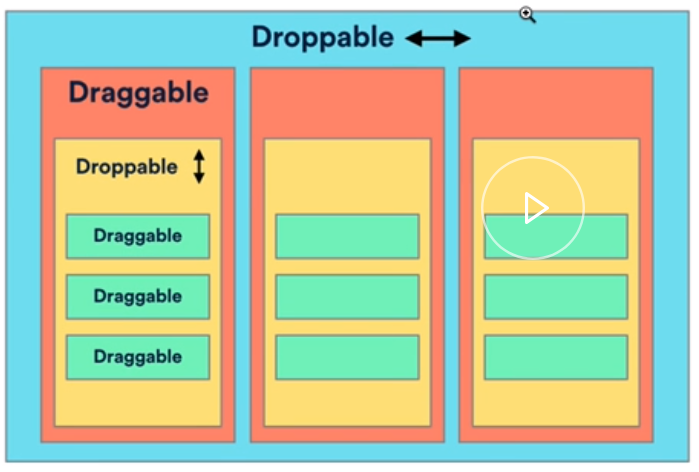
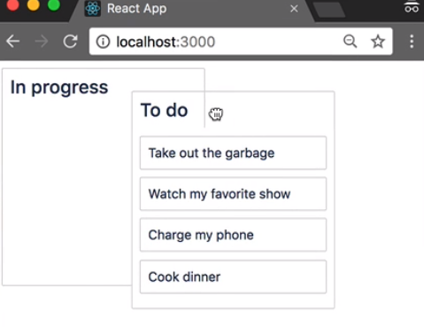
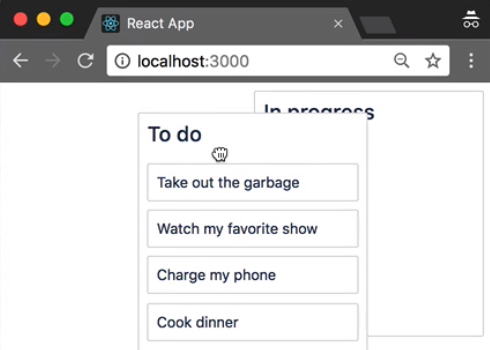

In this lesson, we'll be adding the ability to reorder our columns. I've created an illustration of the approach we are going to implement.



We currently have a number of `Droppable` components that are ordered vertically.

These are our task list and are in yellow here. They contain our tasks which are `Draggable` components. We're going to add a single `Droppable` parent. This `Droppable` will be ordered on the horizontal plane. We will then enhance our `Column` components, so that they are also `Draggable` components.

This approach includes the usage of nested `Draggable` and `Droppable` components. We'll reorder our columns on the horizontal plane and we'll reorder our tasks on the vertical plane.

We are now going to modify our `initial-data.js` slightly. We are removing the third column from our data for now, so that we can more easily see the impact of our work.

#### initial-data.js
```javascript
const initialData = {
  tasks: {
    "task-1": { id: "task-1", content: "Take out the garbage" },
    "task-2": { id: "task-2", content: "Watch my favorite show" },
    "task-3": { id: "task-3", content: "Charge my phone" },
    "task-4": { id: "task-4", content: "Cook dinner" }
  },
  columns: {
    "column-1": {
      id: "column-1",
      title: "To do",
      taskIds: ["task-1", "task-2", "task-3", "task-4"]
    },
    "column-2": {
      id: "column-2",
      title: "In progress",
      taskIds: []
    }
  },
  // Facilitate reordering of the columns
  columnOrder: ["column-1", "column-2"]
};

export default initialData;
```

We are now going to create a horizontally ordered `Droppable`, which we use to reorder our columns. First we need to import `Droppable` from `react-beautiful-dnd`.

#### index.js
```javascript
import { DragDropContext, Droppable } from "react-beautiful-dnd";
```

I'm going to wrap our `Container` component inside of a `Droppable`.

It doesn't really matter what ID we give this `Droppable`, as it won't be interacting with other droppables. Let's just call it `all-columns`.

```html
 <DragDropContext onDragEnd={this.onDragEnd}>
        <Droppable
          droppableId="all-columns">
          {()) => (
            <Container>
              {this.state.columnOrder.map((columnId, index) => {
                const column = this.state.columns[columnId];
                const tasks = column.taskIds.map(
                    taskId => this.state.tasks{taskId}
                )
                return (
                  <Column
                    key={column.id}
                    column={column}
                    tasks={tasks}
                  />
                );
              })}
            </Container>
          )}
        </Droppable>
      </DragDropContext>
```

We need to set the `direction` of the `Droppable` to be `horizontal`, as it'll be reordering our columns in the horizontal plane. We are also going to add a `type` prop with the value of `column`. We are going to set a different `type` prop value for our `Column` reorder `Droppable`, compared to our task list droppables, so they don't interfere with one another.

```html
<Droppable
  droppableId="all-columns"
  direction="horizontal"
  type="column"
  >
```

We now need to set up the rest of our `Droppable`. I've added that `droppableProps` to this component, as well as provided the DOM ref to `react-beautiful-dnd`.

```javascript
<Container
  {...provided.droppableProps}
  innerRef={provided.innerRef}
>
```

I'm also adding the `placeholder` for our droppable.

```html
<Container {...provided.droppableProps} innerRef={provided.innerRef}>
  ....
  {provided.placeholder}
</Container>
```

We can now move on to our `Column` component. We want to make our `Column` draggable. The first thing we are going to do, is to `import` `Draggable` from `react-beautiful-dnd`.

#### column.jsx
```javascript
import { Droppable, Draggable } from "react-beautiful-dnd";
```

We're now going to wrap our whole `Column` inside of a `Draggable`.

```javascript
<Draggable>
  <Container {...provided.draggableProps} innerRef={provided.innerRef}>
    <Title {...provided.dragHandleProps} />
    <Droppable droppableId={this.props.column.id} type="task" />
  </Container>
</Draggable>
```

For the `draggableId`, which is going to use the `column.id`. A droppable also needs an `index`. This is the position of the draggable inside of the droppable. We are currently not providing an index, so we'll need to do this.

```html
  <Draggable draggableId={this.props.column.id} index={this.props.index}>
```

The second argument to a `map` function is the `index` of the array. We can just pass this straight along to our `Column` component.

```javascript
{this.state.columnOrder.map((columnId, index) => {
  const column = this.state.columns[columnId];

  return (
    <Column
      key={column.id}
      column={column}
      index={index}
      >
  );
})}
```

We'll now go back. We need to finish wiring up our `Draggable`.

I have applied the `draggableProps` to our `Container` and wired up our `innerRef` function, but I have yet to apply our drag handle props, which is why I'm getting some invariant failure over here.

```html
 <Container {...provided.draggableProps} innerRef={provided.innerRef}>
```

The draggable and the drag handle do not need to be the same element. We are going to use the column `Title` as the `dragHandleProps` for the column. We're now also going to add a `type` for the `Droppable` that contains our tasks.

```html
<Title {...provided.dragHandleProps}>
  {this.props.column.title}
</Title>
<Droppable droppableId={this.props.column.id} type="task">
```

Let's take a look at our app. We can still reorder task which is great.



It looks like we're starting to get there with column reordering, a bit of style funniness, and also when we drop, we're getting an error. A few things we still need to do.

We're getting an error, because we still have to update the reordering logic in our `onDragEnd` function. We are now going to pull the `type` property out of our `result` object. We can use this to know, if the user was dragging a column or a task.

#### index.js
```javascript
const { destination, source, draggableId, type } = result;
```

We now need to add some logic to handle reordering for a column. Here, I'm creating a `newColumnOrder` array, which has the same values as the old `columnOrder` array. I'm now removing the old column id from the original index and I'm inserting the column id into the new position.

```javascript
if (type === 'column') {
  const newColumnOrder = Array.from(this.state.columnOrder);
  newColumnOrder.splice(source.index, 1);
  newColumnOrder.splice(destination.index, 0, draggableId);
}
```

I've now created a `newState` object, which is the same as our old `state` object, but with this `newColumnOrder` array.

```javascript
const newState = {
  ...this.state,
  columnOrder: newColumnOrder
};
this.setState(newState);
return;
```

When we look back at our application, our column reordering is now being persisted. However, I can still see through the column header.

Rather than adding a background color to the title, I'm just going to add a `background-color` to the whole column.

#### column.jsx
```javascript
const Container = styled.div`
  margin: 8px;
  border: 1px solid lightgrey;
  background-color: white;
  border-radius: 2px;
  width: 220px;
  display: flex;
  flex-direction: column;
`;
```

I'm also going to change our task list, conditional background, instead of reverting to `white`, it's going to `inherit` the white value from the container.

```javascript
const TaskList = styled.div`
  padding: 8px;
  transition: background-color 0.2s ease;
  background-color: ${props =>
    props.isDraggingOver ? "lightgrey" : "inherit"};
  flex-grow: 1;
  min-height: 100px;
`;
```

Now, when I drag the column, you can't see through it and the same for the task as well. In our application, we are now able to reorder tasks, move tasks between columns, and reorder columns. We can also do all of these things with the keyboard.


