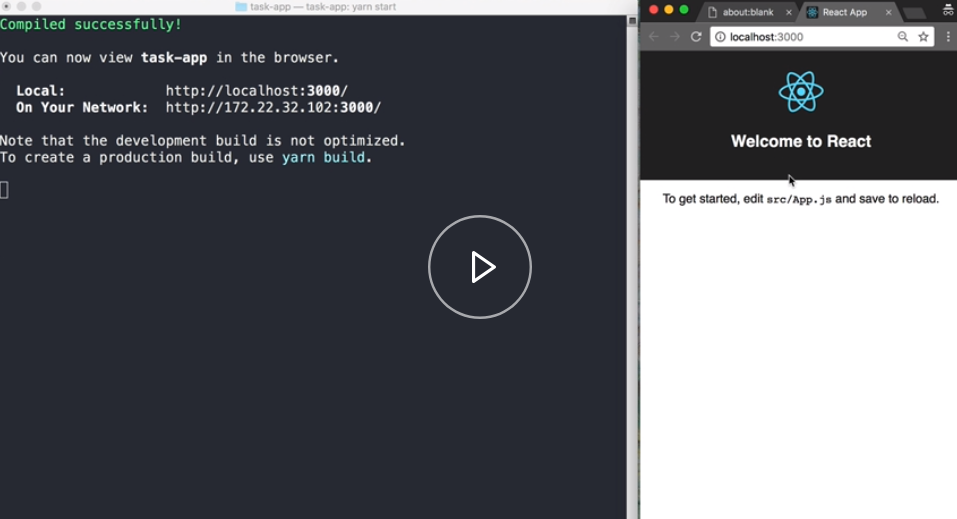
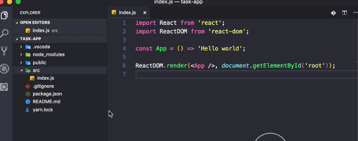

In order to start exploring `react-beautiful-dnd`, we need to set up a React development environment. A simple way to do this is to use the `create-react-app` project, which is available directly through `npm`. By running this command, we'll create a new React application inside of the task app folder.

#### Terminal
```javascript
npx create-react-app task-app
```

Now that the installation has finished, we can move into the `task-app` folder and run `yarn start` to start the development server. We can see over here, on [localhost port 3000](http://localhost:3000), our boilerplate project has started.



Here we have our `index.js` file that was created by `create-react-app`. For now, we're going to strip this back and remove all the things that we're not interested in. 

#### index.js
```javascript
import React from 'react';
import ReactDOM from 'react-dom';

const App = () => 'Hello world';

ReactDOM.render(<App />, document.getElementById('root'));
```

And we'll go over here and we're going to just remove the files that we're not using.



We now have an empty React development environment that we can build on.