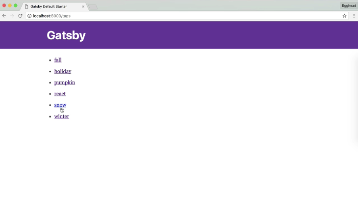

Instructor: [00:00] We have a list of `tags`, but they're not being shown on our `index` page. Let's fix that. 

Inside our `src/templates` directory, we're going to create two new files, one template that lists all of our tags and another template that displays the posts that match a single tag.

#### Terminal
```html
touch all-tags.js tags.js
```

[00:14] We'll bring in `React` and `Link` . We'll destructure `pathContext` from our `props`. We'll pull `tags` out of our `pathContext`. If there are `tags`, we'll `map` over them to create a bullet `li`. Each bullet item will be a `<Link to={`/tags/${tag}`}>`. The link itself will just be the word of the `tag`.

#### all-tags.js
```js
import React from 'react'
import Link from 'gatsby-link'

const AllTags = ({ pathContext }) => {
    const { tags } = pathContext

    if (tags) {
        return (
            <div>
                <ul>
                    {tags.map(tag => {
                        return (
                            <li>
                                <Link to={`/tags/${tag}`}>
                                    {tag}
                                </Link>
                            </li>
                        )
                    })}
                </ul>
            </div>
        )
    }
}
```

[00:30] The tags template will be essentially the same thing. We'll pull `posts` and the `tagName` out of the `pathContext`. If there are `posts` that match the `tag`, we'll display them as a list. We'll display a `header`. For each post, the link will go to the `post.frontmatters.path`. 

#### tags.js
```js
import React from 'react'
import Link from 'gatsby-link'

const Tags = ({ pathContext }) => {
    const { posts, tagName } = pathContext

    if (posts) {
        return (
            <div>
                <span>
                    Post about {tagName}:
                </span>

                <ul>
                    {posts.map(post => {
                        return (
                            <li>
                                <Link to={post.frontmatter.path}>
                                    {post.frontmatter.title}
                                </Link>
                            </li>
                        )
                    })}
                </ul>
            </div>
        )
    }
}
```

We need to update `gatsby-node.js` to actually generate the pages.

[00:47] After we've declared the posts' variable, we'll call a new function that we're going to write called `createTagPage`. We'll pass in the `createPage` action and the `posts`. 

#### gatsby-node.js
```js
createTagPages(createPage, posts)
```

We'll go ahead and write the `createTagPages` function at the top of the file.

[01:01] The first thing we'll do is we'll bring in our tag templates (`tagPageTemplate` and `allTagsTemplate`). We'll also set up an empty object called `postsByTags`. We'll do `posts.forEach` and destructure out each `node`. We're only going to do something if there are tags. Then, for each `tag`, we're going to look and see if it's already in the object. If it's not, we'll add it. Then we'll `.push(node)` into the `tag`.

```js
const createTagPages = (createPage, posts) => {
  const tagPageTemplate = path.resolve(`src/templates/tags.js`)
  const allTagsTemplate = path.resolve(`src/templates/all-tags.js`)

  const postsByTags = {}

  posts.forEach(({node}) => {
    if (node.frontmatter.tags) {
      node.frontmatter.tags.forEach(tag => {
        if (!postsByTags[tag]) {
          postsByTags[tag] = []
        }

        postsByTags[tag].push(node)
      })
    }
  })
```

[01:21] We'll go ahead and create a `tags` variable that will be a list of every tag present in our marked-down blog. 
```js
const tags = Object.keys(postsByTags)
```

We'll call `createPage` to build our index of all the `tags` where the path will be `/tags`. The component will be the `allTagsTemplate`. For `context`, we'll pass a sorted `list` of all of our `tags`.

```js
createPage({
    path: `/tags`,
    component: allTagsTemplate,
    context: {
      tags: tags.sort()
    }
  })
```

[01:38] Now we'll build the individual tag pages. We'll do this with the `tags.forEach`. Our `posts` array will be pulled from the `posts` by `tags`. We'll call `createPage` for each, putting the `tags/${tag name}` as the `path`. The `component` will be the `tagPageTemplate`. For `context`, we'll pass all of the `posts` and the `tagName` for the specific tag.

```js
tags.forEach(tagName => {
    const posts = postsByTags[tagName]

    createPage({
      path: `/tags/${tagName}`,
      component: tagPageTemplate,
      context: {
        posts,
        tagName
      }
    })
  })
}
```

[01:57] This is everything we need to do in the createTagPages function, although I realize that I have a typo down here. This needs to be plural (`createTagPages`). Let's look over this. Our tags template is actually at `tags.js`. These need to be plural -- `postsByTags`, not post.

[02:16] Now that we're processing all of our tags, we need to update our `index` page in order to show the tags. We'll edit `pages/index.js`. Below the `frontmatter` excerpt, we'll set up an `ul` where we'll `map` over `post.frontmatter.tags`. We'll `return` a `li` that will be a `Link to={`tags/${tag}`}>`. The link will be our tag text.

#### pages/index.js
```js
return (
          <div>
            <h2>
              <Link to={frontmatter.path}>
                {frontmatter.title}
              </Link>
            </h2>
            <p>{frontmatter.date}</p>
            <p>{frontmatter.excerpt}</p>
            <ul>
              {post.frontmatter.tags.map(tag => {
                return (
                  <li>
                    <Link to={`/tags/${tag}`}>
                      {tag}
                    </Link>
                  </li>
                )
              })}
            </ul>
          </div>
        )
      })}
    </div>
  )
}
```

[02:37] We'll restart `gatsby develop`. Inside Chrome, it looks like we have a tags list. When we click one, if I navigate to `/tags`, these are all the tags we have in use.


