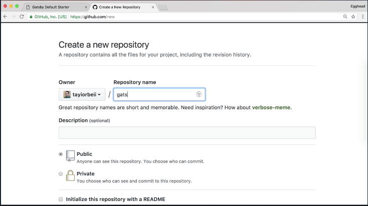
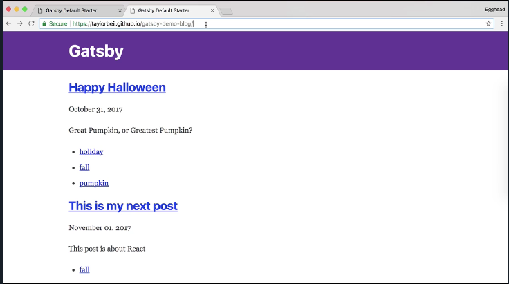

In order to publish our blog, we're going to use the `gh-pages` npm package. 

#### Terminal
```bash
add --dev gh-pages
```

And while that installs, I'm going to create a new repository for the blog. I'm going to call it `gatsby-demo-blog`. 



I'll set up the git repo. And now we're going to add a `deploy` script to `package.json`. The command we're going to use is:

#### package.json
```js
"deploy": "gatsby build --prefix-paths && gh-pages -d public",
```

Inside of `gatsby-config.js`, we have an option for setting a `pathPrefix`. The `pathPrefix` is basically the part that goes in the url after your github.

#### gatsby-config.js
```js
pathPrefix: `/gatsby-demo-blog`
```

Now that that's ready, I can run `yarn deploy`. Give it a minute here, and now I can navigate to my github page (tayiorbeii.github.io/gatsby-demo-blog/) and it's here.



`gatsby-demo-blog` has been published to a subdirectory, but I don't have anything at the root. In order to publish to the root of github pages, I'll create a new repository with my username.github.io. Then, inside the public directory of `my-blog`, do `git init`, add the origin `git remote add origin github.com:tayiorbeii.github.io.git`, `git add .`, `git commit -an "initial publishing"`, `git push origin master`, and then in a minute, it will be published.