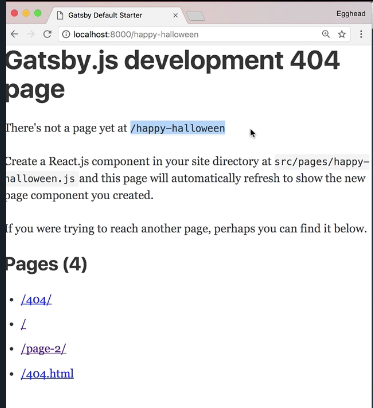
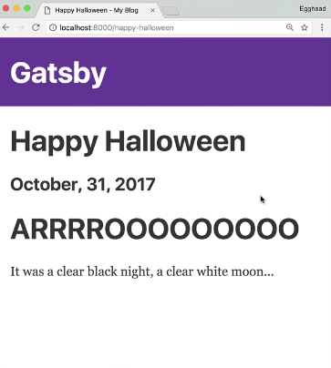

Instructor: [00:00] We've created a blog post template and now when we click one of these, we get a 404 page because our page has not actually been built yet. In order to build our pages, we're going to use Gatsby's createPages Note API.



[00:11] Back in the root of the project, we're going to do a new file called `gatsby-node.js`. Since we need to access our local file system we'll `require('path')`. Gatsby processes every export from `gatsby-node.js`, so we'll write an `export` that takes advantage of the `createPage` action from the `boundActionCreators` and `graphql`. We'll pull out `createPage` from the `boundActionCreators` and we'll bring in our blog post `template`.

#### gatsby-node.js
```js
const path = require('path')

exports.createPages = ({boundActionCreators, graphql }) => {
    const { createPage } = boundActionCreators
    const blogPostTemplate = path.resolve(`src/templates/blog-post.js`)

}
```

[00:36] The `createPages` export returns a promise that we'll start with our `GraphQL` query. Our query starts with `allMarkdownRemark`. Each `node` or `post` will have its generated `HTML` and `ID` and `frontmatter` keys matching what we have at the top of our markdown posts. 

```js
return graphql(`{
    allMarkdownRemark {
        edges {
            node{
                html
                id
                frontmatter {
                    date
                    path
                    title
                    excerpt
                    tags
                }
            }
        }
    }
}`)
```

After the query we'll add a `.then` to actually process the results.

[00:54] If there's `errors` we'll `Promise.reject`. To make this more clear we'll make a `posts` variable from our `allMarkdownRemark.edges`. For each `post` we'll pull out the `node` and use that to call `createPage`. The path'll be the `path` to the blog post and the `component` will be the `blogPostTemplate`.

```js
.then(result => {
    if(result.errors) {
        return Promise.reject(result.errors)
    }

    const posts = result.data.allMarkdownRemark.edges

    posts.forEach(({node}) => {
        createPage({
            path: node.frontmatter.path,
            component: blogPostTemlate
        })
    })
})
```

[01:09] Speaking of which, in the blog post template (`s/t/blog-post.js`), `title` and `date` come from `frontmatter`. 

#### blog-post.js
```js
const { title, date } = frontmatter
```

Now we'll restart `gatsby develop`, reload the page, and there's our posts.


