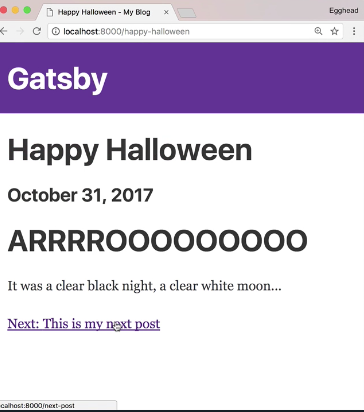

Instructor: [00:00] Gatsby's built all our posts, but in order to navigate between them, I have to go back home and choose a new one. It'd be easier to add next and previous links to each post. We can do this inside of `gatsby-node.js`.

[00:11] First, let's add the `index` to our `forEach` loop. And we'll add the `context` object after the `component`. Let's create a `key` called, `prev`. If it's zero, there is no previous ones, so we'll make it `null`. Otherwise, we'll look for the `node` or `post` at `index-1`.

#### gatsby-node.js
```js
posts.forEach(({node}, index) => {
        createPage({
            path: node.frontmatter.path,
            component: blogPostTemlate,
            context: {
                prev: index === 0 ? null : posts[index - 1].node,
            }
        })
    })
})
```

[00:24] We'll do a similar check for `next`. If the `index` is equal to `posts.length - 1`, that means it's the last one, otherwise it would be the same as above, but with `index + 1`. We need to update our blog post `template` to actually make links.

```js
posts.forEach(({node}, index) => {
        createPage({
            path: node.frontmatter.path,
            component: blogPostTemlate,
            context: {
                prev: index === 0 ? null : posts[index - 1].node,
                next: index === (post.length - 1) ? posts[index + 1].node
            }
        })
    })
})
```

[00:37] When we define our `Template`, we'll also destructure a `pathContext`. We'll destructure `next` and `prev` from the `pathContext`. 

#### blog-post.js
```js
const Template = ({data, location, pathContext}) => {
    const { markdownRemark : post } = data
    const { frontmatter, html } = post
    const { title, date } = frontmatter
    const { next, prev } = pathContext
}
```

Let's add the links below our post. We'll display a `previous` link, if it exists. This is our link from Gatsby `Link`, and our two prop would be `prev.frontmatter.path` and our link will be `prev.frontmatter.title`.

```js
<p>
    {prev && (
        <Link to={prev.frontmatter.path}>
            Previous: {prev.frontmatter.title}
    )}
</p>
```

[00:59] Just to make this simple, we'll do the same thing. We'll just copy and paste it, and just change it to `next`. [laughs] Although, `nextious` doesn't really work. 

```js
<p>
    {next && (
        <Link to={next.frontmatter.path}>
            Next: {next.frontmatter.title}
    )}
</p>
```

I also noticed that, I had an extra comma after the month, so we'll go into deep there from our GraphQL Query. 

Now, we'll restart `gatsby develop`, reload our page, and there we go.


