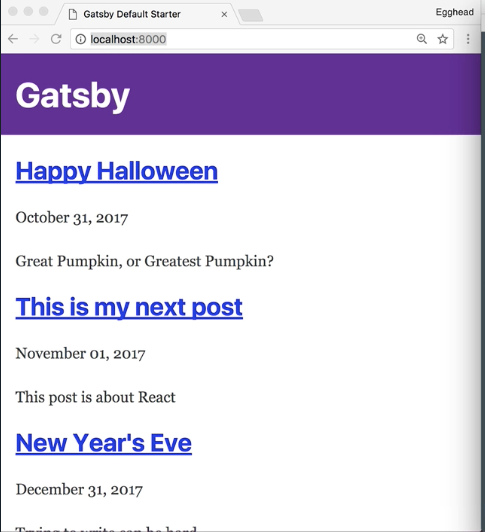

Instructor: [00:00] I'm in the `my-blog` directory, and I've run `gatsby develop`, which is running at `http://localhost:8000`. Inside my `pages` directory, I've got a few blog posts, but it'd be nice to display them on my blog.

[00:13] In order to do that, we're going to add a GraphQL query to `index.js`. `export const query = graphQL`, and then between a couple back ticks, we're going to call our `query Index Query`, so we're querying from all markdown remark. We'll want a `totalCount`, and then we'll set up `edges`, and then we'll add `node`.

#### index.js
```js
export const query = graphql` 
query IndexQuery {
    allMarkdownRemark {
        totalCount
        edges {
            node{

            }
        }
    }
}
```

[00:34] Each `edge` is the file system path to the `node`, which is our post. We'll give it an `id`, and then from the `frontmatter`, we're going to want the `title` and have the `date`, pass it some formatting here, `path`, `tags`, and the `excerpt` we wrote.

```js
export const query = graphql`
query IndexQuery {
    allMarkdownRemark {
        totalCount
        edges {
            node{
                id
                frontmatter {
                    title
                    date(formatString: "MMMM DD, YYYY")
                    path
                    tags
                    excerpt
                }

            }
        }
    }
}
```

[00:48] Now, that we have the GraphQL query written, let's update our component to actually display our data. We'll start by destructuring data into our `IndexPage` component, and I'm going to reformat this so we can have a `return` statement.

[01:00] Now, we'll destructure `edges` and `posts` from `data.allMarkdownRemark`. I'm going to clear out our existing markup, and we're going to map over our posts. We'll do `posts.map`, and then we'll get our post from our `node`, and then we'll destructure our `frontmatter` from our `post`. We'll return a `div` with an `<h2>`, and each `<h2>` will have a `</Link>`.

[01:24] We'll do a `</Link>` to our `frontmatter.path`, and it will be called `frontmatter.title`. Then we'll have our `date` and our `excerpt`, save the file, and all of our posts are showing up.

```js
const IndexPage = ({data}) => {
    const {edges: posts } = data.allMarkdownRemark
    return (
        <div>
        {posts.map(({node: post}) => {
            const { frontmatter } = post

            return (
                <div>
                    <h2>
                        <Link to={frontmatter.path}>
                            {frontmatter.title}
                        </Link>
                    </h2>
                    <p>{frontmatter.date}</p>
                    <p>{frontmatter.excerpt}</p>
                </div>
            )
        })}
        </div>
    )
}
```


