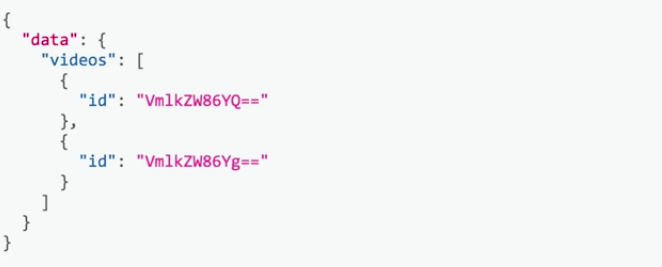
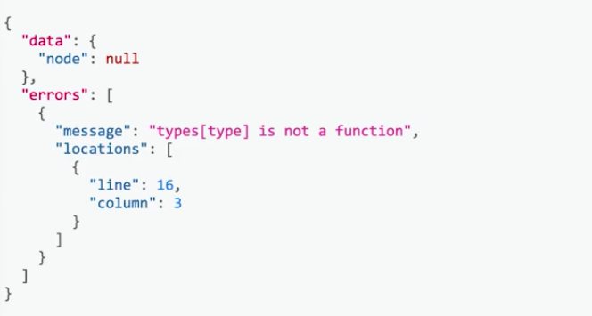
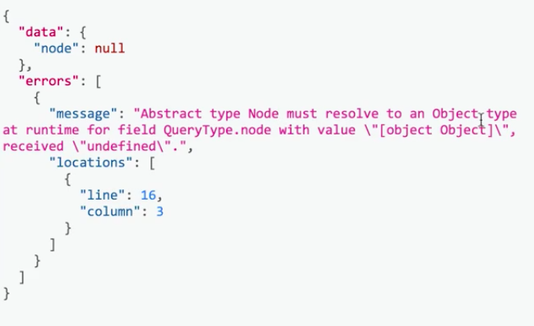
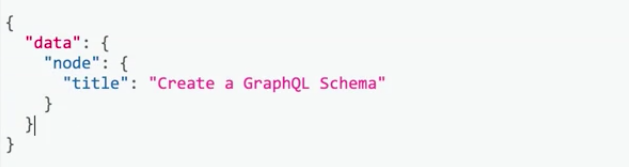

Part of the ways that we can make this `schema` **Relay** compliant is to add a mechanism for refetching any kind of object in our `schema`. In our case, this will be our `videoType`, and we need to be able to refetch any individual video using something called a **Relay Node Interface**

To start off, let's go to our terminal and use `yarn add graphql-relay` to add it to our project. Once that's done, we'll go into `src/node.js`, and update how we're currently defining our `nodeInterface`.

The first thing that we'll need to do is actually change our imports here, instead of importing from `GraphQL`, we're going to be requiring some things from `graphql-relay`. These fields specifically are `nodeDefinitions`, and then `fromGlobalId`.

**src/node.js**
```javascript
const {
  nodeDefinitions,
  fromGlobalId,
} = require('graphql-relay');
```

When we use `nodeDefinitions`, we'll actually be able to get both a `nodeInterface`, like we have defined below, as well as a `nodeField` that will add to our `queryType`, all from using the `nodeDefinitions` function.

**src/node.js**
```javascript
const {nodeInterface, nodeField} = nodeDefinitions();
```

What this function takes in are two methods. The first one is going to be given a `globalId`, and from that ID, we should be able to resolve any kind of ID to an individual object.

**src/node.js**
```javascript
const {nodeInterface, nodeField} = nodeDefinitions(
  (globalId) => {

  },
);
```

The second one takes in an `object` and tells the `nodeDefinitions` function what kind of type this `object` is. We'll need to implement both of them for this interface and `nodeField` to work as expected.

**src/node.js**
```javascript
const { nodeInterface, nodeField } = nodeDefinitions(
  (globalId) => {
  },
  (object) => {
  },
);
```

On this first method, what we can do is use the `fromGlobalId` method to get the `type` and the `id` from any given `globalId`. The intent here is to be able to have some kind of function, such as `getObjectById`, that you can give a `type` and an `id` and it will actually resolve the individual object.

**src/node.js**
```javascript
const { nodeInterface, nodeField } = nodeDefinitions(
  (globalId) => {
    const { type, id } = fromGlobalId(globalId);
    return getObjectById(type, id);
  },
  (object) => {
  },
);
```

We don't have this method yet, let's go and actually import something called `getObjectById`. We'll require this from our `data` directory.

**src/node.js**
```javascript
const { getObjectById } = require('./data');
```

Now, let's go into our `src/data/index.js` file and actually implement this method. We'll do `const getObjectById`, and this function takes in the `type` and the `id`.

What we can do inside of this function is create a `types` map, and we can say that the `video` maps to `getVideoById`. Then, our `return` statement can literally be `types` of `type`, which in this case, will point to `getVideoById`. Then, we'll pass in the `id` to that method.

**src/data/index.js**
```javascript
const getObjectById = (type, id) => {
  const types = {
    video: getVideoById,
  };

  return types[type](id);
};
```

We'll export this function now, we'll do `exports.getObjectById = getObjectById`. We have a proper implementation of this `getObjectById` method that this first part of `nodeDefinitions` needs.

This second method that's a part of `nodeDefinitions` is a way to tell, given an `object`, what its type is. This is very similar to `resolveType` over here, we'll actually go and copy and paste that implementation here. If the `object` has a `title`, we'll `return` that `videoType`, otherwise, we don't know what type we're working with, we'll `return null`.

**src/node.js**
```javascript
const { nodeInterface, nodeField } = nodeDefinitions(
  (globalId) => {
    const { type, id } = fromGlobalId(globalId); 

    return getObjectById(type, id);
  },
  (object) => {
    if (object.title) {
      return videoType;
    }

    return null;
  },
);
```

Last step is just deleting our old interface here and changing our exports. We'll do `exports.nodeInterface = nodeInterface`. We'll also do `exports.nodeField = nodeField;`, as well, so we can use that inside of our `queryType`.

**src/node.js**
```javascript
// REMOVED
const nodeInterface = new GraphQLInterfaceType({
  name: 'Node',
  fields: {
    id: {
      type: new GraphQLNonNull(GraphQLID),
    },
  },
  resolveType: (object) => {
    if (object.title) {
      return videoType;
    }

    return null;
  },
});
```

Let's switch on back to our `index.js` file, and add in an import for a method called `globalId` field. We'll require this from `graphql-relay`. We'll also change the require statement from our `nodeInterface` definition to destructure and to `nodeInterface`, as well as `nodeField`.

**index.js**
```javascript
const { globalIdField } = require('graphql-relay');
const { nodeInterface, nodeField } = require('./src/node');
```

Our next step is to update our `videoType`, and so instead of our `id` field having this implementation, all we need to do is say `id`, and then in `globalIdField`, and we'll just invoke that method and get rid of our old `id`. The interface definition actually stays the same, since that relay `nodeDefinitions` helper also gives us that `nodeInterface`.

**index.js** 
```javascript
const videoType = new GraphQLObjectType({
  name: 'Video',
  description: 'A video on Egghead.io',
  fields: {
  id: globalIdField(),
  // vvv REMOVED vvv
    id: {
      type: GraphQLID,
      description: 'The id of the video',
    },
  // ^^^ REMOVED ^^^ 
    ...
  ...
});
```

Our last step is to actually update our `queryType`. Now, we'll also add a field called `node` and this is just going to be the `nodeField` that we required up above.

**index.js**
```javascript
const queryType = new GraphQLObject({
  name: 'QueryType',
  description: 'The root query type.',
  fields: {
    node: nodeField,
    ...
  ...
});
```

Let's go and check out these updates in `GraphiQL`. We'll run our server using `$ node index.js`, and inside of `GraphiQL`, we can run a query for all of our videos and we'll get their ID.

**GraphiQL Input**
```javascript
{
  videos {
    id
  }
}
```

When we run our query, we can see that the `globalId` field is actually generating these base 64 encoded IDs that are combining the `type` and the `id` information for each individual video.



We also have a new field that we can query on called `node`, which is given to us from the `nodeField`, and we pass in an `id`.

**GraphiQL Input**
```javascript
{
  node(id: "VmlkZW86YQ==")
}
```

We can grab one of these IDs here. The idea is that we should be able to query for this `node` and refetch any given `id`. We can use a fragment `on Video` and try and get the `title` of this.

**GraphiQL Input**
```javascript
{
  node(id: "VmlkZW86YQ==") {
    ... on Video {
      title
    }
  }
}
```

If we run this query, though, we'll actually run into an error here where we're saying `types[type] is not a function`.



Let's go and investigate this inside of our editor. Here, we're just inside of that `node.js` file and we'll log out the `type` and the `id`.

We'll go and restart our server once again, run the same exact query, and we'll see that what's logged out is `Video` with a capital V and then the `id` is `a`.


To fix this, we'll just need to do `type.toLowerCase`.

**src/node.js**
```javascript
const { nodeInterface, nodeField } = nodeDefinitions(
  (globalId) => {
    const { type, id } = fromGlobalId(globalId); 
    
    return getObjectById(type.toLowerCase, id);
  },
  ...
);
```


When we rerun our server and run the query, we'll see that we get another error that's talking about how our abstract type node has to resolve to some kind of object type.



Let's go and investigate this error. Looking into our second method here, it's trying to determine the type. Let's actually log out what `videoType` is when this function is executed.

**src/node.js**
```javascript
const { nodeInterface, nodeField } = nodeDefinitions(
  ...
  (object) => {
    console.log(videoType);
    if (object.title) {
      return videoType;
    }

    return null;
  },
);
```

We'll restart our server, run our query one more time, and we'll see that the `videoType` is actually `undefined`.

We can fix this issue by just requiring our `videoType` inside of here. We'll require, from the `index.js` file up above, and get rid of this import. 

**src/node.js**
```javascript
const { nodeInterface, nodeField } = nodeDefinitions(
  ...
  (object) => {
    const { videoType } = require('../');
    if (object.title) {
      return videoType;
    }

    return null;
  },
);
```

**src/node.js**
```javascript
const {
  nodeDefinitions,
  fromGlobalId,
} = require('graphql-relay');
// vvv REMOVED vvv
const { videoType } = require('../');
// ^^^ REMOVED ^^^ 
const { getObjectById } = require('./data');
```

When we save our file, rerun our server and execute the query. We get our result, and we're good to go.

