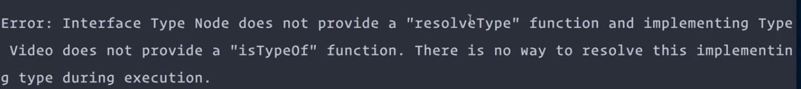
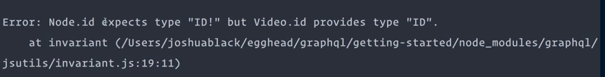

Currently in our GraphQL schema, we have a `videoType`. This `videoType` has a field called `id`. This field is of type `GraphQLID` and it's interesting, because if we were to add another type to our GraphQL schema, such as an instructor type, we might also want that instructor type to have the same field.

When we want to describe a set of possible fields that a type could have, we would use something called a `GraphQLInterfaceType`. To create this interface, let's go and create a `Node.js` file inside of `src/node.js`.

Next, we'll open that file and start importing a couple of things. First, we'll make sure to grab a `GraphQLInterfaceType` since we are creating an interface.

**src/node.js**
```javascript
'use strict';

const {
  GraphQLInterfaceType,
}
```

We'll also grab `GraphQLNonNull` and `GraphQLID` to describe the `id` field on this interface. Then, we'll just `require` all of these from the GraphQL package.

**src/node.js**
```javascript
'use strict';

const {
  GraphQLInterfaceType,
  GraphQLNonNull,
  GraphQLID
} = require('graphql');
```

Next up, we'll define our actual interface, which we're calling `nodeInterface` and this is just a `new GraphQLInterfaceType`. Inside of the constructor, we can give it a `name`, in this case `'Node'`.

**src/node.js**
```javascript
const nodeInterface = new GraphQLInterfaceType({
  name: 'Node',
});
```

Then, we'll also describe all of the `fields` that are available on types that use this interface, in this case, we will define `id`. The type of this `id` will be a new `GraphQLNonNull(GraphQLID),`. The last thing that we're going to do is just export our interface using `module.exports`, and then passing in `nodeInterface`.

**src/node.js**
```javascript
const nodeInterface = new GraphQLInterfaceType({
  name: 'Node',
  fields: {
    id: {
      type: new GraphQLNonNull(GraphQLID),
    },
  },
});

module.exports = nodeInterface;
```

Now, we can switch back into our `index.js` file and `import` this `nodeInterface` at the bottom of our definitions here. We'll do, `const nodeInterface = require(...)` and then, we'll pass in `./src/node`.

**index.js**
```javascript
const nodeInterface = require('./src/node');
```

Now, we can go find our `videoType` which is down here, and we can add in our `interfaces` at the bottom of the definition here. We'll say `interfaces` and pass in an array.

We'll just add in that `nodeInterface` as the first part of that array of `interfaces`. The goal for this interface is to be able to use it anytime we have shared fields between types.

**index.js**
```javascript
const videoType = new GraphQLObjectType({
  name: 'Video',
  description: 'A video on Egghead.io',
  fields: {
    id: {
      type: GraphQLID,
      description: 'The id of the video',
    },
    title: {
      type: GraphQLString,
      description: 'The title of the video.',
    },
    duration: {
      type: GraphQLInt,
      description: 'The duration of the video (in seconds).',
    },
    released: {
      type: GraphQLBoolean,
      description: 'Whether or not the video has been released.',
    },
  },
  interfaces: [nodeInterface];
});
```

Say, we were defining an `instructorType` which would be a new `GraphQLObjectType`. Then inside of here, we knew that the `fields` for this would also contain this `id` field, as well.

Since we're sharing these fields, we would also add the `interfaces` array once again and pass in the `nodeInterface` as the first element of that array.

**index.js**
```javascript
const instructorType = newGraphQLObjectType({
  fields: {
    id: {
      type: GraphQLID,
      description: 'The id of the video',
    },
  },
  interfaces: [nodeInterface];
});
```

This is guaranteeing that these two types that share the same `fields` now have a common interface that they both implement. Let's get rid of this instructor type, since we are not actually using it and try and run our current server using `$ node index.js`.

What we get is actually an error, because our   `Interface Type Node` doesn't actually provide a way for that interface to know what type it's working with when we're trying to resolve that field.



Let's go and fix this error by switching back into our text editor of choice, and then going to `src/node.js`. Inside of here, we're going to add a method called `resolveType`. This is going to be a function that takes in an object.

What we're going to do is check to see if this object has a `title`, then we're going to `return videoType`. We'll import that in a second, otherwise, we don't know what `type` it is, we'll just `return null`.

**src/node.js**
```javascript
const nodeInterface = new GraphQLInterfaceType({
  name: 'Node',
  fields: {
    id: {
      type: new GraphQLNonNull(GraphQLID),
    },
  },
  resolveType: (object) => {
    if (object.title) {
      return videoType;
    }

    return null;
  },
});
```

To get this `videoType`, we need to make sure that we're exporting it. Inside of `index.js` at the end of our `videoType` definition, and it's going to do `exports.videoType = videoType;`.

Then, we'll switch back into `node.js` and import at the top. `const videoType` is going to be equal to `require`, and then, we'll just put in the path to the `index.js` file.

**src/node.js**
```javascript
const { videoType } = require('../');
```

Now that we've imported our `videoType` and we've made sure to add a `resolveType` method, let's go and try to rerun our server to see if there's any more issues.

We'll do `$ node index.js`. We see that we have a new error here, but here, we're just saying that `node.id` is expecting the non-null `GraphQLID` type, but what we're putting in the `videoType` right now is just a `GraphQLID`. This is just saying that our given `videoType` is not actually following the interface that it is implementing.



To fix this, let's hop back into our `index.js` file and instead of saying that the `videoType` has a field that just has a `type` for `GraphQLID`. We're going to say, `new GraphQLNonNull(...)` to make sure that it matches our interface. We'll pass in `GraphQLID`.

**index.js**
```javascript
id: {
  type: new GraphQLNonNull(GraphQLID),
  description: 'The id of the video.',
},
```

Now with this new type definition, let's go back to our server and try and run it. It looks like we're good to go.