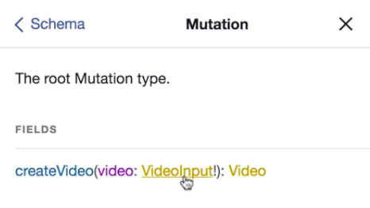
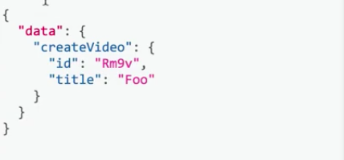

Instead of having this `mutation` field where each of the arguments correspond to some field that we want to create, we can use something called an **input type** to capture all of these arguments in a single object type and be able to query for these more complex related types.

What we can do is get rid of all of these arguments and replace them with a single one called `video` and the type of this will be a `new GraphQLNonNull` and we'll call the argument here a `videoInputType`.

**index.js**
```javascript
const mutation = new GraphQLObjectType({
  name: 'Mutation',
  description: 'The root Mutation type.'
  fields: {
    createVideo: {
      type: videoType,
      // vvv REMOVED vvv
        title: {
          type: new GraphQLNonNull(GraphQLString),
          description: 'The title of the video.',
        },
        duration: {
          type: new GraphQLNonNull(GraphQLString),
          description: 'The duration of the video (in seconds).',
        },
        released: {
          type: new GraphQLNonNull(GraphQLString),
          description: 'Whether or not the video is released.',
        },
      // ^^^ REMOVED ^^^ 

      },
      resolve: (_, args) => {
        return createVideo(args);
      },
    },
  },
});
```

**index.js**
```javascript
const mutation = new GraphQLObjectType({
  name: 'Mutation',
  description: 'The root Mutation type.'
  fields: {
    createVideo: {
      type: videoType,
      args: {
        video: {
          type: new GraphQLNonNull(videoInputType),
        },
      },
      resolve: (_, args) => {
        return createVideo(args);
      },
    },
  },
});
```
This type is going to be built off of something called a `GraphQLInputObjectType`. I'll say `const videoInputType` is going to be equal to a new `GraphQLInputObjectType`. We'll make sure to `import` that at the top of our file. We'll do `GraphQLInputObjectType`, then we'll go back to our definition here and the name is going to be `
'VideoInput'`.

**index.js**
```javascript
const videoInputType = new GraphQLInputObjectType({
  name: 'VideoInput',
});
```

Then we have some `fields` that we want to put in there as well. In this case the `fields` are just going match exactly what we had before, as arguments inside of that mutation field.

**index.js**
```javascript
const videoInputType = new GraphQLInputObjectType({
  name: 'VideoInput',
  fields: {
    title: {
          type: new GraphQLNonNull(GraphQLString),
          description: 'The title of the video.',
        },
    duration: {
      type: new GraphQLNonNull(GraphQLString),
      description: 'The duration of the video (in seconds).',
    },
    released: {
      type: new GraphQLNonNull(GraphQLString),
      description: 'Whether or not the video is released.',
    },
  },
});
```

Now that we have our `videoInput` type defined and we're using that as our argument type inside of `createVideo`, and we've updated our `resolve` statement now to say `args.video`, instead of just `args`, since `video` here will be the object representing all of the fields that we're interested in, let's go and actually try this out in GraphiQL.

**index.js**
```javascript
const mutation = new GraphQLObjectType({
  ...
  fields: {
    createVideo: {
      type: videoType,
      args: {...},
      resolve: (_, args) => {
        return createVideo(args.video);
      },
    },
  },
});
```

Let's go and run our server using `$ node index.js`. Inside of our `GraphiQL` editor we'll just refresh it really quick. Inside of our docs and inside of `mutation`, we can see that `createVideo` now has that `VideoInput` as the `input` arguments for the `mutation`.



To actually write out this `mutation` we would say `mutation`, give it some kind of name -- in this case it's `M`. We'll have `createVideo`, which takes in a `video`. What this will look like is we'll have a `title` once again, so we'll say `"Foo"`, `duration: 300`.

We'll also have `release`, which will be `false`. Then we'll have these curly braces at the end and we'll just query for the `id` and the `title`.

**GraphiQL Input**
```javascript
mutation M {
  createVideo(video: {
    title: "Foo",
    duration: 
  })
}
```

We'll run our mutation and there we go.

