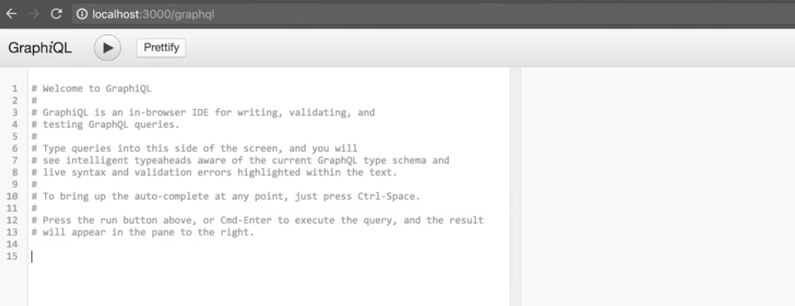
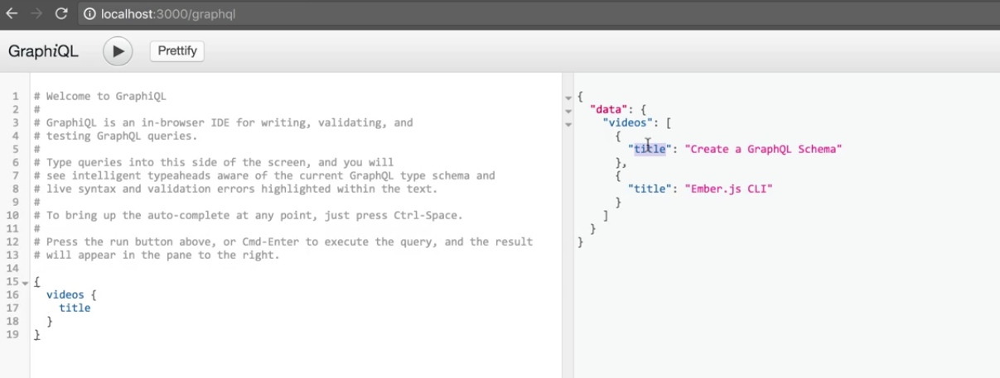

Instead of building out our GraphQL `schema` using this `buildSchema` utility function, and then executing queries against that `schema` using the `graphql()` utility function, it's actually very common to serve up our `schema` as this middleware in some kind of web framework or library like **Connect** or **Express**.

Let's actually go and hop into our Terminal and use **yarn** to add two dependencies. The first one will be `express`, but the second one's going to be a package called `express-graphql`, which will actually enable us to serve up our GraphQL `schema` as a middleware in `Express`.

**Terminal Input**
```bash
yarn add express express-graphql
```

Now that those are installed, let's go and hop into our editor and require `express`. We'll also require our `graphqlHTTP` server, by requiring `express-graphql`.

**index.js**
```javascript
const express = require('express');
const graphqlHTTP = require('express-graphql');
```

We can now go and define our `PORT` variable, which is by listening in on `process.env.PORT`, defaulting to `3000`. We'll also set up our server by calling the `express` function.

**index.js**
```javascript
PORT = process.env.PORT || 3000;
const server
```

Then, down here, we'll actually go and get rid of the `graphql` utility function and we'll say `server.use()`, and we'll mount it on the `'/graphql'` endpoint. Then we'll pass in the `graphqlHTTP` middleware function, and we'll pass in the configuration object.

**index.js**
```javascript
server.use('/graphql', graphqlHTTP({

});
);
```

This **configuration object** takes in a variety of options, but in our case, we're only going to worry about two. The first one is `schema`, which will correspond to the `schema` that we're constructing above. The second option is for using a tool called **GraphiQL**. `graphiql` is just a visual editor, or a visual IDE, for dealing with GraphQL schemas, and we'll explore that in a second.

**index.js**
```javascript
server.use('/graphql', graphqlHTTP({
  schema,
  graphiql: true,
}));
```

Let's go in and clean up a little bit of the code that we don't need above, which will just be this `query` variable.

**index.js**
```javascript
// vvv REMOVED vvv
const query = '
query myFirstQuery {
  videos {
    id,
    title,
    duration,
    watched
  }
}
';
// ^^^ REMOVED ^^^
```

Then finally we're going to tell our `server` what port to `listen` to and we'll give it a callback function. Inside of this function, we're just going to say that we're listening on `http://localhost` and then our given `port`.

**index.js**
```javascript
server.listen(PORT, () => {
  console.log('Listening on http://localhost:${PORT}');
})
```

Now that we have this set up, we can actually go into our terminal and do `$ node index.js`, which will bootstrap our server. Let me exit out of full screen here, and bring in our browser window.

Now what we can do is actually visit `http://localhost:3000/graphql` which is what our middleware is hosted on. We'll get an in browser view of the tool called `GraphiQL`, which will actually enable us to query our GraphQL schema.



However, if we try and write a query here, like requesting all of the titles from our videos, we actually have our field `videos` being returned with a value `null`, which means that GraphQL in this case couldn't actually resolve our query.


We can fix this pretty easily by hopping back into our editor and adding a third option to our `graphqlHTTP` config object. Here we'll pass in `rootValue` similar to what we did when we were using the `graphiql` utility, and we'll just pass in our `resolvers` object that we've defined up above that actually defines how to fetch some of these fields.

**index.js**
```javascript
server.use('/graphql', graphqlHTTP({
  schema,
  graphiql: true,
  rootValue: resolvers,
}));
```

Now let's go into the tab that we have our node process running in and quit it out and make sure that we've actually saved our `index.js` file and we can restart our node process by writing `$ node index.js`. Now when we go to our `Chrome` window, and run our query one more time, we actually get the result we expect where we get a collection of videos and we get the title of each one.

