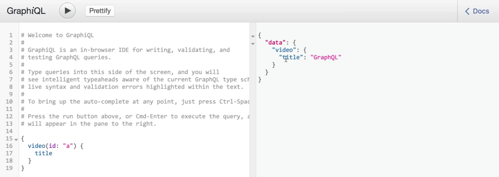
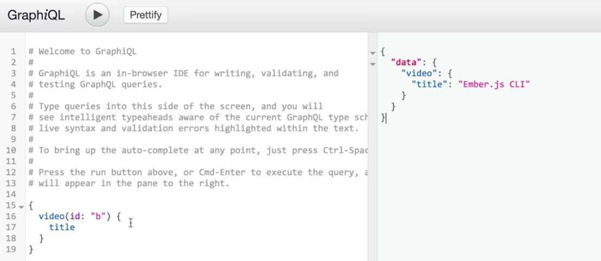

Right now, we have this `GraphQLSchema` that's being defined by a single `QueryType`, and inside of this `QueryType`, we have a single field called `video`, but we're resolving this field with a single object in a `resolve` statement.

**index.js**
```javascript
const queryType = new GraphQLObject({
  name: 'QueryType',
  description: 'The root query type.',
  fields: {
    video: {
      type: videoType,
      resolve: () => new Promise((resolve) => {
        resolve({
          id: 'a',
          title: 'GraphQL',
          duration: 180,
          watched: false
        });
      }),
    },
  },
});
```

While this is great for our examples, it's way more likely that we'll have a collection of videos like we have defined down here. Then when we're querying for a specific video, we want to get that video by its `id`.

In GraphQL, we're actually able to pass arguments to fields by using the `args` **key**. Inside of the `args`, we give it the name of the argument, which in this case would be `id`, its `type`, which would be `GraphQLID`, and then a `description`, which in this case would be `The id of the video.`

**index.js**
```javascript
const queryType = new GraphQLObject({
  name: 'QueryType',
  description: 'The root query type.',
  fields: {
    video: {
      type: videoType,
      args: {
        id: {
          type: GraphQLID,
          description: 'The id of the video',
        },
      },
      resolve: () => new Promise(...),
    },
  },
});
```

Now, when we go and run our server using `$ node index.js` and we actually go and query for that `video` field, we can see that we can add an argument right after the term `video`. The argument that we can pass in is `id` and we'll pass in the `id` of the `video` that we would want.



When we execute that, we still get the same video. Let's actually go and plug in some more diverse data to demonstrate how we could query by `id` and resolve that in our resolve statement.

Let's hop back into our terminal and actually create a new directory. Now, we're going to have one called `src/data` and we'll just add a file inside of there called `index.js`.

Next up, we'll go and grab all of the video information that we have in this file, and we'll cut and paste it inside of that `data/index.js` file
.

**data/index.js**
```javascript
const videoA = {
  id: 'a', 
  title: 'Create a GraphQL Schema',
  duration: 120,
  watched: true,
};
const videoB = {
  id: 'b', 
  title: 'Ember.js CLI',
  duration: 240, 
  watched: false,
};
const videos = [videoA, videoB];
```

Finally, let's add a helper function called `getVideoByID`. This is going to be a function that takes an `id` and will return a `new Promise`.

**data/index.js**
```javascript
const getVideoById = (id) => new Promise((resolve) => { 
});
```

To implement this, we're going to go through and get the `video` after filtering through all the videos. For each `video`, what we're going to do is check to see if the current `video.id` matches the given `id`. At the end, we'll just `resolve` with the video.

**data/index.js**
```javascript
const getVideoById = (id) => new Promise((resolve) => { 
  const [video] = videos.filter((video) => {
    return video.id === id;
  });

  resolve(video);
});
```

Finally, let's go and use `exports.getVideoByID` to export our function. 

**data/index.js**
```javascript
exports.getVideoById = getVideoById;
```

Then inside of our `index.js` file, let's go to the top and do `const { getVideoById } = require('./src/data');`

Now that we have this request to help simulate fetching a video, let's go and update our `resolve` statement. Now, instead of resolving with a static object, instead, what we can do is write out our `resolve` as a function.

The first argument we don't care about, but the second one will contain all of the arguments that are being passed in to our `resolve` statement for our field.

We can use that inside of our function by doing `return getVideoByID`, which will return a promise. Then, we'll pass in the `args.id`, which will be the specific `id` for the video that we want.

**index.js**
```javascript
const queryType = new GraphQLObject({
  name: 'QueryType',
  description: 'The root query type.',
  fields: {
    video: {
      type: videoType,
      args: {...},
      resolve: (_, args) => {
        return getVideoById(args.id);
      }
    },
  },
});
```

Now, let's go into our command line and just restart our server by doing `$ node index.js` and then switching to our Chrome window and run the same request one more time.

Now, we get a video for the `id: 'a'`. We can change it to the `id: 'b'` and make the same kind of request, and we'll get the other video. Now, we're fetching our videos by the given `id`.

