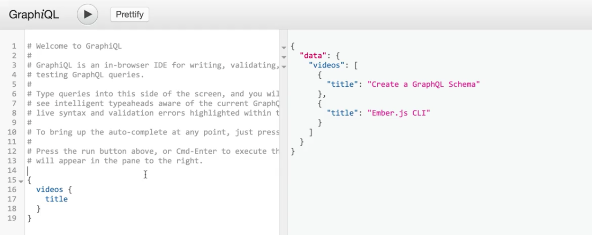

On our `queryType`, we have exposed a single field for video, which will just retrieve a single `video`. Like in our previous schema, we may want to retrieve all of the videos available to us. Let's go ahead and add another field called `videos` that is built off of a **GraphQL list**.

To start off, let's actually go into our `data` folder inside of `index.js`. Let's add another helper called `getVideos`, which is going to be a function that returns a `Promise`. What this promise is going to return is all of our videos.

**data/index.js**
```javascript
const getVideos = () => new Promise((resolve) => resolve(videos));
```

Next, we'll add it to our exports by doing `exports.getVideos = getVideos;`. Then, we'll switch back to our `index.js` file and make sure that we're importing it along with the other helper. I'll do `getVideoById`, and then also, `getVideos`.

**index.js**
```javascript
const { getVideoById, getVideo } = require('./src/data');
```

Finally, what we need to also include is the `GraphQLList` type from the GraphQL package. What we can do is use that inside of our field definition inside of our `queryType`. Now to add the `videos` field, all we need to do is write out `videos`.

For its type, we'll say it's a new `GraphQLList` of the `video` type, we know that it's a collection of videos. Then for the `resolve` statement, we can return `getVideos` or just shorten this to `getVideos`, which will be executed whenever we're trying to resolve all of our videos.

**index.js**
```javascript
const queryType = new GraphQLObject({
  name: 'QueryType',
  description: 'The root query type.',
  fields: {
    videos: {
      type: new GraphQLList(videoType),
      resolve: getVideos;
    },
    video: {
      type: videoType,
      args: {
        id: {
          type: new GraphQLNonNull(GraphQLID),
          description: 'The id of the video',
        },
      },
      resolve: () => new Promise(...),
    },
  },
});
```

Now, we can go and test this out by running our server. By doing `$ node index.js`, we can switch over into our `GraphiQL` editor. Now instead of querying for videos like before, we can query for videos. Then on `videos`, we can ask for the `title` and execute it.

