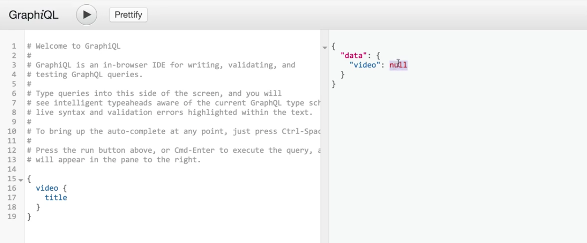
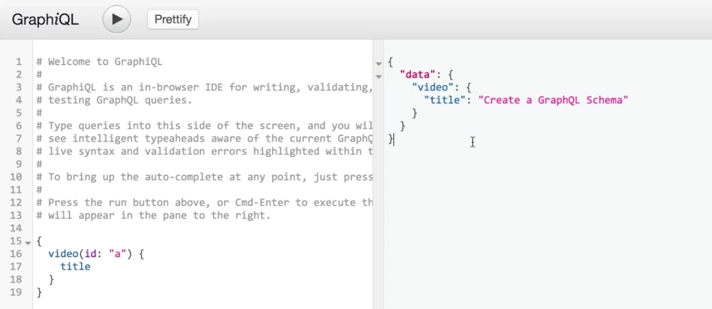

For the `queryType` in our schema, we've defined some arguments. In this case, we have that single argument called `id` that'll help us look up this video by an ID.

**index.js**
```javascript
const queryType = new GraphQLObject({
  name: 'QueryType',
  description: 'The root query type.',
  fields: {
    video: {
      type: videoType,
      args: {
        id: {
          type: GraphQLID,
          description: 'The id of the video',
        },
      },
      resolve: () => new Promise(...),
    },
  },
});
```

But if we go and run this server using `$ node index.js`. Then, go into our **GraphiQL** editor and get rid of the argument here and run the query, we'll actually get `null` as a response, because we're unable to fetch a given video for a given `id` without the person querying giving that `id` to us.



In order to make this `id` argument required, we can use a part of GraphQL known as a `GraphQLNonNull` type.

To use that type, we'll go back into our editor and add in `GraphQLNonNul` as another part of our `import` from the GraphQL package, then we'll go to our `query` field, specifically the `video`. Instead of the type being `GraphQLID`, we'll say it is new `GraphQLNonNull`. We'll pass in a `GraphQLID` as the argument.

**index.js**
```javascript
const queryType = new GraphQLObject({
  name: 'QueryType',
  description: 'The root query type.',
  fields: {
    video: {
      type: videoType,
      args: {
        id: {
          type: new GraphQLNonNull(GraphQLID),
          description: 'The id of the video',
        },
      },
      resolve: () => new Promise(...),
    },
  },
});
```

Now, if we go and restart our server using `$ node index.js` and head on over into our GraphQL tool and run that same kind of query again without the arguments and I'll get an error from GraphQL telling us that the `"Field \"video\" argument \"id\" of the given type \"ID!\" is required but not provided."`.

What this specific type signature is saying is that instead of being explicitly just a `GraphQLID`, we know that it is a `GraphQLID` that is non-null. In this case, when we're using it as an argument, it's a required field in order for us to resolve the query.

Now, if we go back to our query and add in `id: 'a'` and we run our query once more, we'll get back the expected result.

