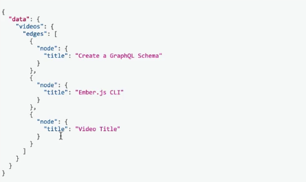

In our existing schema we have this route `mutationType` and it has a single field called `createVideo` that has a video type. It takes in some arguments and then resolves with a `createVideo` method.

**index.js**
```javascript
const mutationType = new GraphQLObjectType({
  name: 'Mutation',
  description: 'The root Mutation type.',
  fields: {
    createVideo: {
      type: videoType,
      args: {
        video: {
          type: new GraphQLNonNull(videoInputType), 
        },
      },
      resolve: (_, args) => {
        return createVideo(args.video);
      },
    },
  },
});
```

While this worked in previous examples, in **Relay** there's a common pattern for mutations where they exist on the root field. The input for each mutation is a single argument called `input`. There are some other technical requirements as well to make mutations a little bit more predictable.

We can update this existing `'Mutation'` field to be `Relay` compliant by first grabbing a function from `graphql-relay`. In this case we're going to get `mutationWithClientMutationId,`.

Next up let's actually go and define our `videoMutation`. I'll hop back down to the end of the file and go right above our `mutationType`. Here we'll say `const videoMutation`. It's going to be equal to calling `mutationWithClientMutationId` and then passing in an object.

**index.js**
```javascript
const videoMutation = mutationWithClientMutationId({
  
});
```

This object takes in a couple of fields, namely `name`, which in this case will be `'AddVideo'`. It'll also take in `inputFields` as an object, `outputFields` as an object, then finally a method called mutate, and GetPayload, which is going to be a method that takes in some arguments. In our case we're going to return a promise.

**index.js**
```javascript
const videoMutation = mutationWithClientMutationId({
  name: 'AddVideo',
  inputFields: {
  },
  outputFields: {
  },
  mutateAndGetPayload: (args) => new Promise((resolve, reject) => {
  }),
});
```


`inputFields` in this case will describe what fields are defined on our input object type, and so we can just grab the fields that we were defining on our `'VideoInput'` type. We'll grab all of these and then we can just put them inside of the `inputFields` here. We'll go and delete the `'VideoInput'` type.

**index.js**
```javascript
const videoMutation = mutationWithClientMutationId({
  name: 'AddVideo',
  inputFields: {
    title: {
      type: new GraphQLNonNull(GraphQLString),
      description: 'The title of the video.',
    },
    duration: {
      type: new GraphQLNonNull(GraphQLString),
      description: 'The duration of the video (in seconds).',
    },
    released: {
      type: new GraphQLNonNull(GraphQLString),
      description: 'Whether or not the video is released.',
    },
  },
  outputFields: {
  },
  mutateAndGetPayload: (args) => new Promise((resolve, reject) => {
  }),
});
```

**index.js**
```javascript
// vvv REMOVED vvv
const videoInputType = new GraphQLInputObjectType({
  name: 'VideoInput',
  fields: {...},
});
// ^^^ REMOVED ^^^
```

`outputFields` in this case will correspond to what we can actually query on after the mutation. In this case we'll just write out `video` and the `video` field will have a type of `videoType`. We can actually query on the created video after our mutation.

**index.js**
```javascript
const videoMutation = mutationWithClientMutationId({
  name: 'AddVideo',
  inputFields: {
    title: {
      type: new GraphQLNonNull(GraphQLString),
      description: 'The title of the video.',
    },
    duration: {
      type: new GraphQLNonNull(GraphQLString),
      description: 'The duration of the video (in seconds).',
    },
    released: {
      type: new GraphQLNonNull(GraphQLString),
      description: 'Whether or not the video is released.',
    },
  },
  outputFields: {
    video: {
      type: videoType,
    },
  },
  mutateAndGetPayload: (args) => new Promise((resolve, reject) => {
  }),
});
```

The last part here is to fill out `mutateAndGetPayload`. Here the arguments being passed in will just correspond to whatever our `inputFields` are. In this case we can just do `Promise.resolve` and we can call our `createVideo` method and pass in the `args`.

And `.then` when we are done we'll get a single video and what we can do is `resolve` and we'll pass in an object. One of the fields will be `video` on there. If we have any kind of errors we'll just `reject`.

**index.js**
```javascript
const videoMutation = mutationWithClientMutationId({
  name: 'AddVideo',
  inputFields: {
    title: {
      type: new GraphQLNonNull(GraphQLString),
      description: 'The title of the video.',
    },
    duration: {
      type: new GraphQLNonNull(GraphQLString),
      description: 'The duration of the video (in seconds).',
    },
    released: {
      type: new GraphQLNonNull(GraphQLString),
      description: 'Whether or not the video is released.',
    },
  },
  outputFields: {
    video: {
      type: videoType,
    },
  },
  mutateAndGetPayload: (args) => new Promise((resolve, reject) => {
    Promise.resolve(createVideo(args))
      .then((video) => resolve({ video }))
      .catch(reject);
  }),
});
```

The value that we end up returning or resolving from this method is what we're going to be able to pick out information from for these `outputFields`. In our case if we want to be able to get the data under the `video` field here that's why we're resolving with an object and one of the keys on that object is `video`.

**index.js**
```javascript
mutateAndGetPayload: (args) => new Promise((resolve, reject) => {
  Promise.resolve(createVideo(args))
    .then((video) => resolve({ video }))
    .catch(reject);
}),
```

Our last step here is to update our `mutationType`. Instead of having this config object for the `createVideo` field now we'll just have `videoMutation`.

**index.js**
```javascript
const mutationType = new GraphQLObjectType({
  name: 'Mutation',
  description: 'The root Mutation type.',
  fields: {
    createVideo: videoMutation,
  },
});
```

Let's go see how our new mutation works in `GraphiQL`. We'll run our server using `$ node index.js`. We'll bring in our `GraphiQL` tool and just refresh. Now when we write our `mutation` we could write `mutation` and `AddVideoQuery`.

For the `$input`, it's going to be the `AddVideoInput`. In this case `AddVideoInput` corresponds to the name of our mutation, which is `AddVideo` and then it appends `Input` at the end.


We'll also need to make sure that this `AddVideoInput` part is required. We'll just add an exclamation mark after that to say that it's non-null. Inside of the `mutation` we'll just use `createVideo`, which will take in an `input` and in this case it'll be the variable `input` and then we can query on the video and get the `title`.

**GraphiQL Input**
```javascript
mutation AddVideoQuery($input: AddVideoInput!) {
  createVideo(input: $input) {
    video {
      title
    }
  }
}
```

Let's go and add the `QUERY VARIABLES` now. We'll have the object. We'll have `input`, which has a `title`. In this case we'll just say `"Video Title"`. We'll also have `duration`, which will be `300`. We'll have `release`, which will be `false`. Finally we'll have `clientMutationID`, which in this case for us will be `abcd`.

**GraphiQL Querry Variables**
```javascript
{
  "input": {
    "title": "Video Title",
    duration: 300,
    "released": false,
    "clientMutationId": "abcd"
  }  
}
```

Let's run our mutation now. We'll click execute and now we see that we have our video created and we can query on the resulting video and get the `title`. You can also write another query just to verify this. We could say `query AllVideosQuery`.

**GraphiQL Input**
```javascript
query AllVideosQuery {
  videos {
    edges {
      node {
        title 
      }
    }
  }
}
```

Here we'll query on `videos` and go through the `edges` and for each node we'll get the `title`. When we execute that we can see that our video was actually added to our list of videos.

