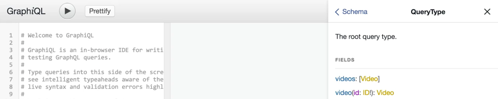
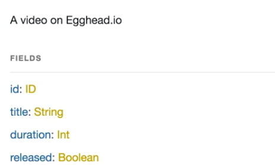
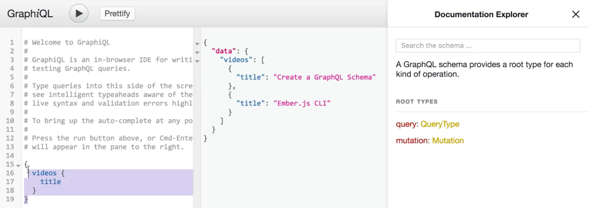
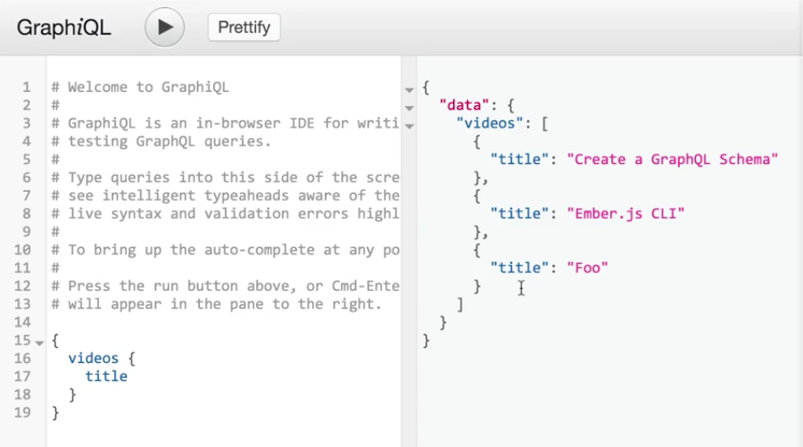

We have a GraphQL schema that's exposing a single `queryType`. If we go into `GraphiQL` to check out the type definitions we can see that the `queryType` exposes two fields, `videos` and `video`.



`videos`, in this case, is just a `GraphQLList` and it's a `GraphQLList` of a type called `video`. `video` in this case just has four fields. One is the `id`. There's also the `title`, `duration`, and whether or not this video was released on egghead.io.



All this information is great for querying information on our videos, but what if we actually want to go and create new videos to put on our platform? In this case, we would use something called a **mutation** in GraphQL, so let's go and write one for adding a video to our GraphQL schema.

Let's switch on over to our editor of choice and start writing our first mutation. Mutations in GraphQL are just **GraphQL object types**, so we can create our new root `mutation` by doing `new GraphQLObjectType`. I'm giving it a `name` of `'Mutations'` and then the `description` can be `'The root Mutation type.'`.

**index.js**
```javascript
const mutation = new GraphQLObjectType({
  name: 'Mutation',
  description: 'The root Mutation type.'
});
```

Next up we'll add a `fields` object and then inside of that object we'll specify a field called `createVideo`, which is going to be responsible for creating videos in our GraphQL schema.

**index.js**
```javascript
const mutation = new GraphQLObjectType({
  name: 'Mutation',
  description: 'The root Mutation type.'
  fields: {
    createVideo: {
    },
  },
});
```

Each field in a GraphQL `mutation` also has a `type`. In this case we're going to have a `videoType`. This is going to correspond to what we're going to be able to query on after we run the `mutation`.

We're also going to need some `args` to help us actually construct our new video. In this case we're just going to specify `title` for the title of the video, `duration` for the duration of the video, and finally, `released`, which will tell us whether or not the video is released to the public.

**index.js**
```javascript
const mutation = new GraphQLObjectType({
  name: 'Mutation',
  description: 'The root Mutation type.'
  fields: {
    createVideo: {
      type: videoType,
        title: {
          type: new GraphQLNonNull(GraphQLString),
          description: 'The title of the video.',
        },
        duration: {
          type: new GraphQLNonNull(GraphQLString),
          description: 'The duration of the video (in seconds).',
        },
        released: {
          type: new GraphQLNonNull(GraphQLString),
          description: 'Whether or not the video is released.',
        },
      },
    },
  },
});
```

The last part for this `mutation` is to add in a `resolve` handler. This has the same signature as those `resolve` statements from querying, but in this case arguments are going to correspond to the arguments that we created before.

The goal of this `resolve` statement now is to go and take in all of the arguments that are being passed in with this `args` variable and create our video. Thankfully, I have a method already for that inside of our `source/data/index.js` file and here there's a method called `createVideo`.

This method takes in a `title`, `duration`, and `released` fields for our video, creates a new video with a brand-new ID, pushes it to our end memory array, and then just returns the video. At the end of the file I'm just exporting that method.

**data/indes.js**
```javascript
const createVideo = ({ title, duration, released}) => {
  const video = {
    id: (new Buffer(title, 'utf8')).toString('base64'),
    title,
    duration,
    released,
  };

  videos.push(video);

  return video;
};
```

With this method in hand, we can go back into our `index.js` file now and `import` it at the top. I'll just do `createVideo` here, and now let's go back to our mutation, specifically this resolver. What we can do is just `return createVideo`, and then pass in the arguments.

`CreateVideo` takes in an object and the object has the fields `title`, `duration`, and `release` and thankfully that matches up with `args` here, so we'll just pass that in to create our video.

**index.js**
```javascript
const mutation = new GraphQLObjectType({
  name: 'Mutation',
  description: 'The root Mutation type.'
  fields: {
    createVideo: {
      type: videoType,
        title: {
          type: new GraphQLNonNull(GraphQLString),
          description: 'The title of the video.',
        },
        duration: {
          type: new GraphQLNonNull(GraphQLString),
          description: 'The duration of the video (in seconds).',
        },
        released: {
          type: new GraphQLNonNull(GraphQLString),
          description: 'Whether or not the video is released.',
        },
      },
      resolve: (_, args) => {
        return createVideo(args);
      },
    },
  },
});
```

Now we've actually created our first `mutation` type and I'll actually rename our variable here to `mutationType` just to indicate that. In order to add it to our `schema` all we need to do is pass it into the `mutation` field, so `mutation` and then mutation field.

**index.js**
```javascript
const schema = new GraphQLSchema({
  querry: queryType,
  mutation: mutationType, 
});
```

We can verify that this is working by switching into our Terminal and rerunning our server by running `$ node index.js`. When we switch into `GraphiQL` and reload the page, we see that there's now a new `mutation` type available to us inside of our schema.

To verify that this mutation actually works for creating new videos, let's go and see what videos currently exist. We'll do `videos` and `title`. We can see that there's a video on creating a GraphQL schema as well as a video on Ember JS CLI.



To create our `mutation` we'll do `mutation` and we'll give it some kind of name. In this case the name's just going to be `M`. We'll do `createVideo` and `createVideo` takes in a `title`, which we will say is `foo`, a `duration`, which is an integer and we'll say `300`.

Then finally it takes in a `Boolean` for a release and we're going to say it's `false`. Inside of this we actually can query for fields on that resulting video. We'll grab the `id` and also the `title`. Then we'll run our mutation.

**Graphical Input**
```javascript 
Mutation M {
  createVideo(title: "Foo", duration: 300, Boolean: false) {
    id, 
    title
  }
}
```

In the response we can see that we have a new video being created with a given `id` and `title`. We can go and verify that this is added to our list of videos by running our `videos` query one more time. We'll just get all the titles, one more query, and there we go. Our video was added to our list of videos.

