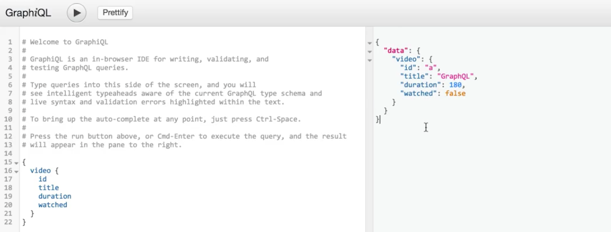

We look inside of our `index.js` file and look at how we're defining our `schema`. What we're doing is using the `buildSchema()` function, passing in a template literal to define our schema as a `String`.

**index.js**
```javascript
const schema = buildSchema('
type Video {
  id: ID,
  title: String,
  duration: Int,
  watched: Boolean
}
');
```

However, what we can do is build out this entire `schema` definition using JavaScript. Let's try that.

The first thing that we're going to need to do is change this `require` statement to grab some of the functions that we need.

The first one's going to be `GraphQLSchema` so we can actually write out our `schema`. The second one's going to be `GraphQLObjectType` for our higher order types. Then finally we can grab `GraphQLString`, `GraphQLInt` and `GraphQLBoolean` as some primitive types in GraphQL.

**index.js**
```javascript
const {
  GraphQLSchema,
  GraphQLObjectType,
  GraphQLInt,
  GraphQLBoolean
} = require('graphql');
```

Now let's take all of these types and start rewriting our `schema`. The first thing we can do is say `const schema = new GraphQLSchema`. What we do is we pass in this configuration object that takes in a couple of keys.

**index.js**
```javascript
const schema = new GraphQLSchema({
});
```

In this video, what we're going to be focusing on is the `Query` type, and we'll actually go and make a variable in an second. But we can also pass in `mutation` as a key, as well as `subscription` to represent other kind of capabilities of our GraphQL server.

**index.js**
```javascript
const schema = new GraphQLSchema({
  query: queryType,
  mutation,
  subscription
});
```

Now let's actually go into find our `Query` type. This `Query` type is going to be a new `GraphQLObject` type. I'll take in that same kind of configuration object that the `schema` did.

**index.js**
```javascript
const queryType = new GraphQLObject({
});
```

The first field that we'll define on it is `name`, which is `'QueryType'`. We can also add in optional `description`, and in this case, we'll just add a description of `"The root query type."`. We can also add a key called `fields`, which will define what the things are that we can query for in our GraphQL schema.

**index.js**
```javascript
const queryType = new GraphQLObject({
  name: 'QueryType',
  description: 'The root query type.',
  fields: {
  },
});
```

Let's go ahead and add a `video` field. Inside of this field, we need to specify the type, which will be `Video` type, and we'll define that in a second. Then we'll also add in a `resolve` field, which will just be a function that will return a promise. This promise is just going to `resolve` with a simple object.

**index.js**
```javascript
const queryType = new GraphQLObject({
  name: 'QueryType',
  description: 'The root query type.',
  fields: {
    video: {
      type: videoType,
      resolve: () => new Promise((resolve) => {
        resolve({
        });
      }),
    },
  },
});
```

We're going to use this object to just represent a `video`, so we'll add in some of the fields that we need, such as `id`, `title`. We can also add in `duration`, and finally, `watched`.

**index.js**
```javascript
const queryType = new GraphQLObject({
  name: 'QueryType',
  description: 'The root query type.',
  fields: {
    video: {
      type: videoType,
      resolve: () => new Promise((resolve) => {
        resolve({
          id: 'a',
          title: 'GraphQL',
          duration: 180,
          watched: false
        });
      }),
    },
  },
});
```

The idea behind this structure is that we're going to have all of these fields and each field has a `type` and a `resolve` statement. What the job of the `resolve` statement is is to provide a function that can return something asynchronous like a promise, and it will actually resolve with the information that we need to resolve this field.

Now that we know how those statements work, let's actually go and write out our `Video` type.

Our `Video` type follows a very similar structure to our `Query` type, where we're just building it off of a `GraphQLObjectType`. We also give it a `name`, in this case it'll be `'Video'`. We'll also give it a `description`, which will be `'A video on Egghead.io'`. It also has fields that we can query for on this type.

**index.js**
```javascript
const videoType = new GraphQLObjectType({
  name: 'Video',
  description: 'A video on Egghead.io',
  fields: {
  },
});
```


The first field that we're going to add is `id`, and the type of `id` is going to be `GraphQLID`. Let's actually make sure that we're grabbing that from the GraphQL package at the top of our file.

**index.js**
```javascript
const {
  GraphQLSchema,
  GraphQLObjectType,
  GraphQLInt,
  GraphQLID,
  GraphQLBoolean
} = require('graphql');
```

Next up, we can add a `description`, and in this case, it's going to be `'The id of the video.'`

Next up, let's add the `title`, which would be very similar, except now the type is a `GraphQLString` and the `description` part is going to be `The title of the video.`

We can also add the `duration`, which will be a `GraphQLInt`. The description's going to be `The duration of the video in seconds.`

The last field that we're going to add is `watched`, which is just a `GraphQLBoolean`. We'll grab that and then then description is going to be `Whether or not the viewer has watched the video.`

**index.js**
```javascript
const videoType = new GraphQLObjectType({
  name: 'Video',
  description: 'A video on Egghead.io',
  fields: {
    id: {
      type: GraphQLID,
      description: 'The id of the video.'
    },  
    title: {
      type: GraphQLString,
      description: 'The title of the video.',
    },
    duration: {
      type: GraphQLInt,
      description: 'The duration of the video (in seconds).',
    },
    watched: {
      type: GraphQLBoolean,
      description: 'Whether or not the viewer has watched the video.'
    },
  },
});
```


Now that we have our `Video` type defined and we have all of these fields defined on it, including `id`, and `title`, `duration` and `watched`, we have our `QueryType` that's telling us what kind of fields are available for us to query on. We actually have a almost complete representation of our original schema that we defined using `buildSchema` and the `resolvers`.

Let's actually try and get rid of this `schema` that we have as well as the resolve statements that we created before, and use this new schema that we created with the `GraphQLSchema` constructor inside of our server.

**index.js**
```javascript
// vvv REMOVED vvv
const schema = buildSchema('
type Video {
  id: ID, 
  title: String,
  duration: Int,
  watched: Boolean
}

type Query {
  video: Video
  videos: [Video]
}

type Schema {
  query: Query
}
');
// ^^^ REMOVED ^^^

// vvv REMOVED vvv
const resolvers = {
  video () => ({
    id: '1', 
    title: 'Foo',
    duration: 180,
    watched: true
  }),
  videos: () => videos,
};
// ^^^ REMOVED ^^^
```

First, we can remove the `rootValue`

**index.js**
```javascript
server.use('/graphql', graphqlHTTP({
  schema,
  graphiql: true,
}));
```

We then switch into our terminal and run `$ node index.js` to start our server. Then we can switch out of full screen here, bring in our window, and run Enter and actually visit our graphical editor.

Inside of here, we can query for our `Video` type, we can get the `id`, `title`, `duration` and whether or not it was `watched`. We'll execute the query and we get a response.

