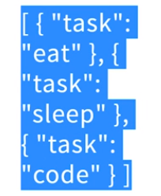
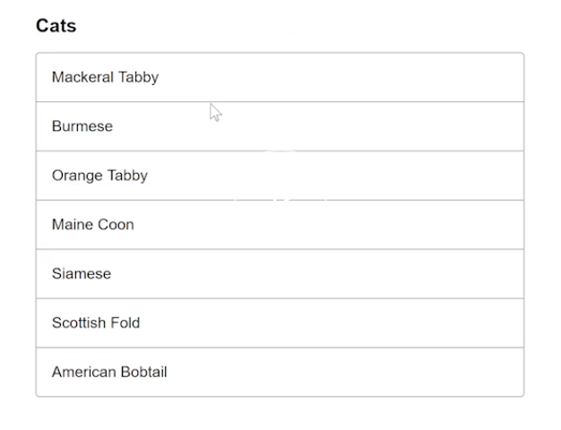

To add todos to our store, we can just go ahead and delete the increment/decrement and replace the counter with `todos`. I'll add a `task` of `eat`, and then duplicate this and change it to `sleep` and `code`. 

#### index.js
```js 
export const state = {
  todos:[
    {task: "eat" },
    {task: "sleep" },
    {task: "code" },
  ]
}
```

Just like we displayed the counter by mapping state, I can go ahead and display the todos in the same way. `Todos`.

#### index.vue
```js
export default {
  computed:{
    ...mapState({
      todos: state=> state.todos
    })
  }
},
```

I'll get rid of these mapMutations because I don't need them. Could also delete the buttons so that I can put in my `todos`, hit save, and you'll see an array of Todos rendered on the page. 

```html
<template>
  <div class="pa4">
    {{todos}}
 </div>
</template>
<script>
import {mapState, mapMutations} from 'vuex'

export default {
  computed:{
    ...mapState({
          todos: state=> state.todos
    })
  },

  methods:{

  }
}
</script>
```



To style this a bit. I'm going to go to [tachyons.io](tachyons.io). Go to the components and down to the lists.

This list looks great so I'll just go here, scroll down, copy the HTML -- it's just HTML and some Tachyon classes.



I'll go ahead and paste that into my index.vue. I'll clean up the formatting a little bit and just remove the padding I had before.

```html 
<template>
  <div>
    <article class="pa3 pa5-ns">
      <h1 class="f4 bold center mw6">Cats</h1>
      <ul class="list p10 m10 center mw6 ba b--light-silver br2">
        <li class="ph3 pv3 bb b--light-silver">Mackeral Tabby</li>
        <li class="ph3 pv3 bb b--light-silver">Burmese</li>
        <li class="ph3 pv3 bb b--light-silver">Orange Tabby</li>
        <li class="ph3 pv3 bb b--light-silver">Maine Coon</li>
        <li class="ph3 pv3 bb b--light-silver">Siamese</li>
        <li class="ph3 pv3 bb b--light-silver">Scottish Fold</li>
        <li class="ph3 pv3 bb b--light-silver">American Bobtail</li>
      </ul>
    </article>
  </div>
</template>
```

Now when I hit save, I'll have that same exact component -- I'll make this a bit smaller -- and that same component from [tachyons.io](tachyons.io). Now I can delete all the other list elements except for the one I need. I'll add a `v-for` attribute and say `todo of todos`. The todo being each todo in the array.

```html
<article class="pa3 pa5-ns">
  <h1 class="f4 bold center mw6">Cats</h1>
    <ul class="list p10 m10 center mw6 ba b--light-silver br2">
      <li v-for="todo of todos" class="ph3 pv3 bb b--light-silver">Mackeral Tabby</li>
    </ul>
</article>
```

Instead of this "Mackerel Tabby", I can just go ahead and make that `todo.task`. When I hit save, now you'll see "eat, sleep, and code". I'll remove this "Cats", replace it with `Todos`, so now we have Todos. To learn more about all these Tachyon classes you see here, just go to [tachyons.io](tachyons.io). There's a great list of them on the table of styles.

```html
<article class="pa3 pa5-ns">
  <h1 class="f4 bold center mw6">Todos</h1>
    <ul class="list p10 m10 center mw6 ba b--light-silver br2">
      <li v-for="todo of todos" class="ph3 pv3 bb b--light-silver">{{todo.task}}</li>
    </ul>
</article>