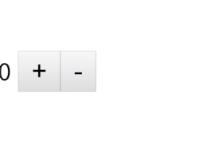
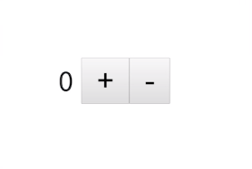

I'm going to add the Tachyons library to my project with `yarn add tachyons`. You'll see it installing down here in the terminal. 

#### Terminal
```
$ yarn add tachyons
```

Then you'll see, once that's done, it's down here in the node_modules/tachyons. Tachyons has a CSS directory with a tachyon.css in it.

Now, what I'm going to do is hop into my config file, my nuxt.config file. Now down in my Global CSS settings, I'm going to add a comma after this CSS file, and tell it to bring in `tachyons/css/tachyons.css`.

#### nuxt.config.js
```js
/*
** Global CSS
*/ 
css: ['~assets/css/main.css', 'tachyons/css/tachyons.css'],
/*
```

What's the name of the module in the node_modules library and the path to the file that I want to include? I'll go ahead and save that. Back in my index.vue file, I can go ahead and start adding the classes and styles that I want to include, like classes padding vertical 4, `class="pv4"`.

#### index.vue
```html 
<template>
  <div class="pv4">
    {{counter}}
    <button @click="increment">+</button>
    <button @click="decrement">-</button>
  </div>
</template>
```

Save and you'll see I now have this padding on top. If I inspect it, you'll also see the padding on the bottom as well. This pv4 class, that's the padding on the top and the padding on the bottom. 



A `pa4` would add padding all around it, two rims on top, right, bottom, left as defined in the pa4 class.



To add any CSS library to project, whether it's a Bootstrap or Foundation, just yarn install them. Reference them by this tachyons/css/tachyons.css path here, which is defined in your config in CSS, and then those classes are available in the template.