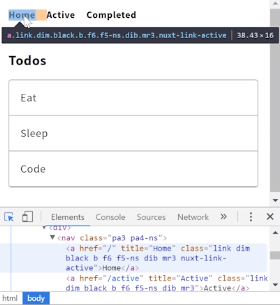
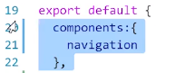
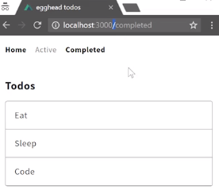
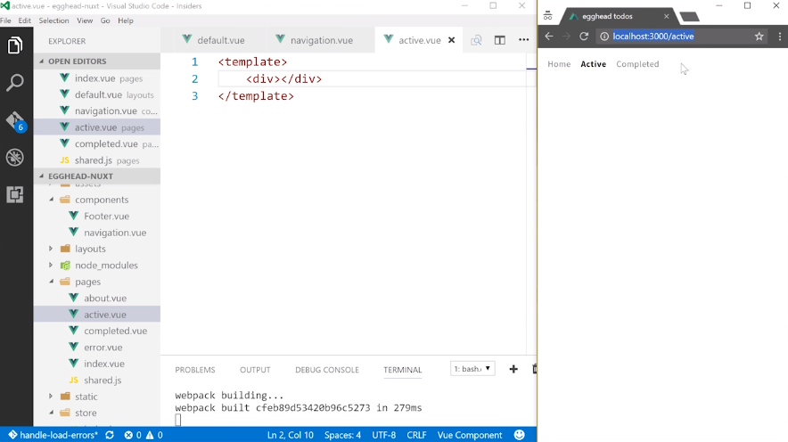

I found a nice title link list navigation to use for the navigation our to-do app, so I'll copy and paste that to where <nav> was. I'll format a bit, and then I can clean it up so that it displays the things that I want to display, and not just the stuff I pasted.

#### index.vue
```html
<template>
  <div>
    <nav class="pa3 pa4-ns">
      <a class="link dim black b f6 f5-ns dib mr3" href="#" title="Home">Site Name</a>
      <a class="link dim gray    f6 f5-ns dib mr3" href="#" title="Home">Home</a>
      <a class="link dim gray    f6 f5-ns dib mr3" href="#" title="About">About</a>
      <a class="link dim gray    f6 f5-ns dib mr3" href="#" title="Store">Store</a>
      <a class="link dim gray    f6 f5-ns dib" href="#" title="Contact">Contact</a>
    </nav>

    <article class="pa3 pa5-ns">
      <h1 class="f4 bold center mw6">Todos</h1>
      <ul class="list p10 m10 center mw6 ba b--light-silver br2">
        <li v-for="todo of todos" class="ph3 pv3 bb b--light-silver">{{todo.task}}</li>
      </ul>
    </article>
  </div>
</template>
```

We're going to have three links. I'm going to get rid of everything but the first one. That way, I can change this to a `nuxt-link`, then change the href to a to-root-URL, and change Site name to `Home`.

```html
<template>
  <div>
    <nav class="pa3 pa4-ns">
      <nuxt-link class="link dim black b f6 f5-ns dib mr3" to="/" title="Home">Home</a>
    </nav>
```

That should look pretty nice for us, and then let's go ahead and add the other two, one for `Active` links, `active`, the other one for the `Completed` todos. That'll be at `completed`. I'll save this. Then we have Home, Active, and Completed.

```html
<nav class="pa3 pa4-ns">
  <nuxt-link class="link dim black b f6 f5-ns dib mr3" to="/" title="Home">Home</a>
  <nuxt-link class="link dim black b f6 f5-ns dib mr3" to="/active" title="Active">Active</a>
  <nuxt-link class="link dim black b f6 f5-ns dib mr3" to="/completed" title="Completed">Completed</a>
</nav>
```

Let's make it so only the current active link is the one that's highlighted. You'll see if you open the dev tools that if you highlight the active link, and I can't hover off of this without making that disappear, but you'll see a Nuxt link active right over here.



We can target a.nuxt-link-active in our own styles, so I'll say `<style>`. We'll `scope` this to our component, say `a.nuxt-link-active` to make sure we got it, and we'll say `font-size five rem`. Hit save, and we've obviously found the active link.

```html
</script>
<style scoped>
a.nuxt-link-active{
  font-size: 5rem;
}
</style>
```

Let's go ahead and make the inactive links `gray`, remove the bold and hit save. 

```html
<nav class="pa3 pa4-ns">
  <nuxt-link class="link dim gray f6 f5-ns dib mr3" to="/" title="Home">Home</a>
  <nuxt-link class="link dim gray f6 f5-ns dib mr3" to="/active" title="Active">Active</a>
  <nuxt-link class="link dim gray f6 f5-ns dib mr3" to="/completed" title="Completed">Completed</a>
</nav>
```
Now we can make our active link color `black`, `font-weight: bold`, and hit save. Now it looks a little nicer.

```html
<style scoped>
a.nuxt-link-active{
  color: black;
  font-weight: bold;
}
</style>
```

We can extract this navigation into its own component. I'll cut this out and create inside of the components directory a `navigation.vue`.

This needs a `<template>`, and inside that <template> I can paste everything we just made. I'll also go back and grab the style that we declared in here and paste that in here, as well.

#### navigation.vue
```html
<template>
  <nav class="pa3 pa4-ns">
    <nuxt-link class="link dim gray f6 f5-ns dib mr3" to="/" title="Home">Home</a>
    <nuxt-link class="link dim gray f6 f5-ns dib mr3" to="/active" title="Active">Active</a>
    <nuxt-link class="link dim gray f6 f5-ns dib mr3" to="/completed" title="Completed">Completed</a>
  </nav>
</template>
<style scoped>
a.nuxt-link-active{
  color: black;
  font-weight: bold;
}
</style>
```

In my index.vue, to use this component, I need to make sure to add `import navigation from`. This is a special aliased path that uses the tilde. I can say `components` without having to navigate up directories with the dot-dot, and then just `navigation`.

#### index.vue
```js 
import {mapState, mapMutations} from 'vuex'
import {init} from './shared'
import navigation from '~components/navigation'
```

So I'm in pages. I could do dot-dot, then components and `, or anywhere in any of the pages, I can just do the tilde components to avoid all those dot-dots.

Now that I've imported the navigation, I can say `components` on my component, say I'll use `navigation`.

```js
export default {
  components:{
    navigation
  },

  fetch:init,

  computed:{
    ...mapState({
      todos: state => state.todos
    })
  },
```

Then just go ahead and drop the `<navigation>` where it was before. Hit save, and we're back to where we were before.

```html
<template>
  <div>
    <navigation></navigation>
        
    <article class="pa3 pa5-ns">
      <h1 class="f4 bold center mw6">Todos</h1>
      <ul class="list p10 m10 center mw6 ba b--light-silver br2">
        <li v-for="todo of todos" class="ph3 pv3 bb b--light-silver">{{todo.task}}</li>
      </ul>
    </article>
  </div>
</template>
```

I can copy this, paste it in completed.vue where this navigation is, and hit save. Now when I navigate to completed.vue, you won't see it show up because I'll have to import and then define it. I'd have to do that on every component I use that in.

Instead of doing that, it makes more sense to grab the navigation and drop it in the default layout, where I can just ask it to live above the nuxt instance.

#### default.vue
```html
<template>
  <div>
    <navigation></navigation>
    </nuxt>
  </div>
</template>
```

Make sure in index.vue, I don't need this stuff anymore.

#### index.vue


I'll go back to my default layout, define my `<script>`, `import` it, `export defaults`, object, takes `components`, and define the `navigation`. When I hit save, you'll see the navigation shows up even though I'm in the Completed path.

#### default.vue
```html
<template>
  <div>
    <navigation></navigation>
    </nuxt>
  </div>
</template>
<script>
import navigation from '~components/navigation'
export default{
  components:{
    navigation
  }
}
</script>
```

You'll notice that Home is active even though we're on the Completed path, and that's because this slash here means that it matches the root path, as well. 



To fix that, we need to make sure we say `exact` on anything that might have a child path, so only make this active if this exactly matches what that is.

#### navigation.vue
```html
<nav class="pa3 pa4-ns">
  <nuxt-link exact class="link dim gray f6 f5-ns dib mr3" to="/" title="Home">Home</a>
  <nuxt-link class="link dim gray f6 f5-ns dib mr3" to="/active" title="Active">Active</a>
  <nuxt-link class="link dim gray f6 f5-ns dib mr3" to="/completed" title="Completed">Completed</a>
</nav>

```

That'll make that go away when we're on the Completed path. Navigate home. We're back to Home, Completed, and now we have this navigation across our site.

Even if I just make a single page for `active` that has nothing but a `<template>` and an empty `<div>` in it, when I navigate to active, you'll see I have this active page with navigation even though my active page is just a template.



It's an empty <div>, so this navigation will work across all the pages, and it's refactored into its own component and then used inside of the default layout.