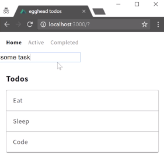
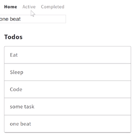

Now we can add a basic `<form>`. We'll get rid of the action with an `input`, with a `type` of `text`, and we'll use this input to submit new todos to our API. So we'll handle the `submit` event on the form and tell that to column method, which we'll call `onSubmit`.

#### index.vue 
```html
<template>
  <div>
        
    <form @submit="onSubmit">
      <input type="text">
    </form>
```

So down in our methods, we can say, `onSubmit` and then `alert yay`. 

```js
methods:{
  onSubmit(){
    alert('yay')
  }
}
```

So let's save here, and the first thing you'll notice is that when you try and submit "something" and hit enter, it'll do the alert and then we'll refresh the page because that's the default behavior of the submit event.

A great convenience with Vue is you can say, `submit.prevent` and that means it'll prevent the default. So when I hit save now,I can type "yay" and hit enter. It'll pop up the alert and it will not refresh this time. So to prevent that submit event from a refresh in the page, just do a .prevent here.

```html
<template>
  <div>
        
    <form @submit.prevent="onSubmit">
      <input type="text">
    </form>
```

Now let's track a value on our input using `v-model` and we'll just name this `task`. 

```html
<template>
  <div>
        
    <form @submit.prevent="onSubmit">
      <input v-model="task" type="text">
    </form>
```

For something to be on the v-model, we have to define that in our data. We'll say `data`, which is actually a function that returns an object. We'll say the `task` is just defaulting to `some task`, just a short working. Let's save here and you can see "some task" pops in automatically.

```js
export default {

  fetch:init,

  data(){
    return{}
      task: "some task"
  },

```



So to get this value into onSubmit, we can just invoke onSubmit and pass in the `task`. 

```html
<form @submit.prevent="onSubmit(task)">
  <input v-model="task" type="text">
</form>
```
Then onSubmit receive the `task`, and then alert the `task`. Hit save and you'll see I'll type in "something". Hit enter. We get "some task something", and everything is wired up properly.

```js
methods:{
  onSubmit(task){
    alert(task)
  }
}
```

So from here to get this into the store, I'm going to bring in `mapActions` from vuex, and this behaves the same as the mapMutations and mapState. 

```js 
import {mapState, mapMutations, mapActions} from 'vuex'
```

Where on my methods, I can spread this object we get back from `mapActions`. I'll just do the array way. I can pass in a string, call this `'add'`, and then I can open up my index.js from my store, and start creating some actions.

```js
methods:{
  ...mapActions([
    'add'
  ])
}
```

I create an action called `add` and add takes in the `context` and the thing we passed in which was the `task`. 

#### index.js 
```js 
export const state = {
  todos: []
}

export const mutations = {
  init(state, todos) {
    state.todos = todos
  }
}

export const actions = {
  add(context, task) {

  }
}
```

So this task is wired up to the task in my <form>. I need to make sure that onSubmit is now `add` because add is mapped to this add mapActions.

```html
<form @submit.prevent="add(task)">
  <input v-model="task" type="text">
</form>
```

This means that this add is wired up to the add under our actions in index.js. That event from submit is going all the way into our store and being handled here, the task is handled there.

My context contains -- so the structure of this -- contains something called `commit`, which will commit something to our mutations. I can say from here that I want to `commit` to `'add'` and then an object with our `task` and `complete:false`. Then I need to make this add that I'm committing to, to say, `add(state, todo)` and this todo is this object. Then I can say that our `state.todo` is an array with the previous `todos` and our new `todo`.

#### index.js
```js
export const state = {
  todos: []
}

export const mutations = {
  init(state, todos) {
    state.todos = todos
  },
  add(state, todo) {
    state.todos = [...state.todos, todo]
  }
}

export const actions = {
  add({commit}, task) {
    commit('add', {task, complete:false})
  }
}
```

So hit save in my index.js, and now when I hit enter to submit the form, I can add a bunch of tasks. 

For now, these will survive as I navigate around, but as soon as I refresh, they're gone because we are not posting them to the API. So, let's fix that by grabbing our API call. I have a great example of that in our shared.js where we get the initial from Axios -- get the initial data.

I'll copy and paste that data into my store and say that I now want to `post` to this. If I'm going to use await, I need to make sure that this function is `async`, so when I post, I'll get a response back from this. What I want to post is this object. The object that I was just pushing into the array before, I now want to post to my service. Bring this down to the next line just to make it more readable.

#### index.js
```js
export const actions = {
  async add({commit}, task) {
    const res = await axios.post('https://todos-cuvsmolowg.now.sh/todos', {task, complete:false})
      commit('add', )
  }
}
```

Then, since we're awaiting for this to happen, once that's done, I can just go ahead and commit the `res.data` which will be the result back from my post call.

```js
export const actions = {
  async add({commit}, task) {
    const res = await axios.post('https://todos-cuvsmolowg.now.sh/todos', 
    { task, complete:false })
    commit('add', res.data)
  }
}
```

So I'll go ahead and save here. Now when I add "some task" and hit enter, it didn't work. I'll check my console and it looks like I didn't define Axios again, since I copy and paste and forgot to. So I'll go up and `import axios from 'axios'`, hit save. 

```js
import axios from 'axios'

export const state = {
  todos: []
}
```
Now, when I hit enter, you'll see that "some task" comes back. Now this time it does take like "one beat". After I hit enter, you'll see it takes us one second to post, get the response back, and update the array. That's because it's actually posting and saving that to our API, so when I refresh now, I have my "some task" and my "one beat". I go to Completed, and it's still there. I can refresh here as well.

