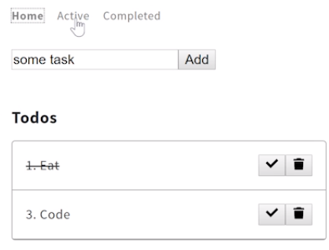
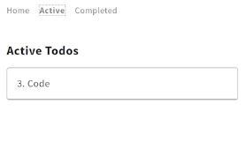
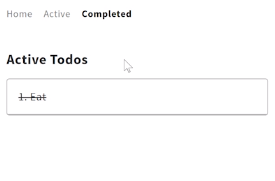
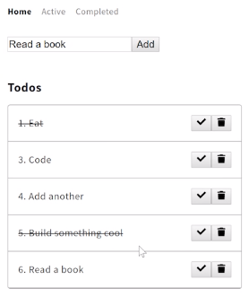
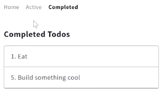
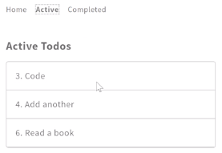

To finish up the other pages, I'll just copy and paste all of the index.vue into the active.vue. Now when I hit save, if I navigate to Active it should look the exact same and have all the same features. 

Let's remove some of these features. We'll remove the form. We'll call this `Active Todos` here, and even get rid of the ability to click on the <button>'s.

```html
<template>
  <div>
    <article class="pa3 pa5-ns">
      <h1 class="f4 bold center mw6">Active Todos</h1>
      <ul class="list p10 m10 center mw6 ba b--light-silver br2">
        <li v-for="todo of todos" class="flex items-center ph3 pv3 bb b--light-silver">
          <span v-bind:class="{strike: todo.complete}" class="flex-auto">{{todo.id}}. {{todo.task}}</span>
        </li>
      </ul>
    </article>
  </div>
</template>
```

Now, Active is just a list of Active Todos. Then if I go back into Home and check off "Eat", when I go back to Active, it's still showing "Eat". Let's make sure that's filtered out. I can just do this in this computed state here. I'll just say `filter` out any `todo` where the `todo` is `complete` but not complete.

```js 
computed:{
  ...mapState({
    todos: state=> state.todos.filter(todo => !todo.complete)
  })
},

```

Now in Active, it'll only show us the ones that haven't been completed. 

Home looks like this. 



Active looks like this.



I'll copy and paste everything from active.vue into completed.vue. I'll paste that there. Then I can also clean up the methods. I don't need any of these. I don't need the data. I don't need this import.

My active.vue is really short, with just a <template> and a list that loops through my todos. I'll copy and paste this into my completed.vue. Select all and paste.

#### active.vue
```html 
<template>
  <div>  
    <article class="pa3 pa5-ns">
      <h1 class="f4 bold center mw6">Active Todos</h1>
      <ul class="list p10 m10 center mw6 ba b--light-silver br2">
        <li v-for="todo of todos" class="flex items-center ph3 pv3 bb b--light-silver">
          <span v-bind:class="{strike: todo.complete}" class="flex-auto">{{todo.id}}. {{todo.task}}</span>
        </li>
      </ul>
    </article>
  </div>
</template>
<script>
import {init} from './shared'
 
export default {

  fetch:init,

  computed:{
    ...mapState({
      todos: state=> state.todos.filter(todo => !todo.complete)
    })
  },
}
</script>
```

Now completed.vue will just be the same thing except it only wants to show complete ones.

#### completed.vue
```js 
computed:{
  ...mapState({
    todos: state=> state.todos.filter(todo => todo.complete)
  })
},
```

Now if I navigate to completed.vue, it looks like I accidentally deleted mapState, so let's `import` that back. `mapState from 'vuex'`.

#### completed.vue
```js
import {init} from './shared'
import {mapState} from 'vuex'
```

Active.vue will need that as well.

#### active.vue
```js
import {init} from './shared'
import {mapState} from 'vuex'
```

Refresh here on 'localhost:3000'. Now Completed shows active todos.

#### completed.vue


Let's change that to "`Completed`". We can even get rid of the strike-through on this. Now Completed Todos are "Eat"; Active Todos are "Code". 

```html
<article class="pa3 pa5-ns">
  <h1 class="f4 bold center mw6">Completed Todos</h1>
    <ul class="list p10 m10 center mw6 ba b--light-silver br2">
      <li v-for="todo of todos" class="flex items-center ph3 pv3 bb b--light-silver">
      <span v-bind:class="{strike: todo.complete}" class="flex-auto">{{todo.id}}. {{todo.task}}</span>
```

Back in Home, I can 'add another', 'build something cool', 'read a book'. We'll check 'build something cool' off.



Navigate to Completed. We'll see 'eat' and 'build something cool.' I can refresh. We'll have the proper things. 



Go to Active. Have all the proper things there.



Then in my terminal I can just say `now` and deploy this application.

#### Terminal
```
$ now
```

Once that's complete, I can go ahead and open this in a new tab, hit enter, and now we have this application live online, where I can complete Completed, Active, Home, Delete. Everything works just as expected.