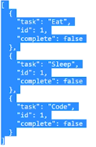
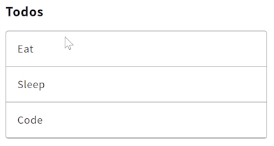

To load some todos into our application, let's first set up an API. Install a library called Now. The awesome thing about Now is that it actually lets you deploy projects straight off of GitHub, and this project at johnlindquist/todos-api.

#### Terminal
```
$ yarn global add now 
```

When you type `now johnlindquist/todos-api`, you will find it on GitHub, deploy it, and then give you a URL. When I visit this URL, it will have a server up and running where, if I request todos, it'll give me back an array of todos.

```
now johnlindquist/todos-api
```



With this link here, I can get, post, delete and patch anything I want to these todos. 

To load these in I'm going to add a library called Axios, which gives me a nice clean way of working with remote data. 

```
$ yarn add axios
```

With that installed, I'll start up my dev server again, say `yarn run dev`.

```
$ yarn run dev 
```

Each page or each component, so for my index.vue, in my code here, a `fetch` will be invoked when the page is loaded. Fetch for me is going to be a function where I can `axios.get` that array of data. I'm going to use the `async await` syntax to make this a nice, clean call to this promise. That way I don't have to .then everything.

#### index.vue 
```js
export default {
  async fetch (){
    await axios.get('https://todos-cuvmolowg.now.sh/todos')
  },
  computed:{
    ...mapState({
      todos: state=> state.todos
    })
  },
```

This will be a `response` and then when I get that response back, fetch also passes in an object with a `store` on it. I can say `store.commit`, and I'll say `init`.

```js 
import {mapState, mapMutations} from 'vuex'

export default {
  async fetch ({store}){
    const res = await axios.get('https://todos-cuvmolowg.now.sh/todos')
    store.commit('init')
  },
  computed:{
    ...mapState({
      todos: state=> state.todos
    })
  },
```

Which is going to be a function on my mutations. `init`, which will take a `state` and an array of `todos`, and simply say the `state.todos` is that new array of `todos`.

#### index.js 
```js 
export const mutations = {
  init(state, todos){
    state.todos = todos
  }
}
```

Then back in index.vue, I'm going to pass in the `res.data`. Obviously this is telling me 'axios is not defined'. That's because I forgot to `import axios from 'axios'`. Now when I save, and often when you get errors it breaks that hot reload connection, so I just refresh.

#### index.vue
```js 
import {mapState, mapMutations} from 'vuex'
import axios from 'axios'

export default {
  async fetch ({store}){
    const res = await axios.get('https://todos-cuvmolowg.now.sh/todos')
    store.commit('init', res.data)
  },
  computed:{
    ...mapState({
      todos: state=> state.todos
    })
  },
```

You can see we now have "Eat, Sleep, Code". This is now coming from the 'https://todos-cuvmolowg.now.sh/todos' URL in my index.vue.



So I can go ahead and delete the todos in my index.js. You'll notice that it's still loading in "Eat, Sleep, and Code".