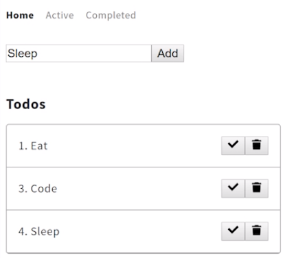
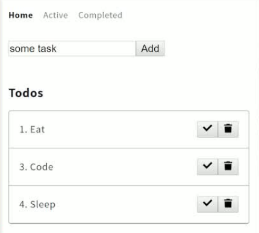

Now, let's go ahead and add another <button> in here. This one'll be our `toggle todo`, and instead of the trash can we'll use a `check` mark. 

#### index.vue
```html
<button @click="toggle(todo)"></button>
<button @click="remove(todo)"></button>

```

You'll see that in action. We have our check marks in there.



Then on our actual task name on this span, we'll say `v-bind:class` so that if our todo is complete, it'll strike it out. Strike is a class from Tachyons that represents the text decoration line-through.

```html
<span v-bind:class="{strike}" class="flex-auto">{{todo.id}}. {{todo.task}}</span>
```

Let's say `todo.complete`. We'll strike it out if they're complete. 

```html
<span v-bind:class="{strike: todo.complete}" class="flex-auto">{{todo.id}}. {{todo.task}}</span>
```

None of them are complete right now, so just to make sure this is working I'll say strike it out if it's not complete. That looks like it'll work.



Let's wire up this toggle button. We want to `toggle` and duplicate this.

```js
methods:{
  ...mapActions([
    'add',
    'remove',
    'toggle',
  ])
}
```

Instead of remove, now we have `toggle`. Then instead of axios.delete we're going to `axios.patch`. We'll patch that same id just like we deleted, but what we're patching this time is the `complete` to not true, but the opposite of what complete currently is. That will toggle it instead of just setting it to true each time.

#### index.js
```js
async toggle({commit}, todo) {
  const res = await axios.patch('https://todos-cuvsmolowg.now.sh/todos/${todo.id}', 
  {
    complete: !todo.complete
  })

    commit('remove', todo)
  }
}
```

Then we can go ahead and add `toggle` here as well so that we have a toggle mutation. 

```js
async toggle({commit}, todo) {
  const res = await axios.patch('https://todos-cuvsmolowg.now.sh/todos/${todo.id}', 
  {
    complete: !todo.complete
  })

    commit('toggle', todo)
  }
}
```

I'll duplicate this, call this one `toggle`, and instead of filtering this time we'll do a `map` that checks if this todo.id, `t.id`, is the same as that todo.id. I'll just do this in a short ternary statement here.

```js
add(state,todo) {
  state.todos = [...state.todos, todo]
},
remove(state,todo) {
  state.todos = state.todos.filter(t=> t.id != todo.id)
},
toggle(state,todo) {
  state.todos = state.todos.map(t => 
    t.id === todo.id
  )
}
```

If that's true then we want to return this `todo`. Otherwise return the original todo, `t`. 

```js
toggle(state,todo) {
  state.todos = state.todos.map(t => 
    t.id === todo.id
    ? todo 
    : t
  )
}
```

Let's make sure this todo is coming back as the right thing, because now we want the response.data, not the original one. We'll get the `res.data`. This is the toggle todo coming back from the patch request.

```js
async toggle({commit}, todo) {
  const res = await axios.patch('https://todos-cuvsmolowg.now.sh/todos/${todo.id}', 
  {
    complete: !todo.complete
  })

  commit('toggle', res.data)
  }
}
```

I'll go ahead and save now. If everything's wired up I can check off "eating". Refresh the page. You'll see that "eating" is still checked off. If I go to Completed, I can check off "sleeping". I can delete "sleeping".

I can toggle back on "eating". I can add "Another task", check that one off and delete it. It's toggling simply because we have a button, which when I click, toggles it todo. That todo is being passed to toggle, which is mapped to an action of toggle, which then patches on our API.

We get that response back and I commit that response to a toggle mutation, defined here. A todo comes in, and our array of todos just either grabs the original one or if they match it grabs the new or updated one we got from the API response.