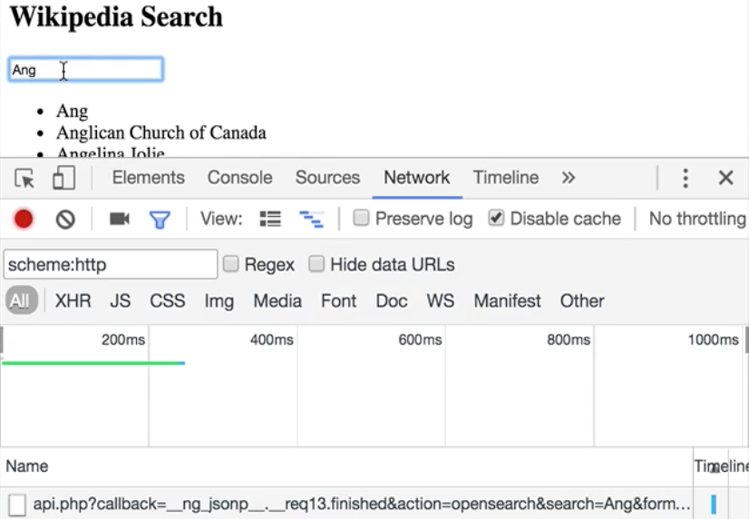

Now that we [debounced the user input](https://egghead.io/lessons/angular-2-building-an-instant-search-with-angular2-debouncing-the-user-input), we are saving our API from tons of unnecessary traffic, but there's still room for improvement, and rx makes things really easy.

When I type ANG and then rest my fingers, we see the request going out. 



Now, let's see what happens when I hit backspace to cut the G, and then put it right back in. What happens is that we make two subsequent requests to fetch items for the term ANG.

Since we're already displaying the search results for exactly that character sequence, we could actually save the request. Thinking in terms of observable streams, what we need is an operator to filter out subsequent duplicate notifications.

Let's import the `distinctUntilChanged` operator, which does exactly that. 

**app.component.ts**
``` javascript
import 'rxjs/add/operator/distinctUntilChanged';
```
We can think of it as a `filter` operator that works over a buffer of the last two notifications to remove duplicates. We add it right after `debounceTime` operator.

**app.component.ts**
``` javascript
export class AppComponent {}
  items:Array<string>;
  term$ = new Subject<string>();
  constructor(private service:WikipediaSearchService) {
    this.term$
        .debounceTime(400)
        .distinctUntilChanged()      
        .subscribe(term => this.search(term))
  }

  search(term: string) {
    this.service.search(term)
                .subscribe(results => this.items = results);
}
```
Let's turn to our browser again and do exactly what we did before. We type ANG, and we see the request goes out. Now, I hit backspace, remove the G, and put it right back in, and I do that a couple of times. We notice that it's not making any new requests. It's still making new requests as soon as the term changes, which is exactly what we want.