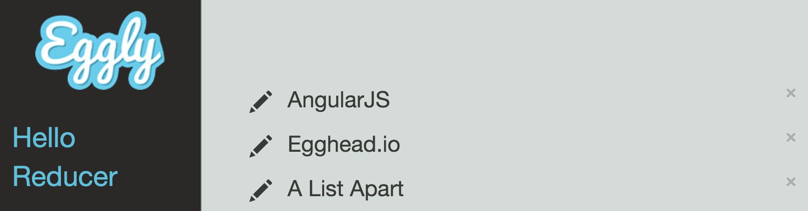
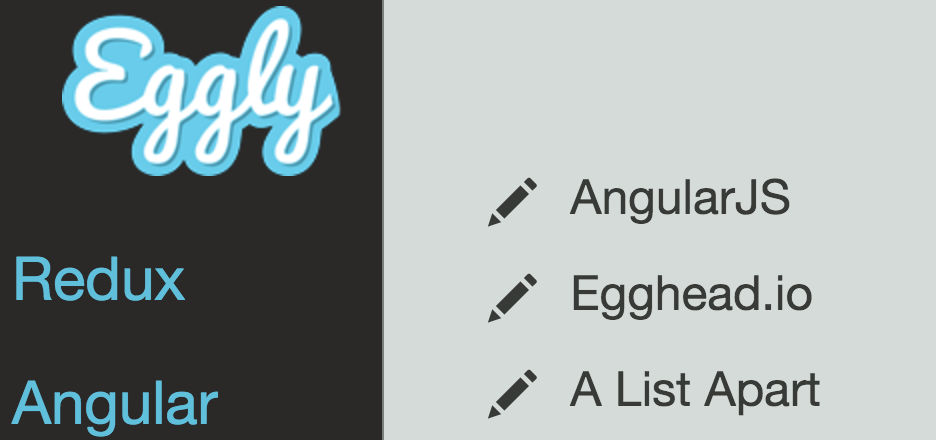

In this lesson, we are going to learn how to abstract out state mutations into a **reducer**. In our current Angular application, all of our category `state` and business logic is handled within the `CategoriesModel`. We are going to refactor our code to entirely eliminate the need for our `CategoriesModel` by building out a couple reducers, and seeing how we can interact with them directly.

The one thing that I want us to notice as we build out our reducers is that a **reducer itself is completely stateless** because it **receives current state every single time it needs to calculate and return new state**. With this clearly defined contract of inputs and outputs, this makes testing reducers really easy, which is one of the huge benefits of using this approach.

To get started, let's create a `categories.state.js` file that's going to hold our initial reducer that we're going to build out. Let's start with a `categories` reducer. We'll give it an initial `state` of an empty array, and an initial category or action type of `GET_CATEGORIES`.
#### categories.state.js
``` javascript
//---------------------------------------------------
// Reducers
//---------------------------------------------------

export const categories = (state = [], {type, payload}) => {
  switch (type) {
    case GET_CATEGORIES:
      return payload || state;
    default:
      return state;
  }
};
```
We're going to just copy this, and we'll `export` this as a `const` so that we can reference this action type in other places within the application. Let's just create a few comment blocks to separate our code, making it easier to read.

#### categories.state.js
``` javascript
//---------------------------------------------------
// Constants
//---------------------------------------------------

export const GET_CATEGORIES = 'GET_CATEGORIES';
```
Once we have this in place, let's step through our reducer, and see what's going on. Within our `categories` reducer, it takes two parameters, as all reducers do. It takes the current `state` as the first parameter, and then an action object as the second parameter that has a type that we use a `switch` statement to then determine what is the next **action** we want to take, based on the action type.

In this case, with `GET_CATEGORIES`, we're just going to return whatever we pass in. If we do not pass anything in, we just return state, just as we'll return state if there's an action type it doesn't recognize. Let's go ahead and use this.

By hopping into our `categories.js` file, we're going to `import` our `categories` reducer as well as our `GET_CATEGORIES` action constant. 

#### categories.js
``` javascript
import { categories, GET_CATEGORIES } from './categories.state'; 
```
Once we have these imported, we can hop down to our `onInit` method, and remove this call to the `CategoriesModel`.

We're going to replace this with a call to the `categories` reducer. The first thing we're going to do to set this up is define an `initialCategories` collection. We'll give it a single category of `Hello Reducers`. From here, we're going to set `this.categories` by calling the `categories` reducer, and passing in the state of `initialCategories`. We'll send in an action object with a type of `GET_CATEGORIES`, without a payload.

#### categories.js
``` javascript
$onInit() {
  const initialCategories = [
    { id: 0, name: 'Hello Reducer'}
  ];

  this.categories = categories( initialCategories, { type: GET_CATEGORIES });
}
```
Let's hop into the browser, and see what happens when this loads. You can see that we have this `Hello Reducer` category item as our only item within our `categories` collection that we're binded to.


Let's go ahead and abstract out this `initialCategories` collection, and move it closer to the reducer. We'll just export this. Let's replace this single categories object here with a collection that is closer to what we're used to working with.

#### categories.state.js
``` javascript
export const initialCategories = [
  {"id": 0, "name": "Development"},
  {"id": 1, "name": "Design"},
  {"id": 2, "name": "Exercise"},
  {"id": 3, "name": "Humor"}
];

export const categories = (state = initialCategories, {type, payload}) => { ... };
```
We'll set our `initial` to `initialCategories`. From here, we can delete this, and just put in `undefined`. 

#### categories.js
``` javascript
$onInit() {
  this.categories = categories( undefined, { type: GET_CATEGORIES });
}
```
Let's go back to the browser, and you can see now that it is loading our `initialCategories`, which is `Development`, `Design`, `Exercise`, and `Humor`.



Let's make a few more calls to our `categories` reducer. To make this a little easier to visualize, we're going to import the `$timeout` service. We'll assign this to a local `this.$timeout` property. 

#### categories.js
``` javascript
constructor(CategoriesModel, $timeout) {
  'ngInject';

  this.CategoriesModel = CategoriesModel;
  this.$timeout = $timeout;
}
```
From here, let's make a call to the `$timeout` service. We'll pass in the initial function, and we're going to define a `payload` object with a new collection of `categories`. We'll give the first one a `name: 'Redux'`, and then let's create another category item. We'll give it a `name: Angular`.

#### categories.js
``` javascript
    this.$timeout(() => {
      const payload = [
        { id: 0, name: 'Redux' },
        { id: 1, name: 'Angular' }
      ];
```
From here, let's go ahead and update the `categories` collection by calling the `categories` reducer. We're going to pass in the current state of `this.categories`. We'll create an action type of get `categories`, and we're just going to pass in the `payload` object. We'll set this to fire in three seconds.

#### categories.js
``` javascript
this.categories = categories(this.categories, { type: GET_CATEGORIES, payload });
    }, 3000);
```
Back to the browser. Let's refresh the page. One, two, three, there we go. 



We've updated our `categories` collection by calling the `categories` reducer. Now you'll notice here that when we call `categories`, we're passing in a `payload`, which then it just returns the `payload` because we have defined it.

#### categories.state.js
``` javascript
export const categories = (state = initialCategories, {type, payload}) => {
  switch (type) {
    case GET_CATEGORIES:
      return payload || state;
    default:
      return state;
  }
};
```
If we define an action type that it doesn't understand, it's just going to return `state`, basically performing a no operation, if you will. Let's just copy this block of code here, and we'll simulate what happens when we do that.

Let's create or update our payload collection to just have a single category of `Uh Oh`. We'll create an action type that it's not going to recognize, which is `GET_CATEGORIES!` We'll set this to fire at six seconds.

#### categories.js
``` javascript
    this.$timeout(() => {
      const payload = [
        { id: 0, name: 'Un Oh!' }
      ];

      this.categories = categories(this.categories, { type: 'GET_CATEGORIES!', payload });
    }, 6000);
```
Refresh the page, one, two, three. One, two, wait for it, and nothing happens. Let's hop back into our code. Let's update the action type one more time. 
#### categories.js
``` javascript
this.categories = categories(this.categories, { type: 'GET_CATEGORIES', payload });
```
Back to the browser, and one, two, three. One, two, three, and there we have it.


What we want to do is replace this call to the get current category on the categories model with another reducer. We're going to create a reducer called `category`, give it an initial `state` of an empty object, and an initial type of `GET_CURRENT_CATEGORY`.

#### categories.state.js
``` javascript
export const GET_CURRENT_CATEGORY = 'GET_CURRENT_CATEGORY'


export const category = (state = {}, {type, payload}) => {
  switch (type) {
    case GET_CURRENT_CATEGORY:
      return payload || state;
    default:
      return state;
  }
};
```
We'll copy this. We will define another action type constant. If we look at our reducer, it's very similar to the one above. It just returns the `payload` if it exists, or the initial `state` if it does not. Let's go ahead and import the `category` reducer, as well as our action constant.

#### categories.js
``` javascript
import { categories, GET_CATEGORIES, category, GET_CURRENT_CATEGORY } from './categories.state';
```
We'll go down to, `onCategorySelected`. Because it's a `category` reducer, we're going to update this parameter so it doesn't collide. We're now going to set this `currentCategory` equals the call to the `category` reducer sending in `this.currentCategory`, which initially, it'll be `undefined`.

#### categories.js
``` javascript
 onCategorySelected(currentCategory) {
    this.currentCategory = category(this.currentCategory, { type: GET_CURRENT_CATEGORY, payload: currentCategory });
  }

  isCurrentCategory(category) {
    return this.currentCategory &&
      this.currentCategory.id === category.id;
  }
```
We'll give it an action type of get `currentCategory`, and a payload of `currentCategory`. Because we're setting this directly in the categories controller, we can just get rid of this call here, as well as this call.

We can get rid of the `CategoriesModel` entirely, so mission accomplished here. Let's comment this out, so it's a little easier to visualize as selecting the category. As we click through here, we can see that, within the component itself, we are keeping track of the current category.

Let's hop back into our code. We will uncomment this, and let's do a quick review of the reducers that we have created. We have our `categories` reducer, with a state of initial 1categories1 to start out with. We are passing in an action object that has a `type` and a `payload` property.

#### categories.state.js
``` javascript
export const categories = (state = initialCategories, {type, payload}) => {
  switch (type) {
    case GET_CATEGORIES:
      return payload || state;
    default:
      return state;
  }
};
```
Based on the `type`, then we use that to determine what action we're going to take. We have the same thing with our `category` reducer. We've defined our action constants here, so we're not dealing directly with strings.

That allows us to import not only our reducers, but our action constants that we are then using to set `this.categories` within our `CategoriesController`. We're calling `this.categories` equals the result of whatever the `categories` reducer is.

#### categories.js
``` javascript
 this.categories = categories(undefined, { type: GET_CATEGORIES });

    this.$timeout(() => {
      const payload = [
        { id: 0, name: 'Redux' },
        { id: 1, name: 'Angular' }
      ];

      this.categories = categories(this.categories, { type: GET_CATEGORIES, payload });
    }, 3000);
```
The method for that every single time is we're passing in a `state` and an action item that may or may not have a `payload` object on it. We did the same thing with `currentCategory` by calling the `category` reducer, and sending in the `currentCategory` state, and a `GET_CURRENT_CATEGORY` action item, with a `payload` of `currentCategory`.

This is how we use a reducer to manage state within an Angular application.