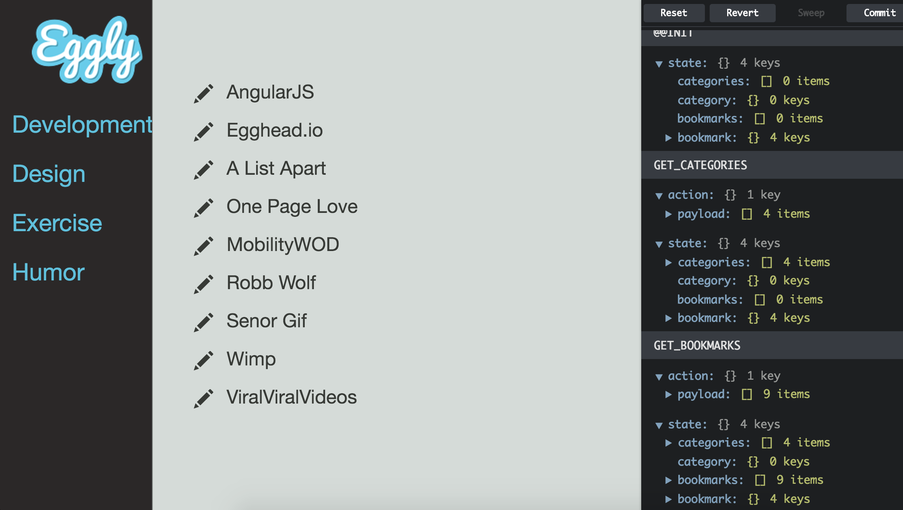
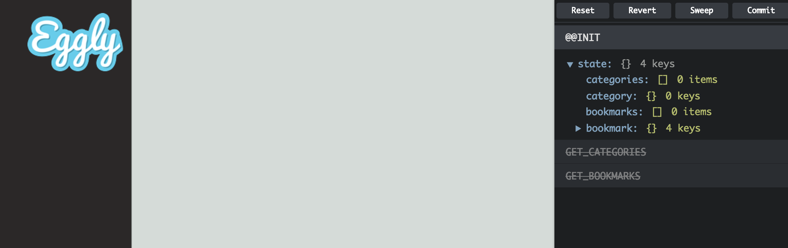
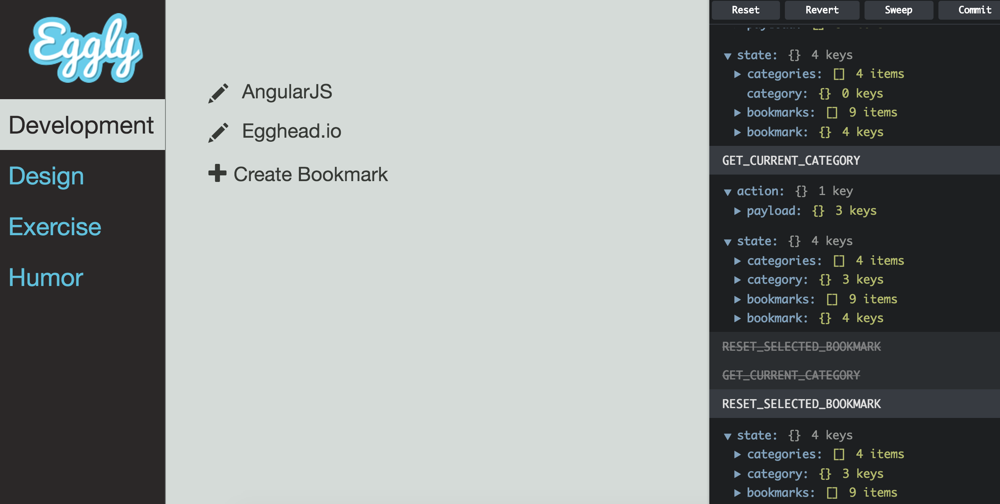

In this lesson, we are going to learn how to integrate **Redux DevTools** into our Angular application. Redux DevTools is a live editing time travel environment for Redux.

There are a list of really awesome features with this library, but my two favorite ones are the ability to inspect every state and action payload as it comes through our reducers, as well as we have the ability to go back in time by canceling actions.

This is going to be an interesting lesson, because in order for this to work we are going to need to make something that was written for React work in Angular. For the most part, everything will play side-by-side, with one small trick that we'll pull off at the end to force an Angular digest cycle when React manipulates the application store.

The first thing that we need to do to enable our integration is to install some npm packages. Let's open up the terminal and we're going to go `npm install`, save, and we're going to `install react react-dom redux-devtools`. Let's break this to a new line because this is a little bit lengthy, `redux-devtools-dock-monitor` and then we're going to do `redux-devtools-log-monitor`.
#### terminal
``` bash
$ npm install --save react react-dom redux-devtools \
> redux-devtools-dock-monitor redux-devtools-log-monitor
```
We'll go ahead and install these packages. Now that these are installed, let's hop onto our `.babelrc` file real quick. We're going to update this to not only use `es2015` but `react` so that it can compile properly. Let's go ahead and import our packages, so we're going to import `React` and `Component` from `react`. Let's `import ReactDOM from 'react-dom'`. 
#### app.js
``` javascript 
import React, { Component } from 'react';
import ReactDom from 'react-dom';
```
We'll go ahead and do `createDevTools from 'redux-devtools'`. From here we're going to import the `LogMonitor` and the `DockMonitor`. The `LogMonitor` is what we actually will use to visualize the state moving through our reducers, and the `DockMonitor` is the component that we used to actually pull this into our application so that we can see it.
#### app.js
``` javascript 
import { createDevTools } from 'redux-devtools';
import LogMonitor from 'redux-devtools-log-monitor';
import DockMonitor from 'redux-devtools-dock-monitor'; 
```
We need to initialize or create our `DevTool` component. We're going to call `createDevTools`, and we're going to start out by defining our `<DockMonitor>` with a `toggleVisibilityKey`. In this case, let's go with `ctrl-h`. We'll also set our `changePositionKey`.

This is the component that we'll use to visualize the `DevTools` in our view once we spin this up. We're going to set this `defaultIsVisible` to `false`. Within here, we will go ahead and add in the `<LogMonitor>` with a `theme` of `tomorrow`. Using this `<DockMonitor>`, `<LogMonitor>` combination is the officially recommended base configuration. Let's go ahead and clean this up.
#### app.js
``` javascript
const DevTools = createDevTools(
  <DockMonitor toggleVisibilityKey='ctrl-h'
    changePositionKey='ctrl-q'
    defaultIsVisible={false}>
      <LogMonitor theme='tomorrow' />
  </DockMonitor>
);
```
From here, let's create a run block. We need to render our `DevTools` component within our Angular application. We'll do this within the run block. We're going to inject `$ngRedux`. From here we're going to use `ReactDOM` to render our `DevTools` component. We're going to pass in `$ngRedux` as our `store`.

From here we're going to set our container to `document.getElementById`, and we're going to set this to `devTools`. We'll create this element in a moment. One other thing we need to do is add in a `store` enhancer to our `createStoreWith` method call. We're going to call the `instrument` method on our `DevTools`. What this does is it basically enhances our application store to work with `DevTools`.
#### app.js
``` javascript
const run = ($ngRedux) => {
  'ngInject';

  ReactDom.render(<DevTools store={$ngRedux} />, document.getElementById('devTools'));
}

const config = $ngReduxProvider => {
  'ngInject';

  $ngReduxProvider.createStoreWith(rootReducer, [thunk], [DevTools.intrument()])
}
```
We're going to add in our run block using the `.run()` method.
#### app.js
``` javascript
let appModule = angular.module('app', [
    CommonModule.name,
    ComponentsModule.name,
    ngRedux
    ])
    .config(config)
    .run(run)
    .component('app', AppComponent)

```
Let's create a `div` with an `id` of `devTools`. 
#### index.html
``` javascript
<div id="devTools"></div>
```
This is going to allow us to drop in our `devTools` component. From here let's hop into the browser and make sure that everything is working.



We'll refresh. `ctrl-h`. You can see here that the `DevTools` are showing up, but when we select a particular action, nothing works until we select something else in the Angular application. The reason being is that our `react` component is changing the `store` and Angular doesn't know what to do.

What we're going to do is we're going to monkey-patch this `componentDidUpdate` method on our DevTools component or rather our `DockMonitor` component. What we're going to do is store a reference to the original `DockMonitor` `componentDidUpdate` method that we're going to need in just a moment.

From here we're going to overwrite it with a new method. I apologize to all my React friends that we may get into a fist fight later for doing this, but what we're doing is assigning this a new function that every time this is called, we are forcing a digest cycle by calling it `$rootScope.evalAsync`. We're also adding this into our parameter so that it gets injected.
#### app.js
``` javascript
const run = ($ngRedux, $rootScope) => {
  'ngInject';

  const componentDidUpdate = DockMonitor.prototype.componentDidUpdate;

  DockMonitor.prototype.componentDidUpdate = () => {

  }

  ReactDom.render(<DevTools store={$ngRedux} />, document.getElementById('devTools'));
}
```
We're checking to make sure that we do have a `componentDidUpdate` method. Then from there we're calling `apply(this)` and passing it `arguments`. We're calling `this` as if we would have we not put this little monkey-patch in there.
#### app.js
``` javascript
DockMonitor.prototype.componentDidUpdate = () => {
  $rooScope.$evalAsync();

  if(componentDidUpdate) {
    componentDidUpdate.apply(this, arguments);
  }
}
```
Let's hop onto the browser and see what our new and improved `componentDidUpdate` method is going to do for us. We'll refresh. `ctrl-h`. You'll notice here when we select `GET_BOOKMARKS`, that it cancels out that action and `GET_CATEGORIES` as well.



We can step backwards and forwards by enabling these actions that we've dispatched as well as we select `categories`. We can go down. We can see these being handled and displayed in our `LogMonitor`. We can actually step back in time and undo these actions. This is really handy for stepping through a set of actions forwards and backwards.



Let's also create a `bookmark`, and so we'll create a new `bookmark`. You can see there is the `action` coming through and we can undo it or redo it as if it never happened, or if we want to replay it. This is what we mean by time travel. It allows us to `dispatch` an action, and because our reducers are stateless, it's really easy to undo them with new actions.

Let's do a review. We installed these npm packages. From there, we imported them into our main application files, so `React`, `React DOM`, create `DevTools`, which we then used to create our `DevTools` component, which we used our `LogMonitor` and the `DockMonitor`, which is the recommended default configuration.
#### app.js
``` javascript
const DevTools = createDevTools(
  <DockMonitor toggleVisibilityKey='ctrl-h'
    changePositionKey='ctrl-q'
    defaultIsVisible={false}>
      <LogMonitor theme='tomorrow' />
  </DockMonitor>
);
```
From there we created a `run` block to render our `DevTools` component, and we overwrote the `componentDidUpdate` method. We instantiated that into our `DevTools div` on our main application file, and we enhanced our store with `DevTools.instrument`, and then tied everything together with the `run` block.
#### app.js
``` javascript
let appModule = angular.module('app', [
    CommonModule.name,
    ComponentsModule.name,
    ngRedux
    ])
    .config(config)
    .run(run)
    .component('app', AppComponent)

```
The main piece that I want to call out here is because we have a `React` component and an `Angular` component. We slightly modified the `componentDidUpdate` method so that when we do something within our `DevTools`, that Angular kicks off a digest cycle and knows about it. This is how you integrate `React DevTools` into an Angular application.