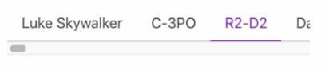

Instructor: 00:02 rather than hardcoding our `people` here, let's delete that and use a `people$` stream instead. I'll create a `people$` stream, so `const people$`. This will use our createLoader function. Going to bring this up above it.

#### App.vue
```javascript
subscriptions() {
  const createLoader = url => 
    Observable.from(this.$http.get(url)).pluck(
      "data"
    )

  const people$ = 
}
```

00:19 Just say `createLoader` and pass in our service, `https://starwars.egghead.training/people`. That will load in an array of people. 

```javascript
const people$ = careteLoader 
  (`https://starwars.egghead.training/people`)
```

We'll go ahead and `return` this in our object at the bottom.

```javascript
return {
  name$,
  image$,
  disabled$,
  buttonTest$,
  activeTab$,
  people$
}
```

Hit Save, and now we have a whole bunch of tabs with the proper names on them. You'll notice that when I click on them that nothing happens, though.



00:47 That's because the `map` that we did before, we tried to map the `tabId` to the `people[tabId]`, this people no longer exists. The way we check the array of people off of this stream is by using `.combineLatest(people$)`. This essentially means take the active tab and when either of these fires combine the two latest values together and then push that down.

01:18 The way we're going to do that is with a selector function. The arguments are `tabId` and the array of `people`. Then, we'll do a very, very similar look-up where we say `people`, look up the `tabId` and grab their current `id`.

```javascript
const luke$ = activeTab$
  .combineLatest(people$, (tabId, people) => 
  people[tabId].id)
  .map(
    id => 
    ...
  )
```

01:38 Hit Save there, and now you see Luke shows up when we click on the Luke Skywalker tab. I'll click on C-3PO, R2-D2, Han Solo, keep on scrolling. Everyone is mapped together properly. This `people` stream is using this `createLoader` promise. The `activeTab$` now combines with that and selects that appropriate `id` off of the `people` array that comes back from the `people$` stream.

02:05 I don't need so many people for my tab, so I'm going to limit them down to, let's say, people `slice`. Let's do seven. Now we'll have the first seven results.

```javascript
const people$ = careteLoader (
  `https://starwars.egghead.training/people`
).map(people => people.slice(o, 7))
```