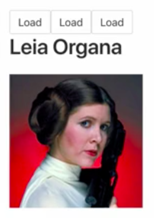

Instructor: 00:01 Our dom streams also allow us to pass some data along inside of our configured stream here. If we pass an object along instead of just `click`, I can say that the `subject` is the `click` that's created from the domstream, and the `data` is just going to be the number `1`, or this is the id for Luke.

#### App.vue
```html
<button class"button" :diabled="disabled$" v-ssstream:click="{subject:click$, data:1}">{{buttontext$}}</button>
```

00:20 If I come down here into `const luke$`, I can say `pluck` the `"data"` off, and then `map` that `id` to the string of our url, using that `id`. 

```javascript
const luke$ = this.click$
  .pluck("data")
  .map(id => 
    `https://starwars.egghead.training/people/${id}`
  )
```

I'll hit save here and have the exact same result. What this allows me to do is, if I create three buttons where each of these uses different data -- `4` is Darth Vader and `5` is Leia -- 

```html
<button class"button" :diabled="disabled$" v-ssstream:click="{subject:click$, data:1}">{{buttontext$}}</button>
<button class"button" :diabled="disabled$" v-ssstream:click="{subject:click$, data:4}">{{buttontext$}}</button>
<button class"button" :diabled="disabled$" v-ssstream:click="{subject:click$, data:5}">{{buttontext$}}</button>
```

I'll just save. Then I can click this one to get Luke, this one to get Darth, and this one to get Leia.



01:00 Each of these passes a `data` along. The `data` comes through the `click` stream here. You can `pluck` off the `data`, and then use that data to `map` whatever data comes through -- I just named it `id` -- pass it along, and use it however you need it.