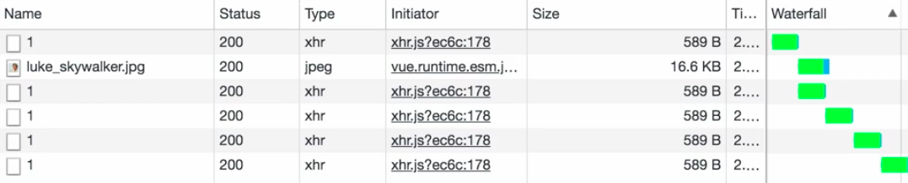

Instructor: 00:00 The concept of a `disabled$` stream, and then `disabled` a button in the UI like this does prevent the user from mashing on this button by disabling the element. I can't mash on that until this is done loading.

00:15 If I remove this `disabled` property, then I'll mash on this button with disabled removed. You watch the network panel. You'll see that a bunch of requests go out each time I click. While the UI was preventing it earlier, the stream itself was not preventing all of these requests.

00:35 We can do that by changing our operator in `luke$` from `switchMap`, which says that each time you try and push a value from our website into `switchMap`, attempt to cancel what's going on in here and fire off a new one. Each time it clicked, it tried to fire off a new request.

00:53 Where `exhaustMap` has the behavior of each time a value pushes from the url into `exhauseMap`, wait for this inner observable. Remember this loader observable that we created. Wait for this one to complete before firing off another one.

#### App.vue
```javascript
const luke$ = this.click$
  .mapTo(
    "https://starwars.egghead.training/people/1"
  )
  .exhauseMap(createLoader)
  .catch(err => 
    createLoader(
      "https://starwars.egghead.training/people/1"
    )
  )
  .share()
```

01:11 I'll clear out our network. Make sure that we slow down our requests. Back in the network, if I mash on load, you can see only one request was made. Then another one was made and another.

01:30 Each time, it's waiting for the previous one to complete, as you can see in the waterfall here. This step, then this step, then this step, then this step always waited for the previous one to complete.



01:43 We'll contrast that with the waterfall of a `switchMap`. Now I'll mash on the button. You can see that each of those clicks made a request.

01:54 The waterfall did not wait for the previous one to complete. It attempted to cancel and fire off a new one.

02:02 Again, while our disabled stream works great for disabling in the UI -- so we'll leave it in there -- 

```html
<button class"button" :diabled="disabled$" v-ssstream:click="{subject:click$, data:5}">{{buttontext$}}</button>
```

it's also good to understand that the proper operator in this scenario would be `exhaustMap`, so that it waits for the previous request to finish loading.