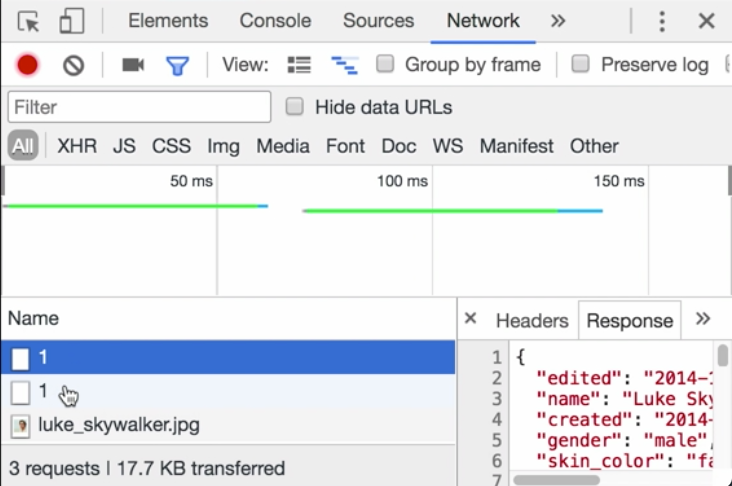

Instructor: 00:00 you'll also notice in the network tab when I click, you'll see two requests going out and loading the same data. 



The reason that's happening is because `luke$` is here and here: 

#### App.vue
```js
const name$ = luke$.pluck("name")
const loadImage$ = luke$
  .pluck("image")
  .map(
    image =>
      `https://starwars.egghead.training/${image}`
  )
```

So this `pluck` `name$` stream and this `pluck` map stream, which are named here for `name$` and `load$` image are both telling this stream, this `luke$` stream, to trigger that request.

00:25 When you have two streams which are accepting values from a single stream and you want them to stay in sync, then simply tack on a `share()` at the end here. 

```js
const luke$ = this.click$
  .mapTo(
    "https://starwars.egghead.training/people/1"
  )
  .switchMap(createLoader)
  .catch(err =>
    createLoader(
      "https://starwars.egghead.training/people/2"
    )
  )
  .share()
```

I'll hit Save, clear out the network tab, and click. You'll see it only made this one request this time. That's because each stream that's being attached to this `luke$` stream is now sharing that same initial stream.

00:52 This load request will be shared between the `name$` stream and the `loadImage$` stream. You'll want to make sure to put this after something like a heavy request is made. If I put this up where the click is made, it's only sharing that initial click.

```js
const luke$ = this.click$
  .share()
  .mapTo(
    "https://starwars.egghead.training/people/1"
  )
  .switchMap(createLoader)
  .catch(err =>
    createLoader(
      "https://starwars.egghead.training/people/2"
    )
  )
```

01:09 If I clear out the network tab and click, you'll see it's still making those two requests, because this is being shared here, but everything underneath it is still being requested twice by these two streams.

01:21 Make sure to share at the point in the stream where you know the other streams are going to want that same data, that data being that request, so when I click once, you make one request...