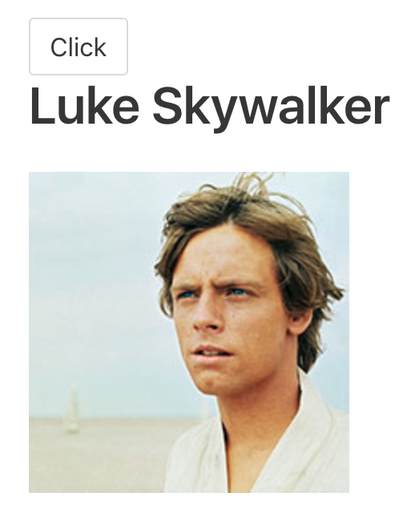

Instructor: 00:00 we'll make this a bit more interesting by loading an image. Instead of plucking the `"data"` and `"name"`, let's `pluck` the data. We'll call this `person$`, and change this to `person`. 

#### App.vue
```js
const person$ = Observable.from(
      this.$http.get(
        "https://starwars.egghead.training/people/1"
      )
    ).pluck("data")

const luke$ = this.click$.switchMap(
  () => person$
)
```

Then, we can create a `name$` stream. I'll say const `name$` is `luke$.pluck("name")`, an `image$` stream which can be `luke$.pluck("image")`.

```js
const name$ = luke$.pluck("name")
const image$ = luke$.pluck("image")

return {
  name$,
  image$
}
```

00:27 We'll return both of those. We'll return `name$` at `image$`, and then render both of them out inside of our `<template?`. We'll render out the `name$`. For right now, we'll render out `image$` right here to check that it's working. 

```html
<template>
  <section class="section">
    <button class="button" v-stream:click="click$">Click</button>
    <h1 class="title">{{name$}}</h1>
    <h2>{{image$}}</h2>
  </section>
</template>
```

I'll click, and you'll see `Luke Skywalker`. You'll see this image name. Let's go ahead and drop that inside of an `img` tag.

```html
<template>
  <section class="section">
    <button class="button" v-stream:click="click$">Click</button>
    <h1 class="title">{{name$}}</h1>
    
  </section>
</template>
 
```

00:49 We'll bind the source to image. The image actually is on the remote server. I'm going to have to `map` this `image` to the URL where it is, so `starwars.egghead.training/`, and then `${image}`. Hit Save there. Now when I click, it'll load in Luke and load in the image...

```js
const image$ = luke$
  .pluck("image")
  .map(
    image =>
      `https://starwars.egghead.training/${image}`
  )
```
