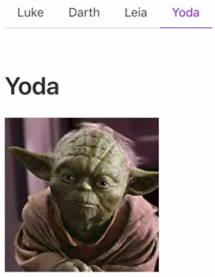

Instructor: 00:01 I'm going to refactor out these `<button>`s and move that behavior into these `<b-tabs>`. Something I'll need to do for that is to create an array of `people`. That's just objects of `name`, so `Luke`, an `id` of `1`, then `Darth` and `Leia`. `Darth` as an `id` of `4`, and `Leia` has an `id` of `5`.

```javascript
data() {
  return { 
    activeTab: 0, 
    people: [
      {name: "Luke", id:1},
      {name: "Darth", id:4},
      {name: "Leia", id:5}
    ]
  }
}
```

00:26 Now I can pass these people into my `b-tabs`. I'll get rid of these. I can `v-for` on these tab items. I'll say `person of people`. I can `:key` that against the `person.id`, and the `:label` will now be bound to `person.name`. 

```html
<b-tab-item v-for="person of people"
:key="person.id"
:label="person.name"></b-tab-item>
```

Hit Save there, and there's no visual change, it's just updated to use my set of data.

00:53 In fact, let's throw in `Yoda` for good measure just to show him. `id:20` and `name: "Yoda"`.

```javascript
data() {
  return { 
    activeTab: 0, 
    people: [
      {name: "Luke", id:1},
      {name: "Darth", id:4},
      {name: "Leia", id:5},
      {name: "Yoda", id:20}
    ]
  }
}
```

Now we have a Yoda tab. To make sure we load the right person, I'll have to map the `activeTab$` IDs to the IDs in our `people`. That'll look something like removing `this.click` and saying `activeTab$.map`. This is the `tabId`.

01:19 We want to select `this.people[tabId].id`. 

```javascript
const luke$ = activeTab$.map(tabId => 
this.people[tabId]idi)
  .map(
    id => 
    ...
  )
```

This `tabId` will find the person and `.id` will find this people's `id`. Now with that simple refactor, I hit Save and everything updated perfectly. Hit Darth, click Leia, click Yoda, and everything's working because I simply swapped that click stream for an active tab stream...

