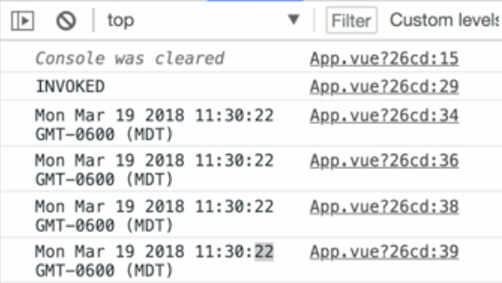

Instructor: 00:00 Currently every single time I click on a tab, it makes another network request, even if I've already visited that tab. So to implement some caching, we first need to understand how promises inter-operate with observables because my `createLoader` is using a promise to fetch that `"data"`.

00:20 When you create a `new Promise`, you pass in a function that can `resolve` or `reject`. Inside of this function, I'm going to write, `console.log("invoked")`. 

#### App.vue
```javascript
subscriptions() {
  new Promise((resolve, reject)=>{
    console.log("INVOKED")
  })
  ...
}
```

Simply by hitting save here, you'll see invoked shows up in the console, even though I haven't resolved or rejected this promise.

00:40 If I do `resolve` it -- so I'll pass in `"hello"` as the value and then call this variable `myPromise`, and I'll create a `then` on `myPromise`, so promise then `value => console.log(value)` -- you'll see "invoked" and then "hello" is passed to "then," which will result in "invoked" and "hello".

```javascript
const myPromise = new Promise(
  (resolve, reject) => {
    console.log("INVOKED")

    resolve("hello")
  }
)

myPromise.then(value => console.log(value))
```

01:02 If I do this like four times, hit save, you'll see "invoked" and then four "hellos." Only one "invoked" because this function is only invoked one time. If I change `"hello"` to a `new date()` and hit save, even though it's inside of a function that would generally kind of act as a factory and create a new date, you'll see that each of these times -- so 50 seconds, 50 seconds, 50 seconds -- are the same, even if I wrap in a `setTimeout()`.

01:31 So this will be my callback, and then we'll say respond after three seconds, and move these two up inside of the callback, hit save. 

```javascript
const myPromise = new Promise(
  (resolve, reject) => {
    console.log("INVOKED")

    resolve("hello")
  }
)

myPromise.then(value => console.log(value))
myPromise.then(value => console.log(value))

setTimeout(() => {
  myPromise.then(value => console.log(value))
  myPromise.then(value => console.log(value))
}, 3000)
```

You'll see the first two are 22 seconds and the next two are also 22 seconds, even though this occurred three seconds later.



01:49 It's getting that exact same value each time. If I re-factor these promises and change them into observables by using `Observable.from`, so to select this, and grab all of these and rename it to `Observable.from(myPromise).subscribe`, now all these promises are working as observables.

```javascript
Observable.from(myPromise).subscribe(value => console.log(value))
Observable.from(myPromise).subscribe(value => console.log(value))

setTimeout(() => {
  Observable.from(myPromise).subscribe(value => console.log(value))
  Observable.from(myPromise).subscribe(value => console.log(value))
}, 3000)
```

02:13 I'll hit save and we'll have that exact same behavior of invoked 02 seconds, and all of these shared that exact same value, and this was only invoked once. No matter who subscribes to this observable or accesses it later, it's always going to get that same promise value that you pass into resolve.