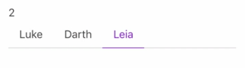
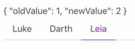

Instructor: 00:00 You probably already have some components with some V models. For example, I'll create some `data`, and we'll return an `activeTab` and set that to `0`.

#### App.vue
```javascript
export default {
  data(){
    return{
     activeTab: 0
    }
  }
}
```

00:12 Say you're using that as the V model of a `<b-tabs>` component, so this is the Bulma tabs component from Buefy, which has `b-tab-item`. `b-tab-item` have `label`, so we'll set this label to `Luke`, that one to `Darth`, and that one to `Leia`, so Darth, Leia. Then set the `v-model` here to `activeTab`.

00:36 Then just render out the `activeTab` above the tab component. 

```html
<section class="section">
  {{activeTab}}
  <b-tabs v-model="activeTab">
    <b-tab-item label="Luke"></b-tab-item>
    <b-tab-item label="Darth"></b-tab-item>
    <b-tab-item label="Leia"></b-tab-item>
  </b-tabs>
  ...
</section>
```

If I click Darth, this changes to one, and Leia, this changes to two. 



I can watch this `v-model` value as an observable using `this.$watchAsObservable`, and then a string of `"activeTab"`. We'll call this our `activeTab$`.

```javascript
subscriptions() {
  const activeTab$ = this.$watchAsObservable("activeTab")
  ...
}
```

01:05 We can `return` that and our object, `activeTab$`. 

```javascript
return {
  name$,
  image$,
  disabled$,
  buttonText$,
  activeTab$
}
```

Now render out our `activeTab$` stream. 

```html
<section class="section">
  {{activeTab$}}
  <b-tabs v-model="activeTab">
...
```

Now you'll notice there's no value above our tabs anymore. If I click on Darth, it changes to an object of old value and new value. Leia, old one's Darth, new one's Leia, but if I refresh the page, that value disappears.



01:30 We can trigger that to fire right away in here with some options. These are the same options as the $watch of view, and one of them is called `immediate`. We'll set that to `true`. That means to fire right away. 

```javascript
subscriptions() {
  const activeTab$ = this.$watchAsObservable(
    "activeTab",
    { immediate: true}
  )
  ...
}
```

You can see we get a new value of zero, and I didn't have to click anything. This still works, that still works, and that still works.

01:53 You often don't have to worry about the old values. We can go ahead and `.pluck("newValue")`. 

```javascript
subscriptions() {
  const activeTab$ = this.$watchAsObservable(
    "activeTab",
    { immediate: true}
  ).pluck("newValue")
  ...
}
```

Hit save, and now this zero up here is an observable stream, which updates whenever my component V model updates. 