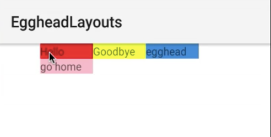
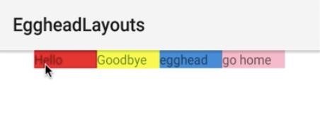
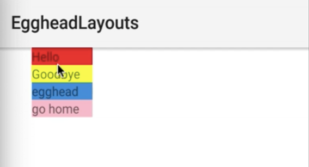

00:00 Start by adding a `<WrapLayout>` to your `<Page>`. And we're going to set a `width` on the `<WrapLayout>`, so we can really see the visual effect once we run this. Inside of the `<WrapLayout>`, we need a few view components to fill the space. We'll start with a `<Label>` with the `text` set to `"Hello"`. And we're also going to use `backgroundColor` to really see the `<WrapLayout>` here in effect.

#### wrap.xml
```xml
<Page>
    <WrapLayout width="250">
        <Label text="Hello" backgroundColor="red" />
    </WrapLayout>
</Page>
```

00:30 We'll add another `<Label>` with the `text="Goodbye"`, `backgroundColor="yellow"`, another `<Label>` with the `text="egghead"`, `backgroundColor=#3489db"` as a hex. And last, we use another `<Label>` with the `text="go home"` and `backgroundColor="pink"`. And again, to see this in effect, we're going to set a few properties that you might not normally need, such as the `width` on these child items. And we're going to use `"70"` on each of these labels.

```xml
<Page>
    <WrapLayout width="250">
        <Label text="Hello" width="70" backgroundColor="red" />
        <Label text="Goodbye" width="70" backgroundColor="yellow" />
        <Label text="egghead" width="70" backgroundColor="#3489db" />
        <Label text="go home" width="70" backgroundColor="pink" />
    </WrapLayout>
</Page>
```

01:22 And when we run this, we should see three items on the first row and this last `<Label>` should wrap. And here, you see the first `<Label>`, the second `<Label>`, third, and fourth. The fourth `<Label>` is wrapped because all four items have greater width, when they're combined, than the entire `<WrapLayout>` of 250. 



If we change this to `"280"`, which would be the sum of the four labels' widths, they should be on one row. And here, you see one, two, three, four all on the first row.

```xml
<WrapLayout width="280">
```



02:02 The `<WrapLayout>` also provides the `orientation` property, which you can set to `"vertical"`. The default is horizontal. When you run this, the wrap will present items in a column.

```xml
<WrapLayout width="280" orientation="vertical">
```

