00:00 Start by adding the `<FlexboxLayout>` to our `<Page>`. Inside of the `<FlexboxLayout>`, we'll add a few view components to fill it out so we can see how the layout will arrange the child items. We'll also add some color inline for the visual effect, to keep track of the buttons.

#### flex.xml
```xml
<Page>
    <FlexboxLayout>
        <Button text="Hello" backgroundColor="red"/>
        <Button text="Goodbye" backgroundColor="green"/>
    </FlexboxLayout>
</Page>
```

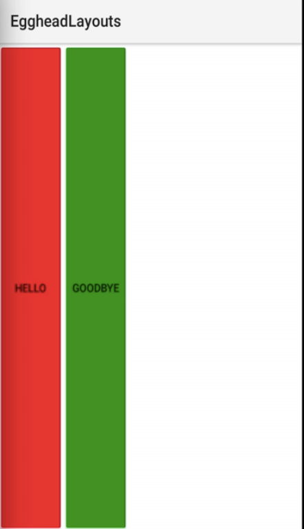

00:38 With the two buttons inside of the `<FlexboxLayout>`, we're going to use the `order` property to specify the order that these items will render. We're going to flip these so the first button here will be second, and the second button is going to be number one.

```xml
<Page>
    <FlexboxLayout>
        <Button order="2" text="Hello" backgroundColor="red"/>
        <Button order="1" text="Goodbye" backgroundColor="green"/>
    </FlexboxLayout>
</Page>
```

00:54 When we run this, the button HELLO should be on the right, and the button with GOODBYE will be on the left. There you see they switched. 

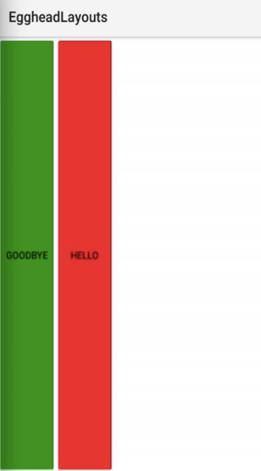

Let's get these back in order. Run that, and you'll see they'll switch again.

```xml
<Page>
    <FlexboxLayout>
        <Button order="1" text="Hello" backgroundColor="red"/>
        <Button order="2" text="Goodbye" backgroundColor="green"/>
    </FlexboxLayout>
</Page>
```

01:09 For the `<FlexboxLayout>`, there are several properties that you can use to adjust the alignment and the layout of the child items. We'll start with the `alignItems` property. We're going to set this to `"flex-start"`, which will position the view components at the top -- there, you see.

```xml
<Page>
    <FlexboxLayout alignItems="flex-start">
        <Button order="1" text="Hello" backgroundColor="red"/>
        <Button order="2" text="Goodbye" backgroundColor="green"/>
    </FlexboxLayout>
</Page>
```

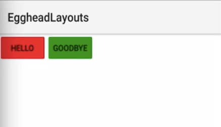

01:31 There's also the `"flex-end"`, which will position them at the bottom or the end of the `<FlexboxLayout>`.

```xml
 <FlexboxLayout alignItems="flex-end">
```

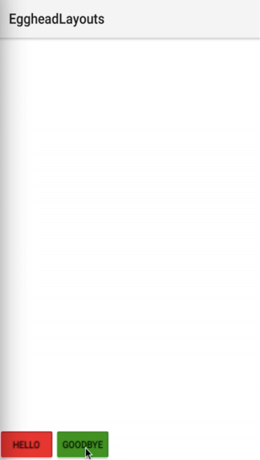

 We also have the `justifyContent` property, which you can set to `"space-between"` to add padding between the view components inside of the layout. There, you see the buttons now have padding.

 ```xml
 <FlexboxLayout alignItems="flex-end" justifyContent="space-between">
```

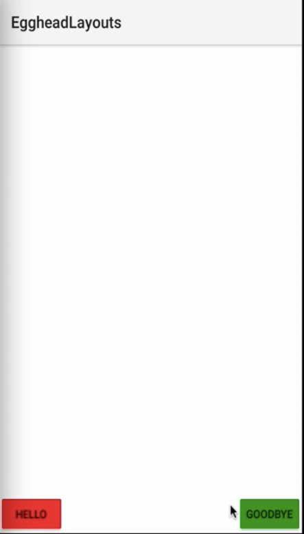

01:52 You have `"space-around"`, which will give padding on all sides of the view components. 

```xml
 <FlexboxLayout alignItems="flex-end" justifyContent="space-around">
```

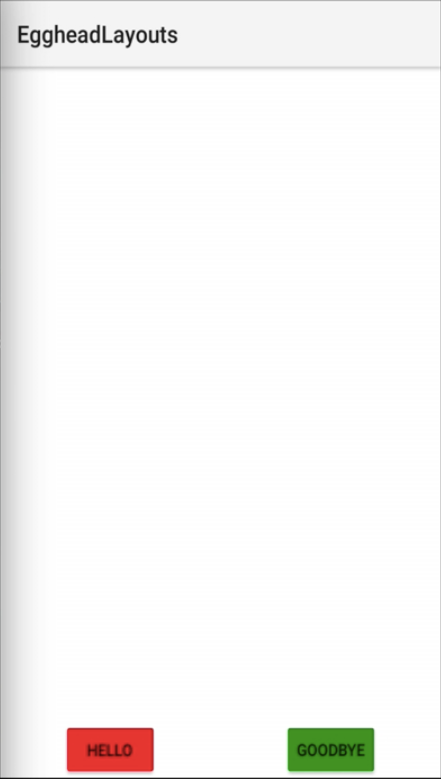

Then there's `"center"`. This is very similar to the web on using `<FlexboxLayout>`. Here you go. They're centered, and the `alignItems` use `flex-end`. 

```xml
 <FlexboxLayout alignItems="flex-end" justifyContent="center">
```

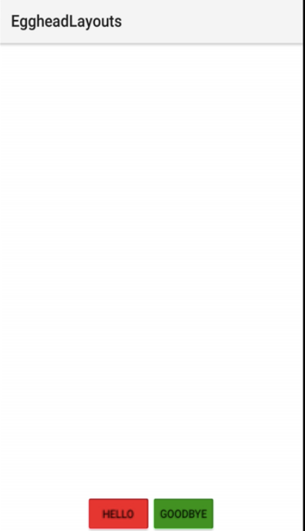

Let's go ahead and push this to `center` also.

02:13 The items will appear in the center of the `<FlexboxLayout>` due to the `alignItems` and `justifyContent` properties being set to `center`. 

```xml
 <FlexboxLayout alignItems="center" justifyContent="center">
```

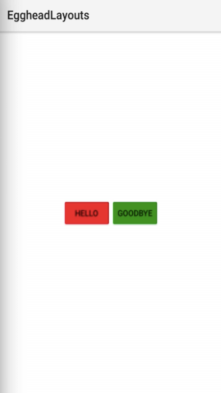

Let's add two more view components here. We're using buttons, and we'll set the `backgroundColor` inline here. We are going to also set a `height`.

02:44 We'll vary these on each of the buttons so we can see how the items will be positioned in the screen space they will consume. We'll run this, and the buttons will be varying in heights. You'll see here there's HELLO, EGGHEAD, and GOODBYE.

```xml
<Page>
    <FlexboxLayout alignItems="center" justifyContent="center">
        <Button order="1" text="Hello" backgroundColor="red" height="60" />
        <Button order="2" text="Goodbye" backgroundColor="green" height="100" />
        <Button text="Egghead" backgroundColor="blue" height="50" />
    </FlexboxLayout>
</Page>
```


You can't really see the EGGHEAD text. Let's set the `color="white"` to make that more visible.

```xml
<Button text="Egghead" color="white" backgroundColor="blue" height="50" />
```

03:07 There is also the `alignContent` property that you can use on the `<FlexboxLayout>`. You can set this to `"flex-start"`. If you're going to use this, I would typically get rid of the `alignItems`. Run this, and now you see they're `flex-start` on the `alignContent`.

```xml
<FlexboxLayout alignContent="flex-start" justifyContent="center">
```

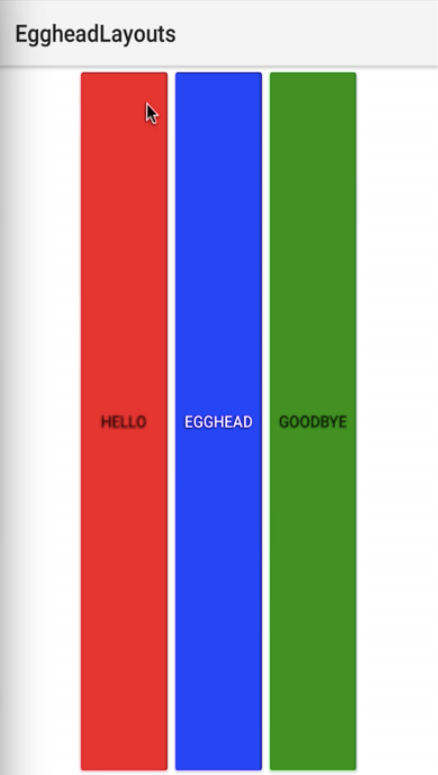

03:28 So they do start at the top, they're justified in the center, but they're also going to span because they're set with the `alignContent` and not the items. Here, if you added `alignItems` and set that to `"center"`, run this, and you see now they're back in the center, which ignores the `alignContent` property.

```xml
<FlexboxLayout alignContent="flex-start" alignItems="center" justifyContent="center">
```

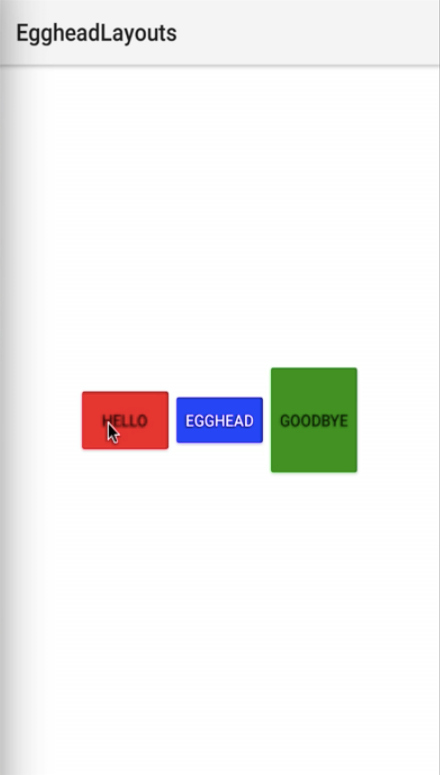

03:53 You can try various values to get different outputs, but we'll keep it simple here. We'll go back to `"flex-end"` and see exactly what happens. Now they're at the end, and again, `alignContent` is being ignored because we're setting the items alignment and we also have the `justifyContent` still set to `"center"`.

```xml
<FlexboxLayout alignContent="flex-start" alignItems="flex-end" justifyContent="center">
```

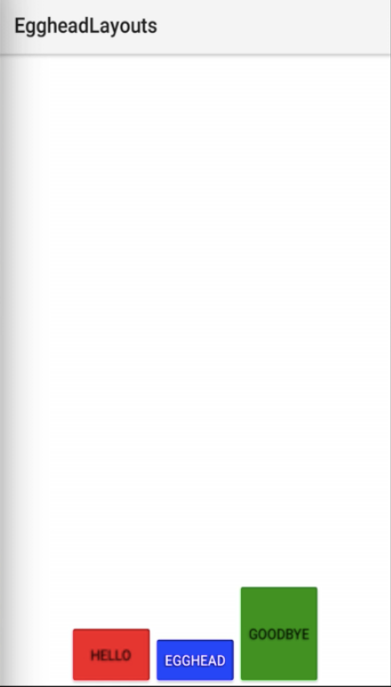

04:15 The good thing about NativeScript is you can also set this with CSS. You don't necessarily have to inline these properties. Let's go ahead and say `class="main-container"`. 

```xml
<FlexboxLayout class="main-container">
```

04:33 With the CSS `class` set to `main-container` we'll define it inside of `app.css`. We'll open `main-container`. We're going to use the `align-items` property, and set it to `center`. We'll use `justified-content`, and we'll set it to `space-between`.

#### app.css
```css
.main-container {
    align-items: center;
    justify-content: space-between;
}
```

04:53 You run this, and you'll see the space-between added a little bit more padding. 

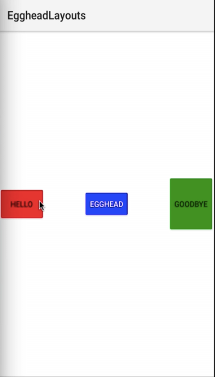

Let's go ahead and say `flex-start` to see the real effect here. 

```css
.main-container {
    align-items: flex-start;
    justify-content: space-between;
}
```

Now the items are aligned using `flex-start`, and they're justified with `space-between` using CSS specified by the `class` property on the layout.

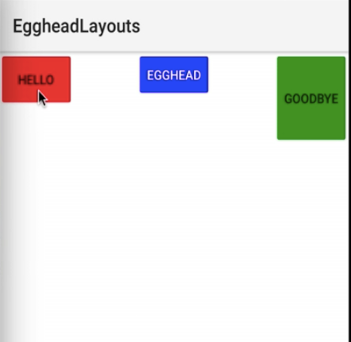