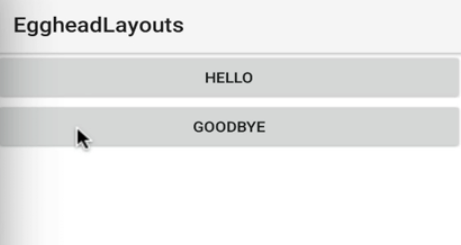
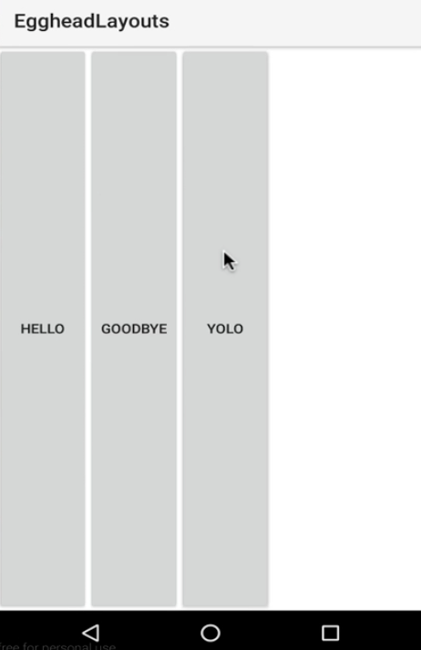

00:01 Let's start by adding the `<StackLayout>` to the `<Page>`. Inside of the `<StackLayout>`, we're going to add a `<button>` with the `text` set to `"Hello"` and we'll add another `<button>` with the `text` set to `"Goodbye"`. Close that.

#### stack.xml
```xml
<StackLayout>
    <button text="Hello" />
    <button text="Goodbye" />
</StackLayout>
```
00:30 When we run this, we'll see two buttons stacked vertically inside of our `<StackLayout>`. Here they are, hello and goodbye.



 You could continue stacking items inside of the `<StackLayout>`, and they'll continue to stack vertically, because that is the default for the `<StackLayout>`.

 ```xml
 <button text="Yolo" />
 ```

00:49 The `<StackLayout>` also provides the `orientation` property which, set to `"horizontal"`, will stack your items left to right.



