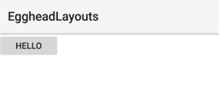
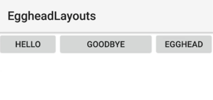
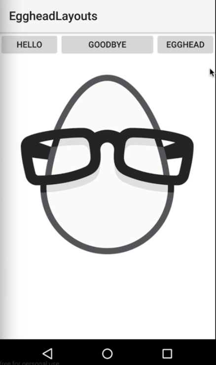
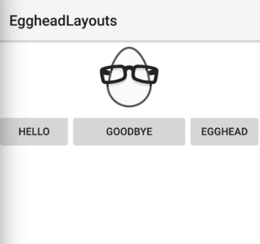
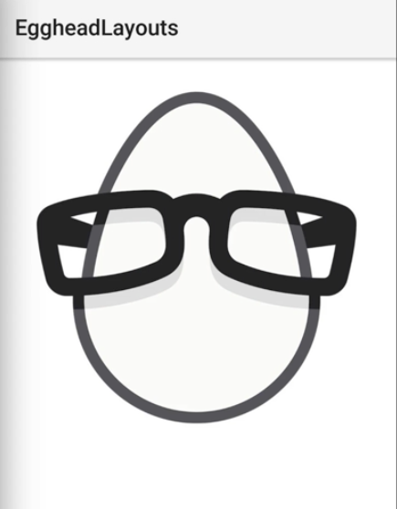

00:00 Start by adding a `<GridLayout>` to your `<Page>`. The `<GridLayout>` has two properties that are essential for laying out the child views, `rows` and `columns`. We're going to set our first row to a height of `"40"`, and the second row to a height of `"auto"`.

00:20 We'll set our first column to a width of `"100"`, second column is going to use `"*"`, and this will indicate that anything in that column will consume the entire space. We'll have a third column with a width of `"100"` also. We need to fill this with a few view components.

#### grid.xml
```xml
<Page>
    <GridLayout rows="40, auto" columns="100, *, 100"> 
    </GridLayout>
</Page>
```

00:40 We'll start with a `<Button>` with the `text` set to `"hello"`. Now we have to specify where we want it to show in the grid. We're going to use the `row` property, and we'll set it equal to `"0"` for the first row. This button's going to be 40 high because it's in the first row.

00:59 We'll set the `col` property, which is for the column, to `"0"` which is also the first column, so it's going to be 100 wide. We'll run this and we'll just one button show up into the view, here it is, it's 100 wide because it's in the first column, and it's 40 high because the first row is set to 40.

```xml
<Page>
    <GridLayout rows="40, auto" columns="100, *, 100"> 
        <Button text="hello" row="0" col="0" />
    </GridLayout>
</Page>
```



01:20 Let's keep adding a few items here to see how to layout more views inside of the grid. We'll also position this `<Button>` on the first row, but we're going to set it in the second column, and then we're going to add another `<Button>`, set it on the same row, but it's going to be the third column.

```xml
<Page>
    <GridLayout rows="40, auto" columns="100, *, 100"> 
        <Button text="hello" row="0" col="0" />
        <Button text="Goodbye" row="0" col="1" />
        <Button text="Egghead" row="0" col="2" />
    </GridLayout>
</Page>
```

01:47 We'll run this, we'll have three buttons left to right. HELLO, GOODBYE, and EGGHEAD. 



They're specified with the `row` and `col` properties, and you'll notice this GOODBYE in the second column fills all space, so the GOODBYE button is as wide as the second column due to the `*` value.

02:09 Let's go here, and we're going to add an `<Image>`, and we're going to put this `<Image>` on the second row. The source is going to be the Egghead logo, and we're going to set it on the second row, but we're going to use the `colSpan` property.

02:25 What this allows us to do is specify an item to fill more than one column. It's going to be `"3"`, so this `<Image>` is going to fill all three columns on our `<GridLayout>`.

```xml
<Page>
    <GridLayout rows="40, auto" columns="100, *, 100"> 
        <Button text="hello" row="0" col="0" />
        <Button text="Goodbye" row="0" col="1" />
        <Button text="Egghead" row="0" col="2" />
        <Image row="2" colSpan="3" src="https://pbs.twimg.com/profile_images/735242324293210112/H8YfgQHP.jpg" />
    </GridLayout>
</Page>
```

 Run this, you'll see the Egghead logo, it' filling the entire grid's columns due to the `colSpan` property, and it's on the second row.

 

02:47 We could flip this, put it on the first row, change these buttons to the second row, the order doesn't matter inside of the grid, what matters is the `row` and `col` properties, when you specify them. Let's change this to `"100"`. 

```xml
<Page>
    <GridLayout rows="100, auto" columns="100, *, 100"> 
        <Button text="hello" row="1" col="0" />
        <Button text="Goodbye" row="1" col="1" />
        <Button text="Egghead" row="1" col="2" />
        <Image row="0" colSpan="3" src="https://pbs.twimg.com/profile_images/735242324293210112/H8YfgQHP.jpg" />
    </GridLayout>
</Page>
```

We run this, the `<Image>` will be on top, and it's now only 100 high because of the row having 100 set to the height of the first row.



03:17 There's also the `rowSpan` property if you want an item to fill multiple rows, you could also use that, and you could technically get rid of that.

```xml
<Page>
    <GridLayout rows="100, auto" columns="100, *, 100"> 
        <Image row="0" rowSpan="2" colSpan="3" src="https://pbs.twimg.com/profile_images/735242324293210112/H8YfgQHP.jpg" />
    </GridLayout>
</Page>
```

 Now this `<Image>` is going to fill two rows and three columns, which we have declared. It's going to fill the entire grid at this point, once we run it.

 