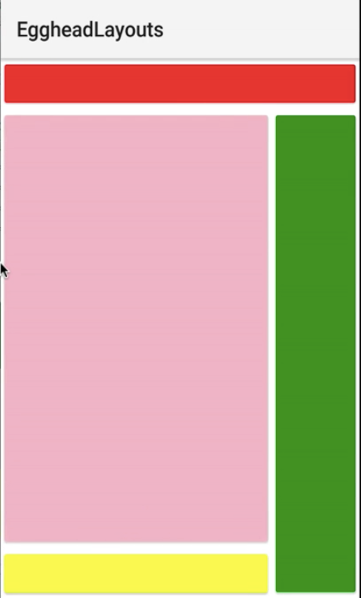
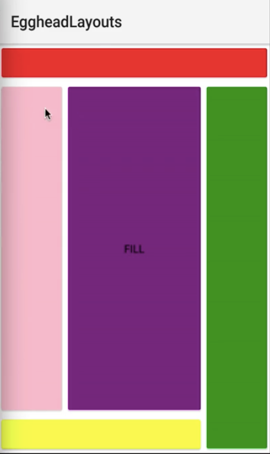

00:00 Start by adding a `<DockLayout>` to your `<Page>`. Inside of the `<DockLayout>`, we're going to layout four buttons, and they're going to take the `dock` property, which accepts `"top'"`, `"left"`, `"right"`, `"bottom"` as the value. We're going to color these inline with the `backgroundColor`, just so we know exactly where they end up inside of the `<DockLayout>`.

00:35 We'll add two more buttons. This one we'll `dock` to the `"bottom"` of the `<DockLayout>`, and our last `<Button>`, we will `dock` to the `"left"`. 
#### dock.xml

```xml
<Page>
  <DockLayout> 
    <Button dock="top" backgroundColor="red" />
    <Button dock="right" backgroundColor="green" />
    <Button dock="bottom" backgroundColor="yellow" />
    <Button dock="left" backgroundColor="pink" />
  </DockLayout>
</Page>
```

And we run this, we'll have four buttons inside of the `<DockLayout>` positioned by their dock property, `"top'`, `"right"`, `"bottom"`, and `"left"`. The top, right, bottom, and left button.



01:00 But the `<DockLayout>` also provides the `stretchLastChild` property, which set to `"true"` is likely what you'll use in a production application, if you use the `<DockLayout>`. We'll set another `<Button>` with the `text="Fill"`, and we'll run this. 
 
```xml
<Page>
  <DockLayout stretchLastChild="true"> 
    <Button dock="top" backgroundColor="red" />
    <Button dock="right" backgroundColor="green" />
    <Button dock="bottom" backgroundColor="yellow" />
    <Button dock="left" backgroundColor="pink" />
    <Button text="Fill" backgroundColor="purple" />
  </DockLayout>
</Page>
```

And you're going to see this `<Button>` consume all of the space in the center of the `<DockLayout>`, between the other buttons that have the dock properties specified -- the top, right, bottom, left. And here's your last child, which fills the remaining space inside of the `<DockLayout>`.

