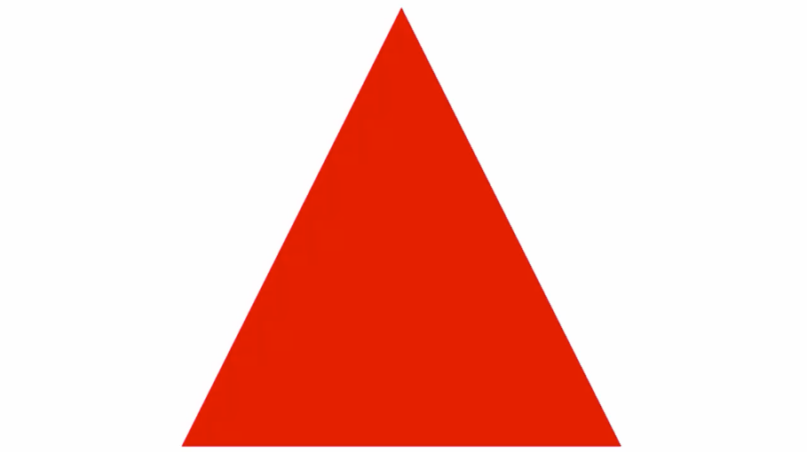
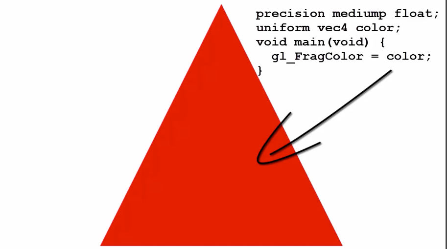
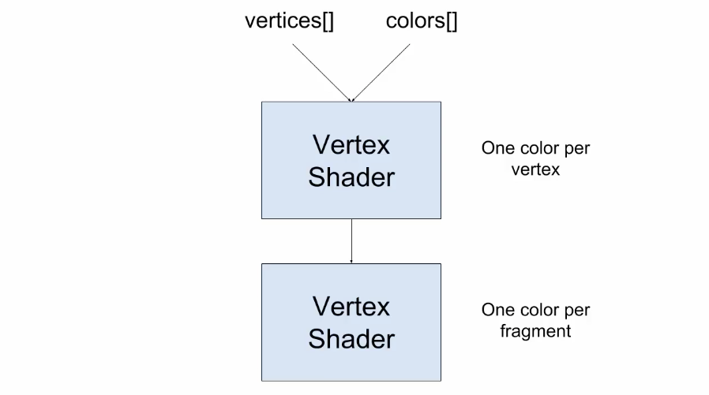
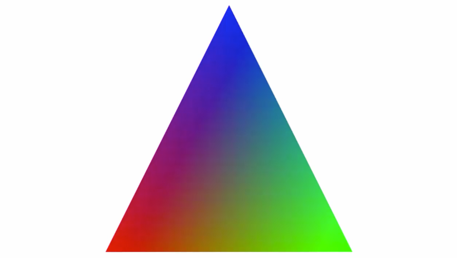
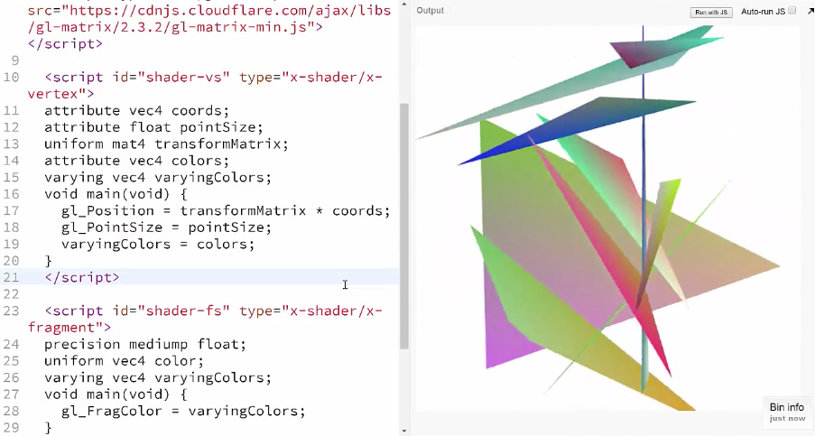
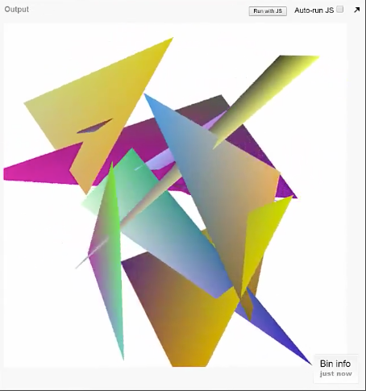

Thus far we've been using a single color for every fragment that's drawn to the screen. We're able to change that color via **JavaScript**, but we need to have a way to have different objects or different parts of objects have different colors. We'll do that now.



So far we've only seen color used in the **fragment shader**, but **WebGL** allows us to assign a color to each `vertex` in the `vertex shader` as well.



We can then use this special mechanism to pass that color data to the `fragment shader` where those `vertex` colors will be interpolated across the full triangular surface.



If we have a triangle with red, green, and blue vertices like so, the `fragment shader` will interpolate those colors and fill the rectangle like this. 



First of all we need to define the colors. We'll work from the end of the previous lesson where we have the rotating triangles like so.


We're going to assign a random color to every single `vertex`, so we'll need a new array to hold all those color values. I'll make that right up at the top of the `createVertices()` function. As we loop through and create the `x`, `y`, and `z` values for each `vertex`, we'll also get a random red, green and blue value along with one for alpha. We'll push those four values onto the array's separate elements.

```javascript
function createVertices() {
    vertices = [];
    var colors = [];
    for(var i = 0; i < vertexCount; i++) {
        vertices.push(Math.random() * 2 - 1);
        vertices.push(Math.random() * 2 - 1);
        vertices.push(Math.random() * 2 - 1);
        colors.push(Math.random());
        colors.push(Math.random());
        colors.push(Math.random());
        colors.push(1);
    }

    ...
}
```

We'll need to pass this color data over to the `vertex shader`. It's going to be the exact same mechanism that we're using to pass the `vertex` data over. I'll just copy that whole block, paste it back in. For `buffer` I'll change that to `colorBuffer`, and instead of vertices I'll use the colors array. Then, instead of getting the `coords` location, I'll get the location of an attribute called `"colors"`. We'll have to create that attribute in the shader. We'll do that in a moment.

I'll pass in that colors pointer to `gl.vertexAttribPointer`, and we'll make sure that it knows that there are four values per element. I'll enable that pointer and unbind the `buffer`. 

```javascript
colorsLocation = gl.getAttribLocation(shaderProgram, "colors");
gl.vertexAttribPointer(colorsLocation, 4, gl.FLOAT, false, 0, 0);
gl.enableVertexAttribArray(colorsLocation);
gl.bindBuffer(gl.ARRAY_BUFFER, null);
```

Just below that I'm going to comment out this code that sets the `color` in the `fragment shader` as we'll be doing something very different now. 

```javascript
//  var color = gl.getUniformLocation(shaderProgram, "color");
//  gl.uniform4f(color, 0, 0, 0, 1);
```

That's all we need to do on the JavaScript, for now anyway.
Let's jump over the shaders. As you might guess we're going to add a new `vec4` `attribute` called `colors`. That should be familiar now. But how do we get this per `vertex` color data over to the `fragment shader` as per fragment color data?

```html
<script id="shader-vs" type="x-shader/x-vertex">
attribute vec4 coords;
attribute float pointSize;
uniform mat4 transformMatrix; 
attribute vec4 colors;

void main(void) {
    gl_Position = transformMatrix * coords;
    gl_PointSize = pointSize;
}
</script>
```

There's another kind of shader variable that's used just for this purpose. It's called a **varying**. We'll say `varying vec4`, and we'll call this one `varyingColors`. This will be the link between the shaders.

```html
<script id="shader-vs" type="x-shader/x-vertex">
attribute vec4 coords;
attribute float pointSize;
uniform mat4 transformMatrix; 
attribute vec4 colors;
varying vec4 varyingColors;
void main(void) {
    gl_Position = transformMatrix * coords;
    gl_PointSize = pointSize;
}
</script>
```

We need to assign the current value of colors to `varyingColors` each time the shader is executed on a `vertex`. Inside the shader we simply say `varyingColors = colors`. 

```html
<script id="shader-vs" type="x-shader/x-vertex">
attribute vec4 coords;
attribute float pointSize;
uniform mat4 transformMatrix; 
attribute vec4 colors;
varying vec4 varyingColors;
void main(void) {
    gl_Position = transformMatrix * coords;
    gl_PointSize = pointSize;
    varyingColors = colors;
}
</script>
```

Then we jump down to the `fragment shader`. We'll create the exact same varying variable here.

This is the link, but it's a magical link. We set a single color per `vertex`, and we get back a different color for every single fragment, which translates to different colors for each pixel, all nicely smoothly interpolated.

```html
<script id="shader-fs" type="x-shader/x-fragment">
precision mediump float;
uniform vec4 color;
varying vec4 varyingColors;
void main(void) {
    gl_FragColor = varyingColors;
}
</script>
```

We can get rid of this original color uniform and instead apply `varyingColors` to `gl_FragColor`. Run it and there we go. Look at all the pretty colors.



As cool as this looks there's obviously something wrong here. The shapes are rotating around, but they're not really arranging themselves in space correctly. We can fix that really quickly.

By default WebGL doesn't pay attention to `z` values or depths of objects when drawing them to the screen. So sometimes things that are farther away will get drawn on top of things that are closer. All we have to do is tell it to test depths before drawing. We'll do that back in the `initGL` method by saying `gl.enable(g.DEPTH_TEST);`.

```javascript
function initGl() {
    var canvas = document.getElementById("canvas");
    console.log(canvas);
    gl = canvas.getContext("webgl");
    gl.enable(gl.DEPTH_TEST);
    gl.viewport(0, 0, canvas.width, canvas.height);
    gl.clearColor(1, 1, 1, 1);
}
```

Hey, now that's way better. What we have now really does look like 3D. We're still lacking some of the finer details like accurate perspective and lighting, but there's no denying that this looks three-dimensional.



Play around with this one. You're actually at the point now where you could start building out some real models by arranging the vertices into sensible shapes and applying specific colors to each one rather than randomly, like we're doing here.

You might want to try capturing some keyboard or mouse events and transforming the vertices based on those rather than the set rotation values we're doing now.